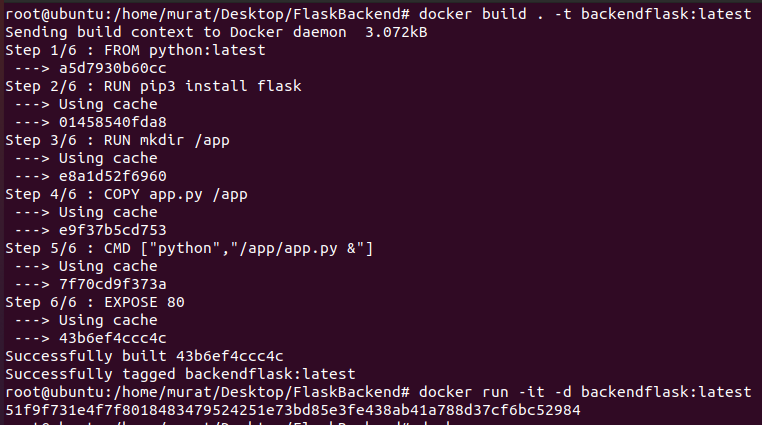
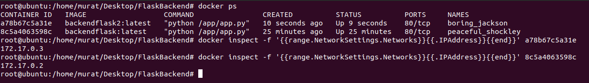
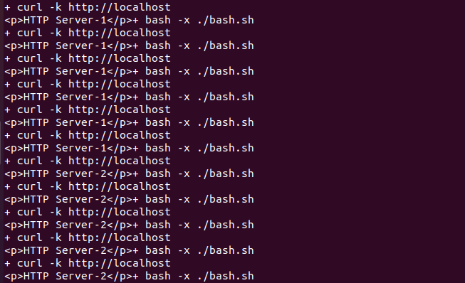
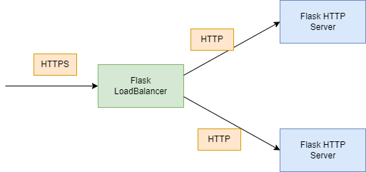
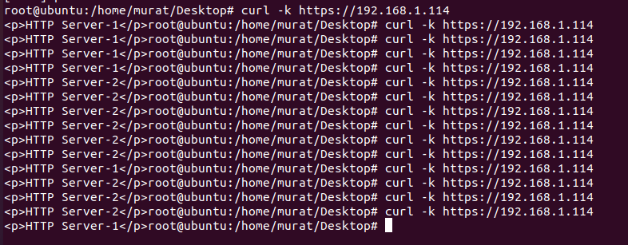

# Flask Server Load Balancer İşlemi 

Flask Framework python dili ile geliştirmiş bir web frameworküdür. Flask kullanılarak dinamik web sayfaları oluşturulabilir ve yönetilmesi sağlana bilmektedir. Bu yazımızda Flask web framework kullanılarak load-balancer işleminin nasıl yapılabileceği analatılmaktadır.

Load-Balancer işleminde lab ortamının oluşturulması amacıyla docker teknolojisinden yararlanılacaktır. Bu amaç doğrultusunda imaj olarak kullancağımız python imajı "docker pull python" komutu kullanılarak indirilir. İndirilen imaj kullanılarak backend http server oluşturulması amaçıyla Dockerfile ve app.py dosyaları aşağıdaki gibidir.

Dockerfile:

    FROM python:latest

    RUN pip install flask
    RUN mkdir /app
    COPY app.py /app
    CMD ["python","/app/app.py &"]
    EXPOSE 80

app.py:

    from flask import Flask
    app = Flask(__name__)

    @app.route("/")
    def index():
        return "
HTTP Server-1
"
    
    if __name__ == '__main__':
        app.run(host='0.0.0.0',port='80')

Oluşturulmuş olan Dockerfile ve app.py dosyaları docker üzerinde imaj oluşturulabilmesi için kullanılır. Docker üzerinde imaj oluşturma işlemi için "docker build . -t flaskbackend:latest" komutu kullanılır. Oluşturulan flaskbackend:latest imajının çalıştırılması amacıyla "docker run -it -d backendflask:latest" komutu kullanılır. 

Load balancer işleminin başarılı olup olmadığının anlaşılması amacıyla ikinci bir http konteyner çalıştırılır. Çalıştırılan konteynerların IP adreslerinin öğrenilmesi amacıyla "docker inspect -f '{{range.NetworkSettings.Networks}}{{.IPAddress}}{{end}}' Konteyner_id"

Yukarıda görülen IP adresleri arasında Load balancer işleminin yapılabilmesi aşağıdaki python script kullanılır.

    import random
    import requests
    from flask import Flask, request

    loadbalancer = Flask(__name__)
    FLASK_BACKENDS = ['172.17.0.2', '172.17.0.3']

    @loadbalancer.route('/')
    def router():
        host_header = request.headers['Host']
        if host_header == 'localhost':
            response = requests.get(f'https://{random.choice(FLASK_BACKENDS)}', verify=False)
            return response.content, response.status_code
        else:
            print("işlem basarısız")
    if __name__ == '__main__':
        loadbalancer.run(host='0.0.0.0',port='80')

Bu script'te temel amaç kendisine gelen http isteklerini rastgelen bir biçinde 172.17.0.2 ve 172.17.0.3 IP adresli HTTP serverlara yönlendirmektedir. 

### Flask Web Server üzerinde SSL-Offloading İşlemi

Flask Server üzerinde SSL offloading işlemi işleminin iki ayrı yöntem bulunmaktadır. Bunlar;

1. Varolan veya Openssl ile üretilmiş olan anahtar ve sertifikaların kullanılmasıdır.
2. Sertifikalara gerek olamadan Openssl kütüphanesinin kullanılması.

Yukarıda bahsi gecen kurallar uygulanması için main fonksiyonu aşağıdaki gibi olmalıdır;
Üretilmiş olan sertifikaların kullanılması

    if __name__ == '__main__':
        loadbalancer.run(ssl_context=("loadbalancer.crt",
        "loadbalancer.key"),host='0.0.0.0',port='443')

Key üretilmeden İşlemin gerçekleştirilmesi:

    if __name__ == '__main__':
        loadbalancer.run(ssl_context='adhoc',
        host='0.0.0.0',port='443')

SSL-Ofloading işleminin sonuçlarının denenmesi amacıyla aşağıdaki görselde görülen senaryo docker ortamında oluşturulmuştur.

Flask LoadBalancer Konteynırına HTTPS protokolü üzerinden istekler gönderilir. Gönderilen bu istekler load balancer özelliği ile HTTP protokolü üzerinden Flask HTTP Server konteynırlarına yönlendirilir.

192.168.1.114 IP adresi üzerine gönderilen curl istekleri ekranda görüldüğü gibi iki docker konteynırı arasında dağıtılmaktadır.
