# Docker Swarm 

**Docker Swarm**, birden fazla bilgisayarı bir araya getirip tek bir sistem gibi uygulama çalıştırmanı sağlayan güçlü bir araçtır.Docker Swarm, birden fazla Docker kurulu bilgisayarı bir araya getirerek bu bilgisayarları tek bir büyük sistem gibi kullanmanı sağlar. Bu duruma şöyle örnek verilebilirim diyelim ki 3 bilgisyarınız var normal şartlarda hepsine ayrı ayrı kurulum yapmanız lazım. Ancak Docker swarm ile bu bilgisayarları birleştirip hepsinde tek bir sistem varmış gibi uygulama çalıştırırsın. Neden Docker swarm kullanırız sorusunun cevabı aşağıdaki tablodaki gibidir;

| Problem                                | Docker Swarm ile Çözüm               |
| -------------------------------------- | ------------------------------------ |
| Tek sunucu yetmiyor                    | Uygulamayı birden fazla sunucuya yay |
| Sunucu çöktüğünde elle müdahale gerekiyor | Swarm otomatik yeniden başlatır      |
| Güncelleme sırasında sistem kapanıyor  | Rolling update ile sıfır kesinti     |
| Şifreleri dosyada tutmak aşırı güvensiz      | Secret yönetimi ile koru             |

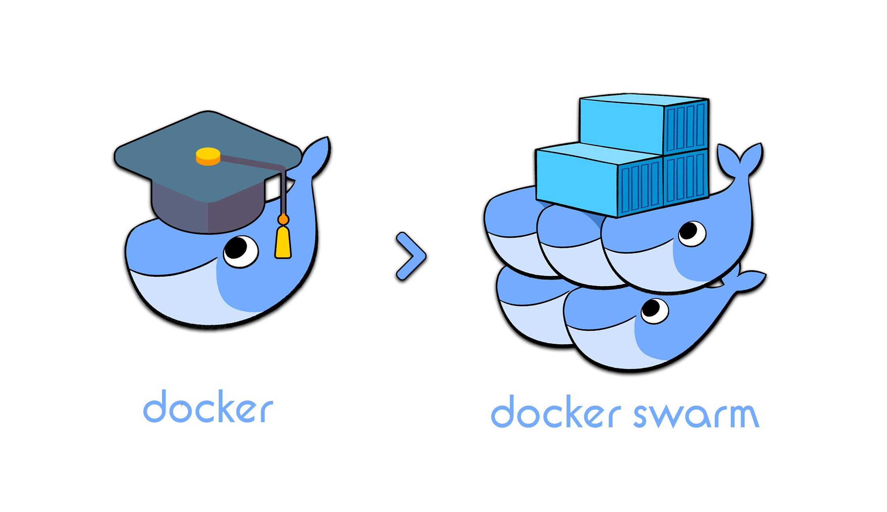

Şimdide docker swarm 'ın kurulumuna ve kullanımına bakalım. Benim şuan iki tane makinem var bunların bir linux diğeri ise windows makinedir ve docker sistemler kurulu haldedir. Linux makinemi **Manager Node** (Ana Makine) olarak başlatacağım. Bu işlem için ``docker swarm init --advertise-addr <IP_Adresi>`` komtu kullanılır.

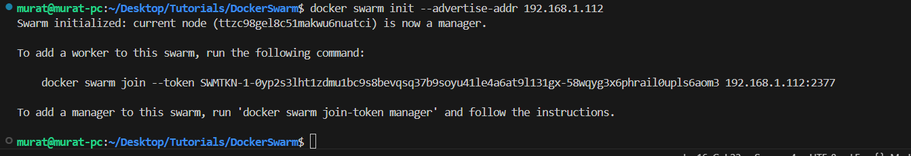

Windows tarafında bulunan ikinci docker makinemi **Worker Node** olarak kullanacağım. Bu işlem için ``docker swarm join --token <Token> <IP_Adresi>:2377`` komutu kullanılır.
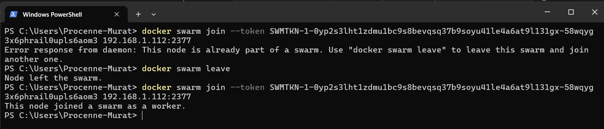

Docker swarm sistemimizi kurduk bu işlemin ardından ilk örneğimizi gerçekleştirelim. Docker swarm ile nginx server 'ın oluşturulması amacıyla aşağıdaki komut kullanılabilir(``Manager Node``).

```bash
docker service create \
  --name web \
  --replicas 3 \
  --publish 80:80 \
  nginx
```
Bu komut ile;

* ``--replicas 3``: 3 tane Nginx oluşturulur.
* ``--publish 80:80``: 80 portu üzerinden konteyner üzerinde çalışan nginx'e ulaşılabilir.
* ``--name web``: servisin adı

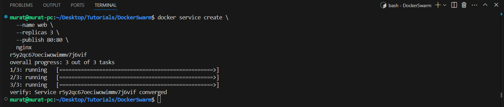

İşlem başarılı bir şekilde gerçekleştirildikten sonra ``Manager Node`` ve ``Worker Node`` çalışan konteynerlar aşağıdaki gibidir;

``Manager Node``

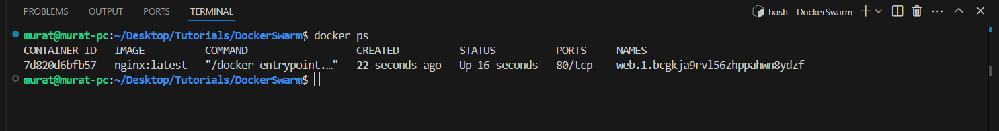

``Worker Node``

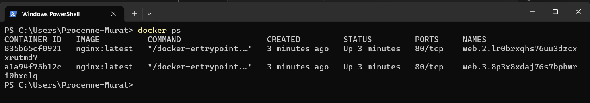

Oluşturulmuş olan replika konteynerlar çalışır durumdadır. Oluşturulmuş olan Docker swarm'ların listelenmesi amacıyla ``docker service ls`` komutunu ``Manager Node`` üzerinde çalıştırabilirsiniz.

Kesintisiz bir şekilde update işleminin gerçekleştirilmesi amacıyla;

```bash
docker service update \
  --image nginx:1.25 \
  --update-parallelism 1 \
  --update-delay 10s \
  web
```
komutu kullanılabilir. 
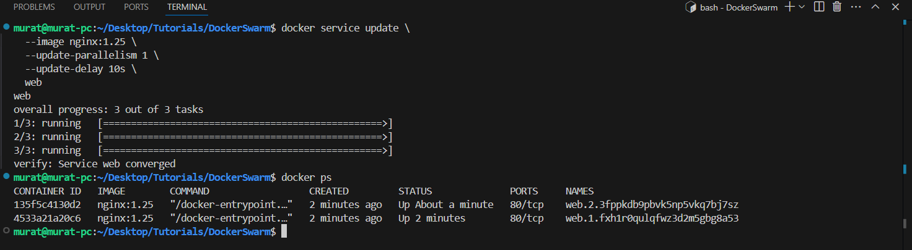 

Görselde görüldüğü update işlemi gerçekleştirilmiştir. Bu update işlemi sırasında herhangi bir kesinti ile karşılaşılmamıştır. Bu durumun temel nedeni her update işlemi konteyner özelinde sıralı bir şekilde gerçekleşmiştir. 


## Docker Swarm - Secret Kullanımı

Uygulama geliştirme aşamasında veritabanı şifresi, API Key yada özel bilgilerin kodun içerisine yazılması uygulama güvenliği açısından oldukça riskli bir durumdur. Bu durumun önüne geçilmesi amacıyla Docker Swarm 'da secret özelliği kullanılır.
Docker Swarm 'ın çalışırken;

* Manager node tarafından encrypt şekilde saklanır.
* Sadece o serviste çalışan container’lara, sadece çalışma anında erişim izni verilir.
* Dosya sistemi içinde /run/secrets/ dizininde okunur.

Secret kullanım adımları aşağıdaki gibidir;

1. Secret oluşturma işlemi için;
```bash
echo "TopSecret" | docker secret create db_password -
```
Komutu kullanılabilir. Bu komutla db_password adında bir secret oluşturduk.
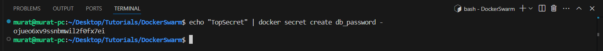

Oluşturulmuş olan bu secret 'ın bir servis tarafından kullanılması amacıyla;

```bash
docker service create \
  --name backend-app \
  --secret db_password \
  nginx
```
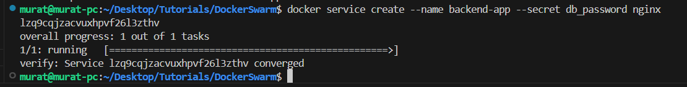

sistem çalıştırıldığında secret'ın çalışan konteyner içerisinde ``/run/secrets/db_password`` dizinindedir.


Geliştirilmiş olan uygulamalar ihtiyaç duydukaları secret bilgilerini bu şekilde elde edebilirler. Oluşturulmuş olan secret 'ın silinmesi amacıyla aşağıdaki komut kullanılmaktadır;

```bash
docker secret rm db_password
```
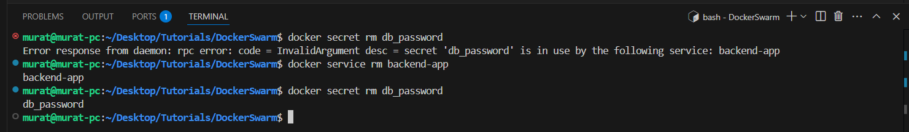

Docker-compose özelinde secret 'ın nasıl kullanıldığına dair aşağıdaki gibi bir örnek verebilirim. 
```yml
version: "3.9"
services:
  backend:
    image: mybackend
    secrets:
      - db_password

secrets:
  db_password:
    external: true

```

Örnekte görülüğü gibi secret sadece adlandırıldığı halde docker-compose.yml dosyası içerisinde görülmektedir. ``external: true`` ifadesi bu secret'ın daha önce tanımlanmış oluğunu göstermektedir. Docker-compose çalışttırılması amacıyla ``docker stack deploy -c docker-compose.yml mystack`` komutu kullanılır.

## Docker Swarm - Ağ Oluşturma (Overlay Network)

Docker Swarm'da birden fazla makinede çalışan servisleri birbirleriyle özel bir ağ üzerinden güvenli iletişim kurması için ``òverlay network`` kulllanılır. Overlay network, farklı node'larda çalışan konteynerlerın aynı yerel ağdaymış gibi iletişim kurmasını sağlar.

Overlay bir network'ün oluşturulması amaçıyla aşağıdaki komut kullanılır;

```bash
docker network create \
  --driver overlay \
  --attachable \
  my_overlay
```
**Komutun Açıklaması**

* ``--driver overlay``: Overlay tipi ağ oluşturur.
* ``--attachable``: Bireysel container’ların bu ağa katılmasına izin verir (özellikle debug için faydalı).

Oluşturulmuş olan ``my_overlay`` adlı network 'e servis tanımlanması amacıyla aşağıdaki komutu kullanabilirsiniz;

```bash
docker service create \
  --name api \
  --network my_overlay \
  myapi:latest
```

``--network`` parametresiyle network tanımlanmıştır.

Oluşturulmuş olan network'ün docker-compose.yml özelinde kullanılabilmesi amacıyla aşağıdaki örnekte gibi kullanabilirsiniz.

```yml
version: '3.9'
services:
  frontend:
    image: myfrontend
    networks:
      - app_net

  backend:
    image: mybackend
    networks:
      - app_net

networks:
  app_net:
    driver: overlay
```

docker-compose çalıştırılması amacıyla ``docker stack deploy -c docker-compose.yml mystack`` komut kullanılabilir.

## Docker Swarm - Constraint Kullanımı

Docker Swarm'da bir uygulamanın hangi node'da çalıştırılacağının belirlenmesi amacıyla etiketleme (labeling) ve yönlendirme (constraint) kullanılır. Bu işlemin gerçekleştirilmesi amacıyla aşağıdaki işlem adımları sırasıyla uygulanır.
ilk olarak var olan nodeların görüntülenmesi amacıyla ``docker node ls`` komutu kullanılır.

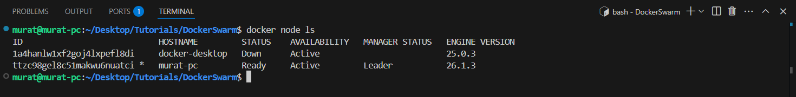

Node adı öğrenildikten sonra örneğin ``docker-desktop`` adlı node için aşağıdaki komut ile etiket verilebilir.

```bash
docker node update --label-add type=windows-docker docker-desktop
```

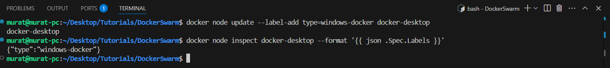

Bu komutla docker-desktop artık type=windows-docker etiketini taşır.

Tanımlamış olduğumuz bu etiketi aşağıdaki örnek komutta olduğu gibi kullanabiliriz.

```
docker service create \
  --name nginx-service \
  --constraint 'node.labels.type == windows-docker' \
  nginx:latest
```

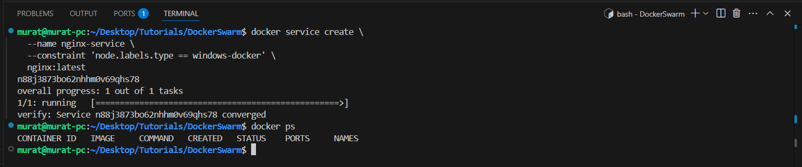

Görselde görüldüğü gibi başarılı bir şekilde service oluşturulmuştur. Manager Node üzerinden herhangi bir konteyner oluşmamıştır. Ancak ``Worker Node`` bakıldığında oluşturulmuş olan konteynerın(servis'in) çalıştığı görülmektedir.

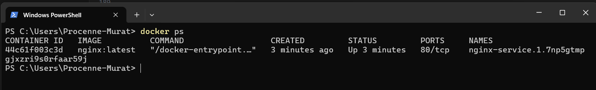

Oluşturulmuş olan etiketin silinmesi amacıyla aşağıdaki işlem adımları uygulanabilir;
Etiketin görülmesi amacıyla;
```bash
docker node inspect docker-desktop --format '{{ json .Spec.Labels }}'
```
Etiketin silinmesi amacıyla;
```bash
docker node update --label-rm type docker-desktop
```
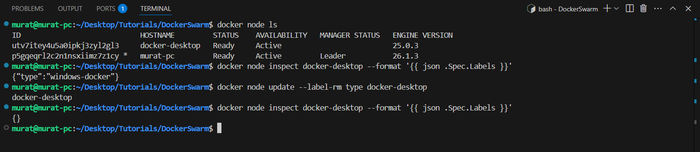

## Docker Swarm - Otomatik Yeniden Başlatma (Restart Policy)

Docker Swarm üzerinde çalışan bir servis'in hata veya beklenmedik bir durum ile karşılaşması durumunda **restart policy** (otomatik yeniden başlatma politikası) devere girer. Bu özellik sayesinde, servisler çökse bile otomatik olarak yeniden başlatılır ve sistem ayakta tutulur. Böylece servis tarafından sağlanan hizmet devam eder.

Bu özellikler;

* Servis çöktüğünde manuel müdahale gerektirmemesi için
* Yüksek erişilebilirlik (high availability) sağlamak için
* Kullanıcıların kesinti yaşamaması için
gereklidir.

Bu özelliğin temel anlamda kullanımı aşağıdaki gibidir;
İlk öncelikle örnek bir servis oluşturalım;

```
docker service create \
  --name hata-servisi \
  --restart-condition on-failure \
  --restart-delay 5s \
  --restart-max-attempts 3 \
  hata-test:v1
```
Komutu kullanılabilir. 
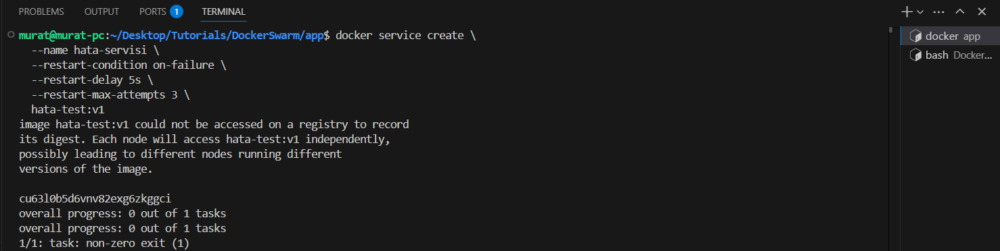

Bu komutta kullanılan ``hata-test:v1`` image oluşturulması amacıyla aşağıdaki Dockerfile ve app.py kullanabilirsiniz;

**Dockerfile**

```dockerfile
# Dockerfile
FROM python:3.11-slim

WORKDIR /app

COPY app.py .

CMD ["python", "app.py"]
```

**app.py**
```python
# app.py
import time

print("⚠️  Uygulama başlatıldı...")
time.sleep(3)
print("💥 HATA! Simüle edilmiş bir çökme")
exit(1)

```

Servisinde durumunun gözlenmesi amacıyla ``docker service ps hata-servisi`` komutu kullanılır. 
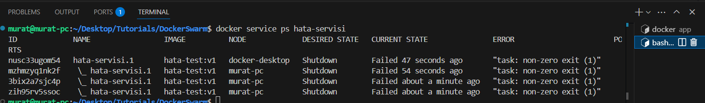

``task: non-zero exit (1)`` hatasının üç defa verildiğinde görev sonlandırılır.

Bu uygulamada şunu test etmiş olduk;

* ``exit(1)`` → uygulama bilinçli hata verdi,
* Docker Swarm → hatayı gördü ve yeniden başlattı,
* 5 saniye bekledi, 3 kez denedi → sonunda durdu.

