# Zabbix, Grafana ve Prometheus ile İzleme Mimarisi: Docker Ortamında Uygulamalı Senaryolar -2

Selamlar konu özelinde bir önceki blog yazıma [Buradan](https://medium.com/@muratasnb/zabbix-grafana-ve-prometheus-ile-i%CC%87zleme-mimarisi-docker-ortam%C4%B1nda-uygulamal%C4%B1-senaryolar-9504e67c6fb2) ulaşabilirsiniz.


### Senaryo-6 - PostgreSQL Veritabanı İzleme (Zabbix Agent + Template)

Bu senaryoda Postgresql veritabanınba ait bilgilerin zabbix üzerinden izlenmesine izin vermektedir. Bu bilgiler aşağıdaki gibidir;

* Veritabanı durumu (çalışıyor mu?)
* Bağlantı sayısı
* Disk alanı
* Commit oranları
* Sorgu istatistikleri (opsiyonel)

Bu senaryo için gerekli olan birleşenler aşağıdaki tablodfaki gibidir;

| Bileşen                 | Açıklama                          |
|-------------------------|-----------------------------------|
| Zabbix Server           | İzleme merkezi                    |
| Zabbix Agent            | PostgreSQL sunucusunda kurulu    |
| PostgreSQL              | İzlenecek servis                  |
| Template DB PostgreSQL  | Zabbix’in resmi şablonu           |

Postgresql izlenebilir hale getirilebilmesi amacıyla ``pg_hba.conf`` zabbix agent erişimi eklenir;

```conf
host    all             zabbix          127.0.0.1/32            md5
```
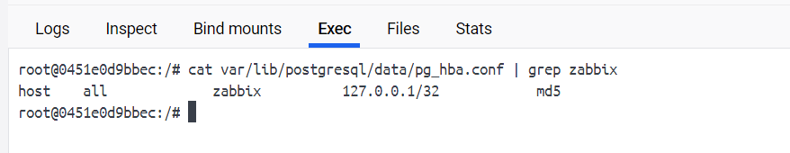

``postgresql.conf`` içerisinde ``listen_addresses`` kontrol edilir.

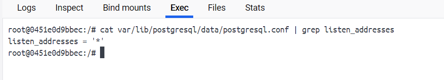

Zabbix için postgresql 'de bir kullanıcı oluşturulması amacıyla aşağıdaki sql komutu kullanılır;

```sql
CREATE USER zabbix WITH PASSWORD 'zabbixpassword';
GRANT SELECT ON pg_stat_database TO zabbix;
```
Zabbix-agent üzerinden ``psql`` komutu kullanılanırak erişim kontrol edilir;

```bash
psql -U zabbix -d zabbix -h postgres -p 5432 -c 'SELECT 1;'
```

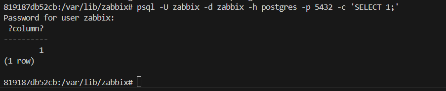

``http://localhost:8080/`` adresi üzerinde zabbix 'e login olunur. Login olma işleminde kullanıcı adı ``admin``, parolası ise ``zabbix`` kullanılır. 

Zabbix üzerinden postgresql tanımlanması amacıyla ``Configuration → Hosts → Create Host`` açılan pencere üzerinden aşağıdaki değerler girilir;

* **Host name**: ``Postgresql``
* **Templates**: ``PostgreSQL by Zabbix agent``

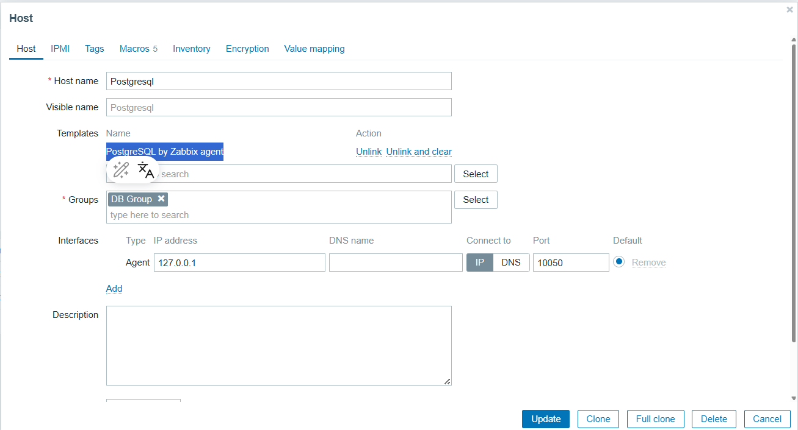

**Macros** değerleri aşağıdaki gibidir;

| Macro            | Değer               |
| ---------------- | ------------------- |
| `{$PG.HOST}`     | `127.0.0.1` veya IP |
| `{$PG.PORT}`     | `5432`              |
| `{$PG.USER}`     | `zabbix`            |
| `{$PG.PASSWORD}` | `zabbix_pass`       |
| `{$PG.DB}`       | `zabbix`            |

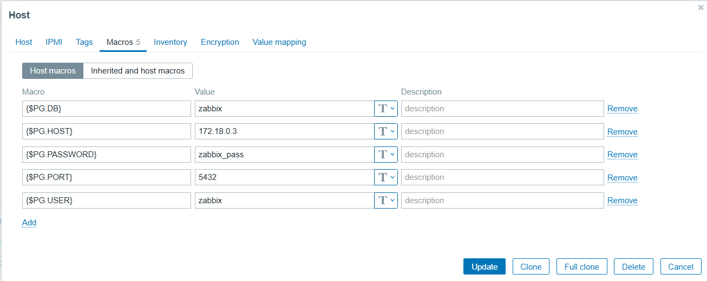

Gelen veriler ``Monitoring → Latest data → Host → PostgreSQL`` yolu üzerinden görüntülenebilir.


### Senaryo-7 - Log İzleme ve Alarm Üretme (Grafana Loki + Alertmanager)

Bu senaryoda Promtail, Loki, Grafana ve Alertmanager bileşenleri ile log toplama ve belirli hatalarda alarm üretme işlemini belirli bir örnek üzerinden adım adım anlatacağım. Bu işlem için kullanılacak olan birleşenler aşağıdaki gibidir;

* **Grafana** – logları görselleştirmek ve alarmları tanımlamak için
* **Loki** – log verilerini saklamak ve sorgulamak için
* **Promtail** – log dosyalarını okuyup Loki’ye göndermek için
* **Alertmanager** – belirlenen koşullarda alarm üretmek için

Bu senaryonun gerçekleştirile bilmesi amacıyla yeni bir docker ortamı kuruyoruz.
``docker-compose.yml``
```yaml
version: "3.7"

services:
  grafana:
    image: grafana/grafana:latest
    ports:
      - "3000:3000"
    volumes:
      - grafana-storage:/var/lib/grafana
    environment:
      - GF_SECURITY_ADMIN_USER=admin
      - GF_SECURITY_ADMIN_PASSWORD=admin
    depends_on:
      - loki

  loki:
    image: grafana/loki:2.9.0
    ports:
      - "3100:3100"
    command: -config.file=/etc/loki/loki-config.yaml
    volumes:
      - ./config/loki-config.yaml:/etc/loki/loki-config.yaml
      - ./loki-data/index:/tmp/loki/index
      - ./loki-data/cache:/tmp/loki/cache
      - ./loki-data/chunks:/tmp/loki/chunks
      - ./loki-data/compactor:/tmp/loki/compactor
      - ./loki-data/rules:/tmp/loki/rules
      - ./loki-data/wal:/tmp/loki/wal

  promtail:
    image: grafana/promtail:2.9.0
    volumes:
      - /var/log:/var/log
      - ./config/promtail-config.yaml:/etc/promtail/promtail.yaml
    command: -config.file=/etc/promtail/promtail.yaml
    depends_on:
      - loki

  alertmanager:
    image: prom/alertmanager
    ports:
      - "9093:9093"
    volumes:
      - ./config/alertmanager.yml:/etc/alertmanager/alertmanager.yml
    command:
      - '--config.file=/etc/alertmanager/alertmanager.yml'

volumes:
  grafana-storage:

```
``docker-compose.yml`` **Amaçı**

Sistemdeki birleşenlerin çalışabilmesi amacıyla kullanılan yaml dosyasıdır.

``config/loki-config.yaml``
```yaml
auth_enabled: false

server:
  http_listen_port: 3100
  grpc_listen_port: 9095

ingester:
  lifecycler:
    ring:
      kvstore:
        store: inmemory
      replication_factor: 1
  chunk_idle_period: 5m
  max_chunk_age: 1h
  chunk_block_size: 262144
  flush_op_timeout: 10s
  wal:
    enabled: true
    dir: /tmp/loki/wal

schema_config:
  configs:
    - from: 2022-01-01
      store: boltdb-shipper
      object_store: filesystem
      schema: v11
      index:
        prefix: index_
        period: 24h

storage_config:
  boltdb_shipper:
    active_index_directory: /tmp/loki/index
    cache_location: /tmp/loki/cache
    shared_store: filesystem

  filesystem:
    directory: /tmp/loki/chunks

compactor:
  working_directory: /tmp/loki/compactor
  shared_store: filesystem

limits_config:
  enforce_metric_name: false
  reject_old_samples: true
  reject_old_samples_max_age: 168h

ruler:
  storage:
    type: local
    local:
      directory: /tmp/loki/rules
  rule_path: /tmp/loki/rules
  alertmanager_url: http://alertmanager:9093
  ring:
    kvstore:
      store: inmemory
  enable_api: true

```
``config/loki-config.yaml`` **Amaçı**

Loki log toplama sisteminin ana yapılandırma dosyasıdır.

**Görevleri**

* HTTP/GRPC portlarını tanımlar.
* Log verilerinin nasıl saklanacağını (filesystem, boltdb-shipper) belirtir.
* Log indeksleme şeması (schema_config) ayarlanır.
* Ruler bileşeniyle alarm kurallarının nasıl çalışacağı tanımlanır.
* WAL (Write Ahead Log) gibi performans bileşenlerini etkinleştirir.

``config/promtail-config.yaml``
```yaml
server:
  http_listen_port: 9080
  grpc_listen_port: 0

positions:
  filename: /tmp/positions.yaml

clients:
  - url: http://loki:3100/loki/api/v1/push

scrape_configs:
  - job_name: myapp
    static_configs:
      - targets:
          - localhost
        labels:
          job: myapp
          __path__: /var/log/myapp.log

```
``config/promtail-config.yaml`` **Amaçı**

Promtail’in hangi log dosyalarını okuyup, Loki’ye göndereceğini tanımlar.

**Görevleri**

* ``Promtail`` için HTTP servis portlarını tanımlar.
* Hangi log dosyalarının okunacağını ve bunların Loki’ye nasıl etiketleneceğini belirtir.

``config/alertmanager.yml``
```yaml
global:
  resolve_timeout: 5m

route:
  receiver: 'default'

receivers:
  - name: 'default'
    webhook_configs:
      - url: 'http://localhost:5001/alert'

```
``config/alertmanager.yml`` **Amaçı**

Alertmanager’ın alarmları nasıl işleyeceğini, nereye göndereceğini tanımlar.

**Görevleri**
* Alarmı alan "receiver" yapılarını tanımlar.
* Alarm gruplandırma ve tekrar sıklığı gibi routing seçeneklerini belirler.
* Alarm çıktısının Slack, webhook, e-posta gibi sistemlere iletilmesini sağlar.

``config/rules/alert-rule.yaml``

```yaml
groups:
  - name: myapp-log-alerts
    rules:
      - alert: MyAppHighErrorRate
        expr: count_over_time({job="myapp"} |= "ERROR" [1m]) > 0
        for: 10s
        labels:
          severity: critical
        annotations:
          summary: "HATA: Log dosyasında ERROR bulundu"
          description: "Son 1 dakika içinde en az bir ERROR logu oluştu."

```

``config/rules/alert-rule.yaml`` **Amaçı**

Alertmanager’ın alarmları nasıl işleyeceğini, nereye göndereceğini tanımlar.

**Görevleri:**

* Alarmı alan "receiver" yapılarını tanımlar.
* Alarm gruplandırma ve tekrar sıklığı gibi routing seçeneklerini belirler.
* Alarm çıktısının Slack, webhook, e-posta gibi sistemlere iletilmesini sağlar.

İlk öncelikle promtail container içerisinde aşağıdaki bash dosyasını çalıştırılır.
``/usr/local/bin/log-generator.sh``
```bash
#!/bin/bash

LOG_FILE="/var/log/myapp.log"
mkdir -p "$(dirname "$LOG_FILE")"

echo "Log generator started..."

while true; do
  echo "$(date '+%Y-%m-%d %H:%M:%S') INFO: Her şey normal" >> $LOG_FILE
  sleep 5
  echo "$(date '+%Y-%m-%d %H:%M:%S') ERROR: Veritabanı bağlantısı kesildi!" >> $LOG_FILE
  sleep 10
done
```
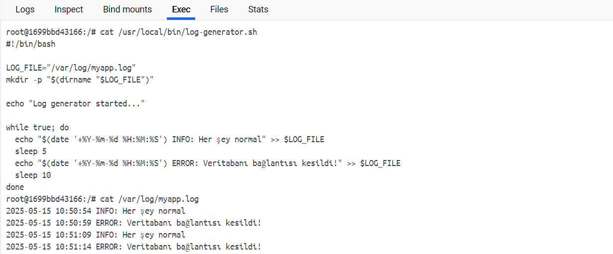

Grafana üzerinden ``Configuration → Data Sources → Add data source`` yolu izlenerek ``Loki`` data sources eklenir.

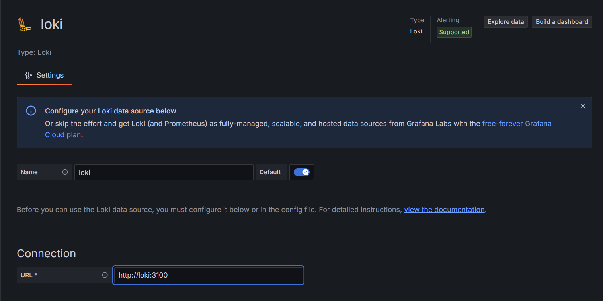

Konu özelinde Grafana üzerinden görüntülenebilmesi ``Explore > Data source: Loki`` yolu izlebilir.

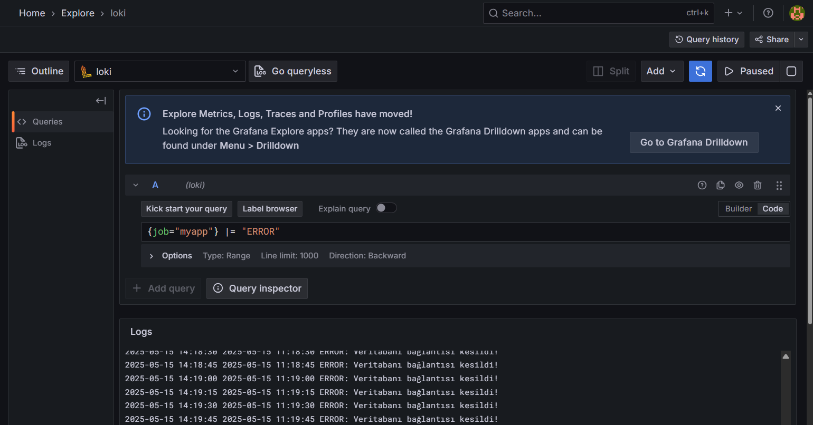

### Senaryo-8 - Konteyner Sayısı Artışı Alarmı (Prometheus Alert Rules)

Bu senaryoda konteyner sayıları düzenli olarak kontrole edilecek ve bu sayı 10 'u geçtiğinde alarm verilmesi sağlanacaktır.
Bu uygulamanın gerçekleşmesi amacıyla ilk blog yazımda kullanmış olduğum docker-compose düzenlenmesi gerekmektedir.
İlk olarak ``prometheus.yml`` dosyası aşağıdaki gibi düzenlenir.

```yaml
global:
  scrape_interval: 15s

scrape_configs:
  - job_name: 'cadvisor'
    static_configs:
      - targets: ['cadvisor:8080']

  - job_name: 'node-exporter'
    static_configs:
      - targets: ['node-exporter:9100']
rule_files:
  - "alert.rules.yml"
```

``prometheus/alert.rules.yml`` dosyası oluşturulur. içeriği;

```yaml
groups:
  - name: docker_alerts
    rules:
      - alert: TooManyContainersRunning
        expr: count(container_last_seen) > 10
        for: 1m
        labels:
          severity: warning
        annotations:
          summary: "Container sayısı 10'u geçti"
          description: "Toplam çalışan container sayısı: {{ $value }}"

```
``docker-compose.yml`` prometheus konteynerına ``- ./prometheus/alert.rules.yml:/etc/prometheus/alert.rules.yml`` volume eklenir.

bütün sistem çalıştırılır. Hali hazırda şuan çalışan 6 adet container bulunmaktadır.

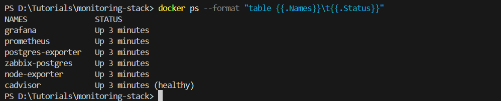

``http://localhost:9090/alerts`` adresi üzerinden var olan alarmlar bulunmaktadır.
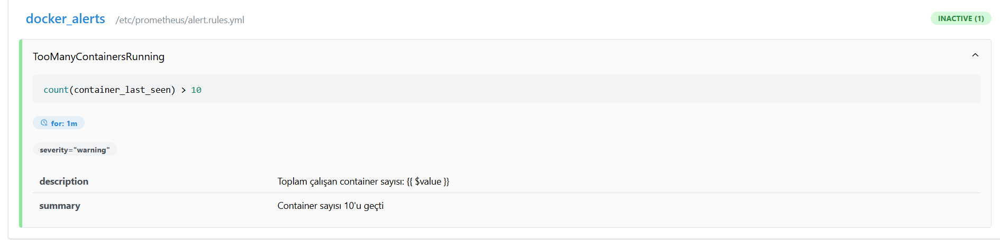
Görselde görüldüğü **Durum:** ``INACTIVE (1)`` bu ne anlama geliyor;
* Prometheus alarm kurallarını başarıyla değerlendirdi 
* Şu anda çalışan container sayısı **10 veya daha az**
* Dolayısıyla ``expr: count(container_last_seen) > 10`` koşulu **sağlanmıyor**

Container sayısı 10'u geçtiği durumlar da ise aşağıdaki görselde görüldüğü gibi hata ile karşılaşılır. Bir dakikadan fazla sürew geçtiğinde aşağıdaki görseldeki gibi alarm görüntülenir.

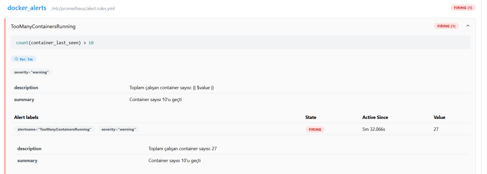

### Senaryo-9 - Disk Dolu Uyarısı (Zabbix)

Bu senaryoda Zabbix Agent üzerinden disk doluluk oranı izlenmesi ve %90 üzerine çıktığında ise uyarı iletilebilmesi adım adım anlatacağım. Bu senaryodaki hedef;

* Zabbix Agent, host sistemdeki disk kullanımını izlesin
* Eğer disk doluluk oranı %90’ı aşarsa → trigger tetiklensin
* Uyarı gönderilsin (Zabbix üzerinden)

Ortamın oluşturulması amacıyla docker-compose.yml içerisinde değişiklikler gerekmektedir. ``zabbix-agent`` container'ına volume olarak ``- /:/mnt/rootfs:ro`` eklenmeli ve ``environment`` içerisine aşağıdaki değişkenler eklenir.
```yml
ZBX_SERVER_HOST: zabbix-server
ZBX_HOSTNAME: docker-host
```

Bu işlemlerin ardından zabbix web arayüzüne ``http://localhost:8080`` adresinden bağlanılır. ``Configuration → Hosts`` yolu ile izlenerek host oluşturulabilir. Gerekli değerler aşağıdaki gibidir;

| Alan                | Değer                                      |
| ------------------- | ------------------------------------------ |
| **Host name**       | `docker-host`                              |
| **Visible name**    | `docker-host` *(isteğe bağlı)*             |
| **Groups**          | `Linux servers` veya özel bir grup oluştur |
| **Agent interface** | IP: `zabbix-agent`, Port: `10050`          |

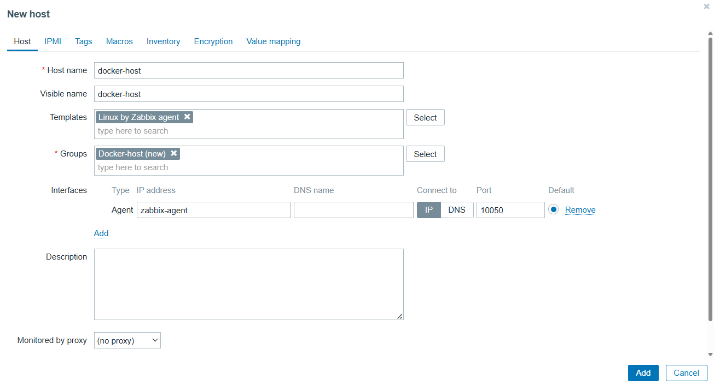

Bu işlemind ardından ``Configuration → Hosts → docker-host → Items → Create Item`` yolu ile yeni bir item oluşturulabilir. Gerekli değerler aşağıdaki gibidir;
| Alan                | Değer                                                                 |
| ------------------- | --------------------------------------------------------------------- |
| **Name**            | PostgreSQL Disk Boş Alan (%)                                          |
| **Type**            | Zabbix agent                                                          |
| **Key**             | `vfs.fs.size[/mnt/rootfs/var/lib/docker/volumes/monitoring-stack_pg_data/_data,pfree]` |
| **Type of Info**    | Numeric (float)                                                       |
| **Units**           | %                                                                     |
| **Update Interval** | 60s                                                                   |

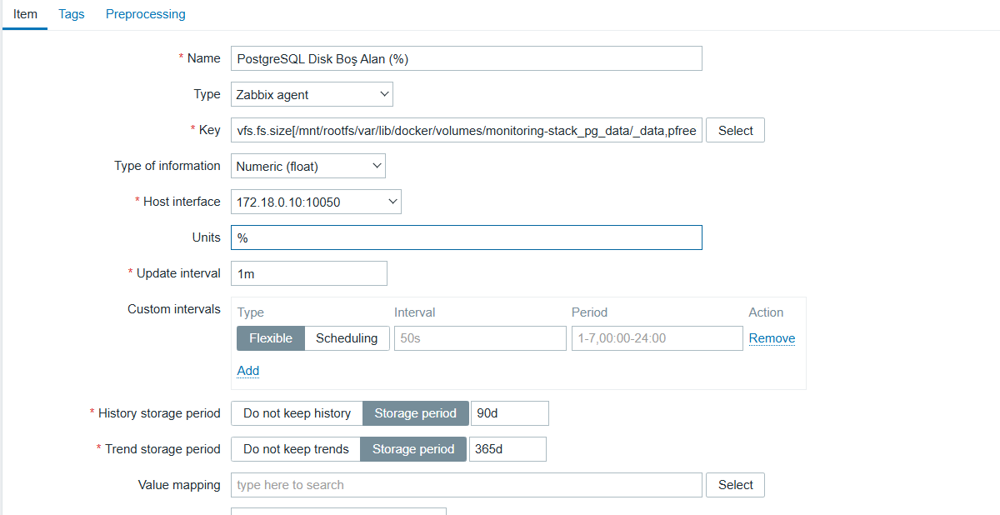

Bu işlemin ardından triggers oluşturulması amacıyla ``Triggers → Create Trigger`` yolu üzerinden açılan pencere üzerinden aşağıdaki değerler girilir.

| Alan          | Değer                                                                                                                                                      |
|---------------|-------------------------------------------------------------------------------------------------------------------------------------------------------------|
| **Name**      | PostgreSQL Disk %90’dan fazla dolu                                                                                                                         |
| **Expression**| `last(/docker-host/vfs.fs.size[/mnt/rootfs/var/lib/docker/volumes/monitoring-stack_pg_data/_data,pfree])<10 and last(/docker-host/vfs.fs.inode[/mnt/rootfs/run/desktop/mnt/host/wslg/distro,pfree])=0` |
| **Severity**  | High                                                                                                                                                       |


Bu işlemin test edilebilmesi amacıyla ``dd if=/dev/zero of=/var/lib/docker/volumes/pg_data/_data/fake.img bs=1M count=10000`` komutu kullanılabilir. Yapılan işlemin alarmı e-posta adresine göndermesi için zabbix üzerinden ``Administration → Media Types → Email`` yolu izlenere SMTP sunucus kullanılabilir.

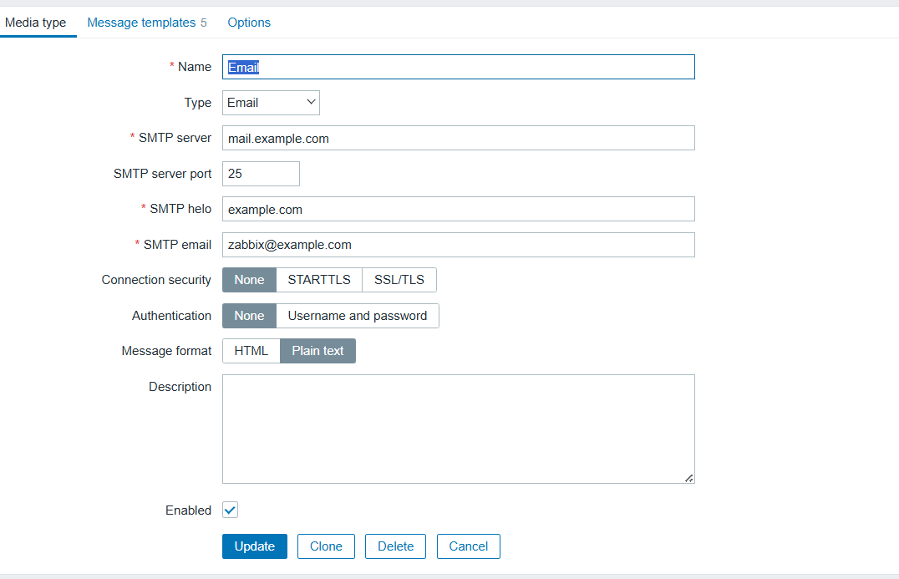

### Senaryo-10 - Karma Dashboard: Zabbix + Prometheus (Grafana Mixed)

Bu senaryoda Grafana arayüzünden hem zabbix hemde prometheus tarafından alınan verilerin tek bir dashboard üzerinde nasıl görülebileceğini işleyeceğiz. Bu işlem için ilk öncelik ``Data Sources`` kısmında Zabbix ve prometheus 'un yüklü olduğundan emin olun.

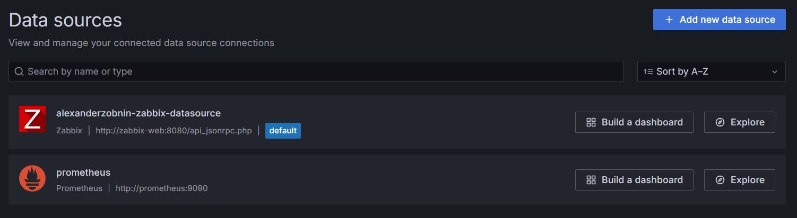

Yeni bir dashboard oluşturmak için ``Add → Dashboard → Add new panel`` yolu izlenerek aşağıdaki değerleri girilir.

* Panel Type: **Mixed**
* Query A: ``Prometheus``
```
count(container_last_seen)
```
* Query B: ``Zabbix``
* Host: ``docker-host``
* Item: ``vfs.fs.size[/mnt/rootfs/run/desktop/mnt/host/wslg/distro,pfree]`` (disk alanı)

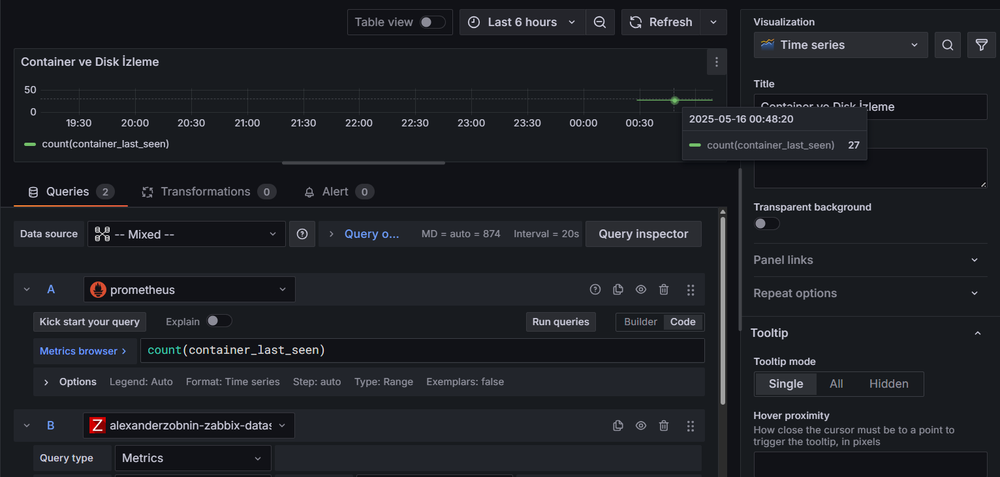
