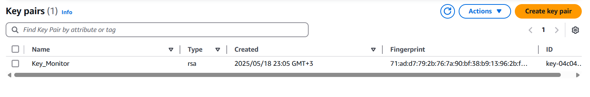
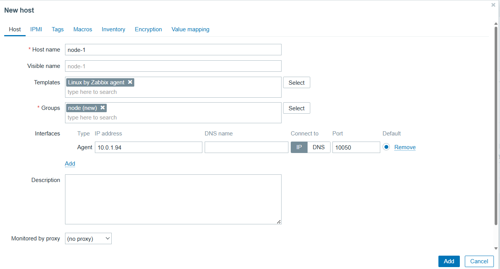
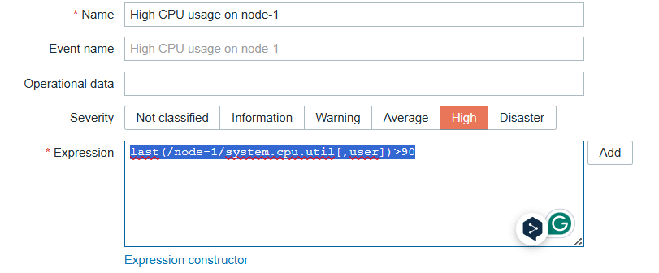
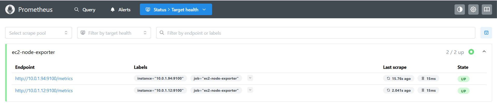
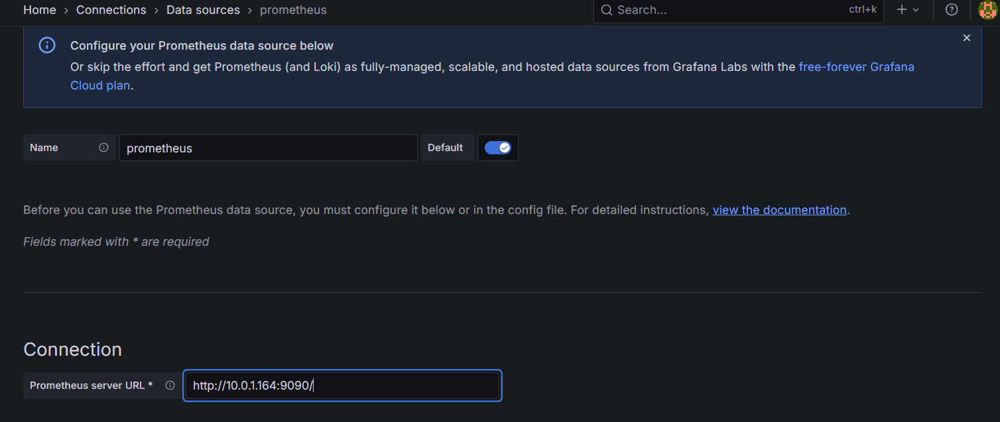
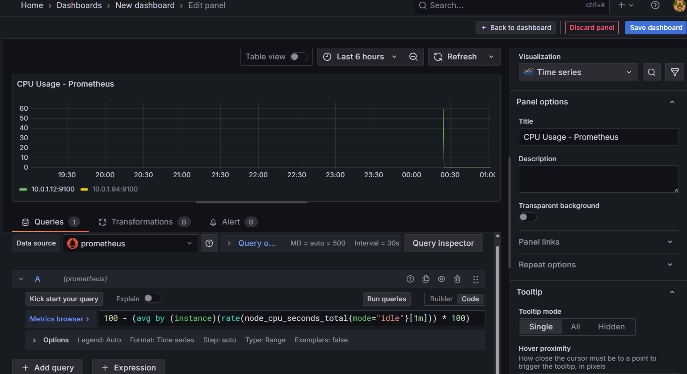
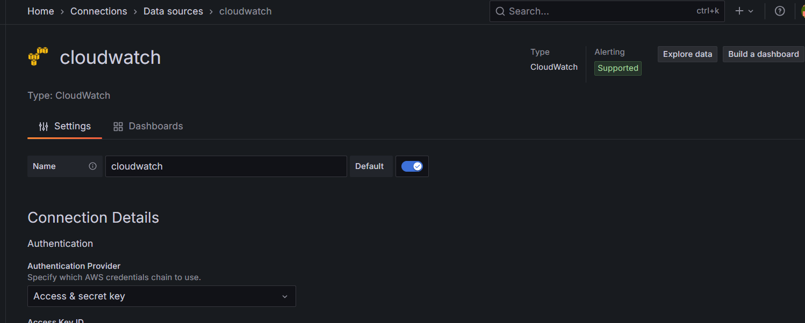
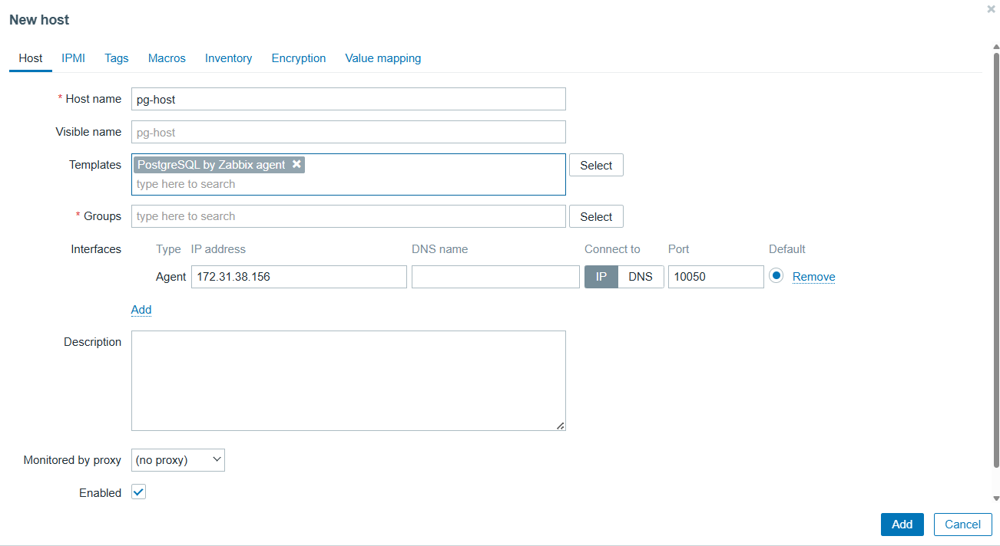
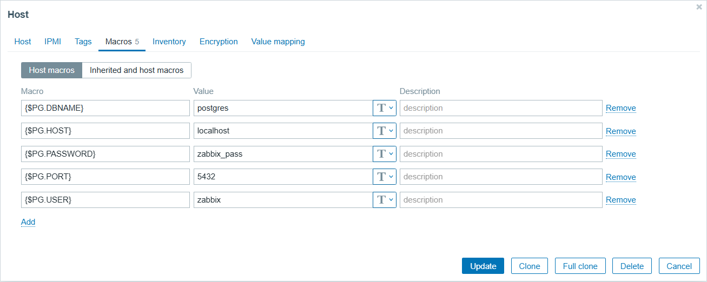
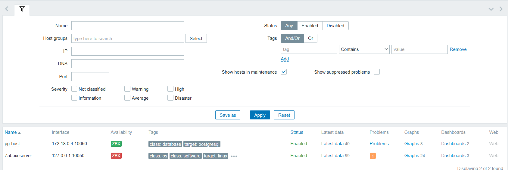

# AWS İzleme Stratejileri: Zabbix, Prometheus ve Grafana ile 5 Uygulamalı Senaryo

Cloud altyapılarında izleme (monitoring), sistem kararlılığı ve operasyonel verimlilik için önemli bir birleşendir. Bu blog yazısın da, AWS Cloud üzerinde, Zabbix, Prometheus ve Grafana gibi popüler açık kaynaklı izleme araçlarının nasıl birlikte veya ayrı ayrı kullanılabileceğini 5 farklı uygulamalı senaryo ile ele alacağız.


Aşağıdaki tabloda senaryoların başlık ve açıklamalarını özet olarak bulabilirsiniz:

| Senaryo No | Senaryo Adı                                                                 | Açıklama                                                                                                                                                          |
|------------|------------------------------------------------------------------------------|-------------------------------------------------------------------------------------------------------------------------------------------------------------------|
| 1          | EC2 Kaynak İzleme (Zabbix + Prometheus)                                     | AWS EC2 instance’larının CPU, RAM, disk ve ağ kullanımı Zabbix agent ve Prometheus node_exporter kullanılarak izlenir. Alarmlar ve grafik paneller oluşturulur.  |
| 2          | CloudWatch Loglarının Grafana ile Görselleştirilmesi                        | AWS CloudWatch logları ve metrikleri Grafana’ya entegre edilerek Lambda, RDS ve API Gateway gibi servislerin performansı analiz edilir.                          |
| 3          | PostgreSQL İzleme (Zabbix Agent + Template)                                 | Docker içinde çalışan PostgreSQL veritabanı, Zabbix’in resmi PostgreSQL şablonlarıyla izlenir. Disk doluluk, bağlantı sayısı ve sorgu yoğunluğu takip edilir.     |
| 4          | EKS Kümelerinde Prometheus ile Kubernetes İzleme                           | AWS EKS üzerinde çalışan Pod, Node ve Container'lar Prometheus stack ile izlenir. Kube-state-metrics ve node-exporter ile metrikler toplanır, alert kuralları eklenir. |
| 5          | SLA Takibi ve Uptime Monitoring (Zabbix + Route53 + Grafana)                | EC2 üzerindeki uygulamaların HTTP servis durumu ve port kontrolleri yapılır. Route53 health check ve Zabbix HTTP item’larıyla SLA izlenir, Grafana ile raporlanır. |


Zabbix, Grafana ve prometheus özelindeki yazıma [Buradan](https://medium.com/@muratasnb/zabbix-grafana-ve-prometheus-ile-i%CC%87zleme-mimarisi-docker-ortam%C4%B1nda-uygulamal%C4%B1-senaryolar-2-889dd52f6f3f) ulaşabilirsiniz. Hadi şimdi ilk senaryomuz ile başlayalım.

## 🔧 1. EC2 Sunucularının CPU, RAM ve Disk Kullanımının İzlenmesi (Zabbix + Prometheus)

AWS üzerinde sunucuların kurulması ve yapılandırılması AWS console üzerinden yapılabilmektedir. Ancak bu işlem uzun sürebilir ve hata yapılabilir bu nedenle AWS üzerinde kurulacak olan sistemlerde hızlı ve hatasız kurmak için terraform kullanılabilir. Terraform kullanımı hakkındaki yazılarıma [buradan](https://medium.com/@muratasnb/terrafrom-infrastructure-as-code-iac-kavram%C4%B1-a9e60b0bd7f8) ulaşabilirsiniz.

İlk öncelikle AWS EC2 instance 'a bağlanılabilmesi amacıyla kullanılabilecek anatarın AWS Console üzerinden ``EC2 > Network & Security > Key Pairs`` yolu izlenerek ``Create key pair`` butonu ile yeni bir anahtar üretilebilir. Açılan pencere üzerinden anahtar üretilir. 



Bu senaryo için terraform kullanacağımı belirtmiştim. Altyapının oluşturulması için gerekli olan dosyalar aşağıdaki gibidir;

**Dizin**

```
terraform-zabbix-monitoring/
├── main.tf
├── variables.tf
├── outputs.tf
└── user_data/
    ├── zabbix_prometheus.sh
    └── node_exporter.sh
```

**main.tf**
```
provider "aws" {
  region                  = "us-east-1"
  shared_credentials_files = ["~/.aws/credentials"]
  profile                 = "vscode"
}
# VPC
resource "aws_vpc" "main_vpc" {
  cidr_block = "10.0.0.0/16"
}

resource "aws_subnet" "main_subnet" {
  vpc_id     = aws_vpc.main_vpc.id
  cidr_block = "10.0.1.0/24"
  map_public_ip_on_launch = true   # ❗ Bu satır önemli
}

resource "aws_internet_gateway" "gw" {
  vpc_id = aws_vpc.main_vpc.id
}

resource "aws_route_table" "route_table" {
  vpc_id = aws_vpc.main_vpc.id

  route {
    cidr_block = "0.0.0.0/0"
    gateway_id = aws_internet_gateway.gw.id
  }
}

resource "aws_route_table_association" "route_assoc" {
  subnet_id      = aws_subnet.main_subnet.id
  route_table_id = aws_route_table.route_table.id
}

# Security Group
resource "aws_security_group" "monitoring_sg" {
  name        = "monitoring-sg"
  description = "Allow SSH, Zabbix, Prometheus, Grafana"
  vpc_id      = aws_vpc.main_vpc.id

  ingress {
    from_port   = 22
    to_port     = 22
    protocol    = "tcp"
    cidr_blocks = ["0.0.0.0/0"]
  }

  # Zabbix agent
  ingress {
    from_port   = 10050
    to_port     = 10051
    protocol    = "tcp"
    cidr_blocks = ["0.0.0.0/0"]
  }

  # Node Exporter
  ingress {
    from_port   = 9100
    to_port     = 9100
    protocol    = "tcp"
    cidr_blocks = ["0.0.0.0/0"]
  }

  # Node Exporter
  ingress {
    from_port   = 8080
    to_port     = 8080
    protocol    = "tcp"
    cidr_blocks = ["0.0.0.0/0"]
  }

  # Node Exporter
  ingress {
    from_port   = 5433
    to_port     = 5433
    protocol    = "tcp"
    cidr_blocks = ["0.0.0.0/0"]
  }

  # Prometheus
  ingress {
    from_port   = 9090
    to_port     = 9090
    protocol    = "tcp"
    cidr_blocks = ["0.0.0.0/0"]
  }

  # Grafana
  ingress {
    from_port   = 3000
    to_port     = 3000
    protocol    = "tcp"
    cidr_blocks = ["0.0.0.0/0"]
  }

  egress {
    from_port   = 0
    to_port     = 0
    protocol    = "-1"
    cidr_blocks = ["0.0.0.0/0"]
  }
}

# Zabbix + Grafana + Prometheus Server
resource "aws_instance" "monitoring_server" {
  ami           = "ami-0fc5d935ebf8bc3bc" # Ubuntu 22.04 (Frankfurt)
  instance_type = var.instance_type
  subnet_id     = aws_subnet.main_subnet.id
  key_name      = var.key_name
  security_groups = [aws_security_group.monitoring_sg.id]

  user_data = file("user_data/zabbix_prometheus.sh")

  tags = {
    Name = "monitoring-server"
  }
}

# İzlenecek EC2'ler
resource "aws_instance" "monitored_node" {
  count         = 2
  ami           = "ami-0fc5d935ebf8bc3bc"
  instance_type = var.instance_type
  subnet_id     = aws_subnet.main_subnet.id
  key_name      = var.key_name
  security_groups = [aws_security_group.monitoring_sg.id]

  user_data = file("user_data/node_exporter.sh")

  tags = {
    Name = "monitored-node-${count.index + 1}"
  }
}
```

**variables.tf**
```
variable "region" {
  default = "eu-central-1"
}

variable "instance_type" {
  default = "t2.micro"
}

variable "key_name" {
  default = "Key_Monitor"
}
```

**outputs.tf**
```
output "monitoring_server_public_ip" {
  value = aws_instance.monitoring_server.public_ip
}

output "monitored_nodes_ips" {
  value = [for node in aws_instance.monitored_node : node.public_ip]
}
```

**user_data/zabbix_prometheus.sh**
```
#!/bin/bash
# Zabbix
apt update && apt install -y zabbix-server-mysql zabbix-frontend-php zabbix-apache-conf zabbix-agent

# Prometheus
useradd --no-create-home --shell /bin/false prometheus
mkdir /etc/prometheus /var/lib/prometheus

cat <<EOF > /etc/prometheus/prometheus.yml
global:
  scrape_interval: 15s
scrape_configs:
  - job_name: 'ec2-node-exporter'
    static_configs:
      - targets: ['10.0.1.101:9100','10.0.1.102:9100']
EOF

wget https://github.com/prometheus/prometheus/releases/latest/download/prometheus-3.4.0.linux-amd64.tar.gz
tar xvf prometheus-3.4.0.linux-amd64.tar.gz
mv prometheus-3.4.0.linux-amd64/prometheus /usr/local/bin/
nohup prometheus --config.file=/etc/prometheus/prometheus.yml &

# GPG key ve repo ekle
sudo apt update
sudo apt install -y gnupg2 curl software-properties-common

sudo mkdir -p /etc/apt/keyrings
curl -fsSL https://apt.grafana.com/gpg.key | gpg --dearmor | sudo tee /etc/apt/keyrings/grafana.gpg > /dev/null

echo "deb [signed-by=/etc/apt/keyrings/grafana.gpg] https://apt.grafana.com stable main" | \
  sudo tee /etc/apt/sources.list.d/grafana.list

# Paket listesi güncelle ve kur
sudo apt update
sudo apt install -y grafana

# Servisi başlat ve etkinleştir
sudo systemctl start grafana-server
sudo systemctl enable grafana-server

sudo apt update -y
sudo apt install -y docker.io docker-compose

# Docker çalışsın
sudo systemctl enable docker
sudo systemctl start docker

# Zabbix için klasör oluştur
sudo mkdir -p /opt/zabbix
sudo cd /opt/zabbix

sudo cat <<EOF > docker-compose.yml
version: '3.7'

services:
  zabbix-server:
    image: zabbix/zabbix-server-pgsql:alpine-6.0-latest
    container_name: zabbix-server
    depends_on:
      - postgres
    environment:
      DB_SERVER_HOST: postgres
      POSTGRES_USER: zabbix
      POSTGRES_PASSWORD: zabbix_pass
      POSTGRES_DB: zabbix
    ports:
      - "10051:10051"
    restart: unless-stopped

  zabbix-web:
    image: zabbix/zabbix-web-apache-pgsql:alpine-6.0-latest
    container_name: zabbix-web
    depends_on:
      - zabbix-server
      - postgres
    environment:
      DB_SERVER_HOST: postgres
      POSTGRES_USER: zabbix
      POSTGRES_PASSWORD: zabbix_pass
      POSTGRES_DB: zabbix
      ZBX_SERVER_HOST: zabbix-server
      PHP_TZ: Europe/Istanbul
    ports:
      - "8080:8080"
    restart: unless-stopped

  zabbix-agent:
    image: zabbix/zabbix-agent:alpine-6.0-latest
    container_name: zabbix-agent
    depends_on:
      - zabbix-server
    environment:
      ZBX_SERVER_HOST: zabbix-server
      ZBX_HOSTNAME: docker-host
    volumes:
      - /:/mnt/rootfs:ro

  postgres:
    image: postgres:13
    container_name: zabbix-postgres
    environment:
      POSTGRES_USER: zabbix
      POSTGRES_PASSWORD: zabbix_pass
      POSTGRES_DB: zabbix
    ports:
      - "5433:5432"
    volumes:
      - pg_data:/var/lib/postgresql/data
    restart: unless-stopped

volumes:
  pg_data:
EOF

sudo docker-compose up -d

```

**user_data/node_exporter.sh**
```
#!/bin/bash
# Zabbix Agent
apt update && apt install -y zabbix-agent
systemctl start zabbix-agent
systemctl enable zabbix-agent

# Node Exporter
wget https://github.com/prometheus/node_exporter/releases/latest/download/node_exporter-1.8.0.linux-amd64.tar.gz
tar xvf node_exporter-*.tar.gz
mv node_exporter-*/node_exporter /usr/local/bin/
nohup /usr/local/bin/node_exporter &
```

Uygulamanın çalıştırılması amacıyla aşağıdaki komutlar sırasıyla çalıştırılır;

```
terraform init
terraform plan
terraform apply
```

Ortam kurulumunun ardından ilk öncelikle zabbix tarafında host oluşturulması amacıyla zabbix' bağlanılır. Bağlantı için ``http://<zabbix-server-public-ip>:8080`` adresini kullanabilirsiniz. Giriş işlemi için ``Admin`` kullanıcısının parolası ``zabbix`` dir. Host oluşturma işlemi ``Configuration > Hosts`` yolu üzerinden ``Create host`` butonuna tıklanılır.  Doldurulması gereken alanlar;

* **Hostname:** node-1
* **Agent interface IP:** EC2 node'un private IP'si
* **Groups:** Linux servers (veya yeni grup oluştur)
* **Templates:** Template OS Linux by Zabbix agent seç



Bu işlemin ardından Tigger (Alarm) oluşturulması amacıyla ``Configuration > Hosts > node-1 > Triggers`` yolu üzerinden ``Create Trigger`` burtonuna tıklanır. Açılan ekran üzerinden aşağıdaki alanlar doldurulur;

* **Name:** High CPU usage on node-1
* **Expression:**
```
last(/node-1/system.cpu.util[,user])>90
```
* **Severity:** High



Bu tigger sayesinde ``node-1`` için CPU kullanım %90'ı geçtiğinde alarm üretir.

Prometheus tarafında yapılan konfigürasyonların doğruluğundan emin olunması için ``http://<zabbix-server-public-ip>:9090`` üzerinde kontrol edilebilir. 


Bu işlemin ardından grafana dashboard'una ``http://<zabbix-server-public-ip>:3000`` adresi üzerinden bağlanılır. ``admin`` kullanıcısı için ``admin`` parolası kullanılır. Prometheus data sources 'i eklenmesi amacıyla ``Home > Connections > Data sources`` yolu üzerinden arama cubuğuna ``Prometheus`` yazılır. Açılan pencere üzerinden URL kısmına ``http://<zabbix-server-private-ip>:9090``  yazılır ve kaydedilir.


Dashboard oluşturulması amacıyla ``Create > Dashboard > Add panel`` prometheus seçilir. Kullanılacak prompt;

```
100 - (avg by (instance)(rate(node_cpu_seconds_total{mode="idle"}[1m])) * 100)
```


## 2. Grafana ile AWS CloudWatch Loglarının Görselleştirilmesi: Lambda, RDS ve API Gateway İzleme Senaryosu

AWS CloudWatch loglarının görselleştirilmesi amacıyla grafana kullanılabilir. ilk öncelikle bu senaryonun daha iyi anlaşılması amacıyla kullanacağımız kavramları inceleyelim.

**AWS CloudWatch**, AWS kaynaklarının ve uygulamaların performansını izlemek, log toplamak ve alarm oluşturmak için kullanılan merkezi bir gözlemleme (observability) hizmetidir.
* EC2, Lambda, RDS, API Gateway gibi servislerden metrik, log ve event toplar.
* Gerçek zamanlı grafikler, uyarılar ve analiz yapılabilir.

**AWS Lambda**, sunucu kurmadan kod çalıştırmanı sağlayan bir sunucusuz (serverless) hesaplama hizmetidir.Otomatik ölçeklenir, bakım gerektirmez.

**Amazon RDS**, yönetilen bir veritabanı hizmetidir. MySQL, PostgreSQL, MariaDB, Oracle ve SQL Server gibi ilişkisel veritabanlarını barındırır.

* Backup, patching, yüksek erişilebilirlik gibi işlemleri AWS otomatik yapar.
* Uygulamalar için güvenli, performanslı ve ölçeklenebilir veritabanı çözümüdür.

Senaryo ortamının oluşturulması için gerekli olan terraform dosyaları aşağıdaki gibidir;

**Klasör Yapısı**
```
terraform-zabbix-monitoring-2/
├── main.tf
├── variables.tf
├── outputs.tf
├── grafana-user-data.sh
```

**main.tf**
```yml
provider "aws" {
  region                  = "us-east-1"
  shared_credentials_files = ["~/.aws/credentials"]
  profile                 = "vscode"
}

resource "aws_iam_policy" "grafana_cloudwatch_policy" {
  name   = "GrafanaCloudWatchAccess"
  policy = file("cloudwatch-policy.json")
}

resource "aws_iam_user" "grafana_user" {
  name = "grafana-cloudwatch-user"
}

resource "aws_iam_user_policy_attachment" "grafana_attach" {
  user       = aws_iam_user.grafana_user.name
  policy_arn = aws_iam_policy.grafana_cloudwatch_policy.arn
}

resource "aws_iam_access_key" "grafana_key" {
  user = aws_iam_user.grafana_user.name
}

resource "aws_security_group" "grafana_sg" {
  name        = "grafana-sg"
  description = "Allow SSH and Grafana access"
  vpc_id      = var.vpc_id

  ingress {
    from_port   = 22
    to_port     = 22
    protocol    = "tcp"
    cidr_blocks = ["0.0.0.0/0"]
  }

  ingress {
    from_port   = 3000
    to_port     = 3000
    protocol    = "tcp"
    cidr_blocks = ["0.0.0.0/0"]
  }

  egress {
    from_port   = 0
    to_port     = 0
    protocol    = "-1"
    cidr_blocks = ["0.0.0.0/0"]
  }
}

resource "aws_instance" "grafana_ec2" {
  ami                         = "ami-0fc5d935ebf8bc3bc"
  instance_type               = var.instance_type
  key_name                    = var.key_name
  subnet_id                   = var.subnet_id
  vpc_security_group_ids      = [aws_security_group.grafana_sg.id]
  user_data                   = file("grafana-user-data.sh")
  associate_public_ip_address = true

  tags = {
    Name = "grafana-cloudwatch"
  }
}

```

**outputs.tf**
```yml
output "grafana_public_ip" {
  value = aws_instance.grafana_ec2.public_ip
}

output "aws_access_key_id" {
  value = aws_iam_access_key.grafana_key.id
}

output "aws_secret_access_key" {
  value     = aws_iam_access_key.grafana_key.secret
  sensitive = true
}
```

**variables.tf**
```yml
variable "region" {
  default = "eu-central-1"
}

variable "instance_type" {
  default = "t3.micro"
}

variable "key_name" {
  description = "SSH key name"
}

variable "vpc_id" {
  description = "VPC ID"
}

variable "subnet_id" {
  description = "Subnet ID"
}
```

**grafana-user-data.sh**
```yml
#!/bin/bash
apt update
apt install -y docker.io
systemctl start docker
systemctl enable docker

docker run -d --name=grafana -p 3000:3000 grafana/grafana

```

**cloudwatch-policy.json**
```yml
{
  "Version": "2012-10-17",
  "Statement": [
    {
      "Effect": "Allow",
      "Action": [
        "cloudwatch:DescribeAlarms",
        "cloudwatch:GetMetricData",
        "cloudwatch:GetMetricStatistics",
        "cloudwatch:ListMetrics",
        "logs:DescribeLogGroups",
        "logs:GetLogEvents",
        "logs:FilterLogEvents"
      ],
      "Resource": "*"
    }
  ]
}
```
```cloudwatch-policy.json``` dosyası, Grafana'nın AWS CloudWatch kaynaklarına erişmesini sağlayan yetkileri tanımlar.

Alt yapının kurulması amacıyla aşağıdaki komutlar sırasıyla kullanılır;

```
terraform init
terraform plan
terraform apply -var="key_name=senin-key-adin" -var="vpc_id=vpc-xxxx" -var="subnet_id=subnet-xxxx"
```
**Keyname** değerini AWS console üzerinden ``EC2 > Key pair`` üzerinden elde edilebilir. **vpc_id** değeri ise ``VPC > Your VPCs`` üzerinden elde edilebilir.  **subnet_id** depeğeri ise ``VPC > Subnets`` üzerinden elde edilebilir. AWS CLI ile de aşağıdaki komutlar kullanılarak değerler elde edilebilir.

* **key_name**
```
aws ec2 describe-key-pairs --query "KeyPairs[*].KeyName"
```

* **vpc_id**
```
aws ec2 describe-vpcs --query "Vpcs[*].VpcId"
```

* **subnet_id**
```
aws ec2 describe-subnets --query "Subnets[*].SubnetId"
```

Ortam kurulumu tamamlandıktan sonra ``http://<grafana_public_ip>:3000`` adresi üzerinden grafana arayüzüne default kullanıcı adı parola ile bağlanabilirsiniz. İlk öncelikle ``Amazon CloudWatch`` data sources eklenmesi amacıyla ``Connections > Data Sources`` yolu izlenir. ``Add Data Source`` butonuna tıklanır. Arama kısmına ``CloudWatch`` yazılır. Ekleme işleminin tamamlanması amacıyla aşağıdaki değerler girilir;

| Alan                  | Değer                                          |
| --------------------- | ---------------------------------------------- |
| **Auth Provider**     | `Access & secret key`                          |
| **Access Key ID**     | Terraform çıktısındaki `aws_access_key_id`     |
| **Secret Access Key** | Terraform çıktısındaki `aws_secret_access_key` |
| **Default Region**    | `eu-central-1` (veya kendi bölgen)             |



**Access Key ID** ve **Secret Access Key** değerlerini ``terraform.tfstate`` dosyası içerisinde bulabilirsiniz.

Ekleme işleminin ardından Dashboard ekleme işlemi için ``Create > Dashboard`` yolu izlenerek ``Add new panel`` butonuna tıklanılır. Açılan pencere üzerinden aşağıdaki uygun değerler girilir;

* Data source: ``CloudWatch``
* Region: ``us-east-1``
* Namespace: ``AWS/Lambda``
* Metric name: ``Duration``
* Stat: ``Average``
* Period: ``1m``
* Dimensions: ``FunctionName: my-lambda-function-name``

**RDS CPUUtilization** Query Ayarları:

* Namespace: ``AWS/RDS``
* Metric name: ``CPUUtilization``
* Stat: ``Average``
* Dimensions: ``DBInstanceIdentifier: my-rds-instance-id``

* **API Gateway Latency** Query Ayarları:

* Namespace: ``AWS/ApiGateway``
* Metric name: ``Latency``
* Stat: ``Average``
* Dimensions: ``ApiName: my-api-name``

## 3. PostgreSQL İzleme (Zabbix Agent + Template)

Bu senaryoda temeldeki amacımız PostgreSQL veritabanının, Zabbix Agent aracılığıyla Zabbix Server'a metrik göndererek izlemektir.
izlenecek olan metrikler;

* Veritabanı açık mı?
* Disk alanı doluluk durumu
* Aktif bağlantı sayısı
* Sorgu yoğunluğu ve I/O

Kullanılacak olan birleşenler;

| Bileşen             | Açıklama                                              |
| ------------------- | ----------------------------------------------------- |
| **EC2 Instance**    | PostgreSQL + Zabbix Agent çalışacak                   |
| **Docker**          | PostgreSQL servisi container içinde                   |
| **Zabbix Agent**    | PostgreSQL verilerini Zabbix Server’a iletecek        |
| **Zabbix Template** | `Template DB PostgreSQL` (Zabbix resmî şablonu)       |
| **Terraform**       | Ortamı otomatik ve tekrar üretilebilir şekilde kurmak |

Senaryonun gerçekleştirilmesi ve altyapının kurulması amacıyla aşağıdaki dizin yapısına göre gerekli dosyalar oluşturulur.

**Proje Yapısı**

```
terraform-zabbix-monitoring-3/
├── main.tf
├── variables.tf
├── outputs.tf
├── cloud-init.sh
```

**main.tf**
```
provider "aws" {
  region                  = "us-east-1"
  shared_credentials_files = ["~/.aws/credentials"]
  profile                 = "vscode"
}

resource "aws_security_group" "pg_monitor_sg" {
  name   = "pg-monitoring-sg"
  vpc_id = var.vpc_id

  ingress {
    from_port   = 22
    to_port     = 22
    protocol    = "tcp"
    cidr_blocks = ["0.0.0.0/0"]
  }

  ingress {
    from_port   = 10050
    to_port     = 10050
    protocol    = "tcp"
    cidr_blocks = ["0.0.0.0/0"]
  }

  ingress {
    from_port   = 8080
    to_port     = 8080
    protocol    = "tcp"
    cidr_blocks = ["0.0.0.0/0"]
  }
  ingress {
    from_port   = 5432
    to_port     = 5432
    protocol    = "tcp"
    cidr_blocks = ["0.0.0.0/0"]
  }
  egress {
    from_port   = 0
    to_port     = 0
    protocol    = "-1"
    cidr_blocks = ["0.0.0.0/0"]
  }
}

resource "aws_instance" "pg_monitor" {
  ami                         = "ami-0fc5d935ebf8bc3bc"
  instance_type               = "t3.micro"
  key_name                    = var.key_name
  subnet_id                   = var.subnet_id
  vpc_security_group_ids      = [aws_security_group.pg_monitor_sg.id]
  associate_public_ip_address = true
  user_data                   = file("cloud-init.sh")

  tags = {
    Name = "pg-monitor-instance"
  }
}

```

**variables.tf**

```
variable "key_name" {}
variable "vpc_id" {}
variable "subnet_id" {}
```

**outputs.tf**

```
output "pg_monitor_ip" {
  value = aws_instance.pg_monitor.public_ip
}

```

**cloud-init.sh**

```
#!/bin/bash
sudo apt update
sudo apt install -y docker.io docker-compose
sudo systemctl enable docker
sudo systemctl start docker

sudo mkdir -p /opt/pg-monitor
sudo cd /opt/pg-monitor

sudo cat <<EOF > docker-compose.yml
version: '3.7'

services:
  zabbix-server:
    image: zabbix/zabbix-server-pgsql:alpine-6.0-latest
    container_name: zabbix-server
    depends_on:
      - postgres
    environment:
      DB_SERVER_HOST: postgres
      POSTGRES_USER: zabbix
      POSTGRES_PASSWORD: zabbix_pass
      POSTGRES_DB: zabbix
    ports:
      - "10051:10051"
    restart: unless-stopped

  zabbix-web:
    image: zabbix/zabbix-web-apache-pgsql:alpine-6.0-latest
    container_name: zabbix-web
    depends_on:
      - zabbix-server
      - postgres
    environment:
      DB_SERVER_HOST: postgres
      POSTGRES_USER: zabbix
      POSTGRES_PASSWORD: zabbix_pass
      POSTGRES_DB: zabbix
      ZBX_SERVER_HOST: zabbix-server
      PHP_TZ: Europe/Istanbul
    ports:
      - "8080:8080"
    restart: unless-stopped

  zabbix-agent:
    image: zabbix/zabbix-agent:alpine-6.0-latest
    container_name: zabbix-agent
    depends_on:
      - zabbix-server
    environment:
      ZBX_SERVER_HOST: zabbix-server
      ZBX_HOSTNAME: docker-host
    volumes:
      - /:/mnt/rootfs:ro
    ports:
      - "10050:10050"

  postgres:
    image: postgres:13
    container_name: zabbix-postgres
    environment:
      POSTGRES_USER: zabbix
      POSTGRES_PASSWORD: zabbix_pass
      POSTGRES_DB: zabbix
    ports:
      - "5432:5432"
    volumes:
      - pg_data:/var/lib/postgresql/data
    restart: unless-stopped

volumes:
  pg_data:
EOF

sudo docker-compose up -d
```

Altyapı sistemi oluşturulduktan sonra ``http://<zpg_monitor-server>:8080/`` bağlanılır ve ``Admin`` kullanıcısına ``zabbix`` parolası ile bağlanılır. Host'un oluşturulması amacıyla ``Configuration > Hosts > Create host`` yolu izlenir. Boşluklar uygun değerler ile doldurulur;
* Hostname: pg-host
* Interfaces: IP olarak EC2'nin özel IP’si
* Templates: Template DB PostgreSQL seç



**Macro Tanımlamaları**

| Macro           | Value       |
| --------------- | ----------- |
| `{$PG.HOST}`     | `localhost` |
| `{$PG.DBNAME}`   | `postgres`  |
| `{$PG.USER}`     | `zabbix`   |
| `{$PG.PASSWORD}` | `zabbix_pass`   |
| `{$PG.PORT}`     | `5432`      |




Yapılmış olan işlemlerin doğruluğunun kontrol edilmesi amacıyla ``Monitoring > Hosts`` 'a gidilir ve ``pg-host`` kontrol edilir.
Eğer ``Availability`` kısmı yeşil ise yapılan işlem doğru bir şekilde yapılmıştır. Eğer kırmızı ise hata özelinde işlem yapmak gerekmektedir.



Bu blog yazısında şimdilik bu kadar 4. ve 5. senaryoları için ikinci bir blog yazısı yazacağım. Görüşmek üzere.
