# 📘 AWS CloudWatch Nedir?

Amazon CloudWatch, AWS kaynaklarını ve uygulamalarımızı izlemek için kullanılan güçlü bir **monitoring ve yönetim** servisidir. CloudWatch sayesinde sistemimizin **performansını takip edebilir**, **uyarılar oluşturabilir**, **log kayıtlarını toplayabilir** ve **otomasyon senaryoları** oluşturabiliriz.
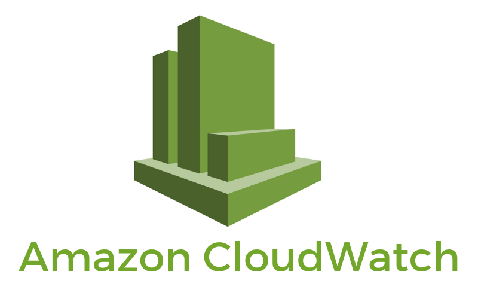

## 🎯 Ne İşe Yarar?

CloudWatch; CPU kullanımı, bellek durumu, disk okuma/yazma gibi sistem metriklerini toplar ve saklar. Ayrıca uygulama loglarını da toplayarak hem canlı izleme hem de geçmişe dönük analiz imkânı sağlar.

## 🌐 Hangi Durumlarda Kullanılır?

- **EC2 performans takibi**
- **Lambda fonksiyonlarının hata oranları**
- **Uygulama loglarının analizi**
- **Gerçek zamanlı dashboard oluşturma**
- **Servis durumu değiştiğinde otomatik aksiyon alma (event-driven automation)**

---

## ⚙️ En Sık Kullanılan Bileşenler

| Bileşen              | Açıklama                                                |
|----------------------|----------------------------------------------------------|
| Metrics              | AWS servislerinden gelen performans verileri            |
| Logs                 | Uygulama ve sistem loglarının merkezi olarak toplanması  |
| Alarms               | Belirli eşik değerleri aşıldığında tetiklenen uyarılar  |
| Dashboards           | Gerçek zamanlı görsel paneller                          |
| Events / EventBridge | Olay tabanlı otomasyon tetikleyici                      |


## 🛡️ Neden Önemlidir?

CloudWatch, sistemde oluşabilecek performans sorunlarını **önceden tespit etmemizi** ve otomatik önlemler almamızı sağlar. Böylece kesintisiz hizmet sunma konusunda **proaktif bir yaklaşım** geliştirmenize yardımcı olur.

### AWS CloudWatch Uygulamları-1 - CloudWatch ile Uygulama Loglarının İzlenmesi ve Alarm Kurulumu

Bu senaryoda, AWS EC2 üzerinde oluşan logların Amazon CloudWatch ile izlenmesi ve "ERROR" gibi kritik ifadeleri Metric Filter sayesinde tespit edilmesi ve bu durum otamatik olarak bir alarm olarak görünmesini sağlayacağız.

Senaroda özet olarak yapılacak işlemler;

* EC2 instance oluşturulması.
* CloudWatch Agent kurulumu
* Uygulama loglarının /var/log/myapp.log dosyasına yazılması.
* "ERROR" içeren satırlar Metric Filter ile izlenmesi.
* Metrik eşik değeri aşarsa alarmın üretilmesi.

Ortamın kurulması amacıyla terraform kullanacağız;

**Dizin Yapısı**
```
Senaryo-1/
├── main.tf
├── variables.tf
├── outputs.tf
├── userdata.sh
├── cloudwatch-agent-config.json
```

**main.tf**
```tf
provider "aws" {
  region                  = "us-east-1"
  shared_credentials_files = ["~/.aws/credentials"]
  profile                 = "vscode"
}
resource "aws_iam_role" "cw_agent_role" {
  name = "cw-agent-role"
  assume_role_policy = jsonencode({
    Version = "2012-10-17",
    Statement = [{
      Action    = "sts:AssumeRole",
      Effect    = "Allow",
      Principal = {
        Service = "ec2.amazonaws.com"
      }
    }]
  })
}

resource "aws_iam_role_policy_attachment" "cw_agent_attach" {
  role       = aws_iam_role.cw_agent_role.name
  policy_arn = "arn:aws:iam::aws:policy/CloudWatchAgentServerPolicy"
}

resource "aws_instance" "log_ec2" {
  ami                    = "ami-0c2b8ca1dad447f8a" # Amazon Linux 2
  instance_type          = "t2.micro"
  key_name               = var.key_name
  iam_instance_profile   = aws_iam_instance_profile.ec2_profile.name
  user_data              = file("userdata.sh")
  associate_public_ip_address = true

  tags = {
    Name = "CloudWatchLogEC2"
  }
}

resource "aws_iam_instance_profile" "ec2_profile" {
  name = "cw-agent-profile"
  role = aws_iam_role.cw_agent_role.name
}

resource "aws_cloudwatch_log_group" "app_log_group" {
  name              = "/ec2/app-log"
  retention_in_days = 7
}

```
**variables.tf**
```tf
variable "key_name" {
  description = "EC2 için kullanılacak SSH key pair adı"
  type        = string
}

```
**outputs.tf**
```tf
output "instance_public_ip" {
  value = aws_instance.log_ec2.public_ip
}

```
**userdata.sh**
```bash
#!/bin/bash
yum update -y
yum install -y amazon-cloudwatch-agent

cat <<EOF > /opt/aws/amazon-cloudwatch-agent/etc/amazon-cloudwatch-agent.json
$(cat cloudwatch-agent-config.json)
EOF

/opt/aws/amazon-cloudwatch-agent/bin/amazon-cloudwatch-agent-ctl \
  -a fetch-config -m ec2 -c file:/opt/aws/amazon-cloudwatch-agent/etc/amazon-cloudwatch-agent.json -s

# Simülasyon için sahte bir log oluştur
echo "INFO Service started" >> /var/log/myapp.log
echo "ERROR Something went wrong" >> /var/log/myapp.log

```
**cloudwatch-agent-config.json**
```tf
{
  "logs": {
    "logs_collected": {
      "files": {
        "collect_list": [
          {
            "file_path": "/var/log/myapp.log",
            "log_group_name": "/ec2/app-log",
            "log_stream_name": "{instance_id}",
            "timezone": "UTC"
          }
        ]
      }
    }
  }
}
```

Ortamın oluşturulması amacıyla kullanılacak olan komutlar aşağıdaki gibidir;

```
terraform init
terraform apply -var="key_name=<Anahtar_adı>"
```
Oluşma işleminin ardındna EC2 instance kontrol edilir. 

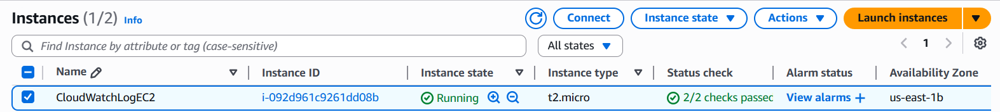

Metric Filter Oluşturulması amacıyla aşağıdaki komut kullanılır.
```powershell
aws logs put-metric-filter `
  --log-group-name "/ec2/app-log" `
  --filter-name "ErrorFilter" `
  --filter-pattern '"ERROR"' `
  --metric-transformations `
    metricName="ErrorCount",metricNamespace="MyAppMetrics",metricValue="1" `
  --profile vscode
````
``/ec2/app-log`` adlı log grubunda ``"ERROR"`` içeren log satırlarını sayar ve  özel bir metrik metrik üretir.

Üretilen metriklerde ``ERROR`` değerini ürettiğinde  belirtilen E-postaya mail gönderilmesi için aşağıdaki komut kullanılır;

```powershell
$topicArn = aws sns create-topic --name AppErrorTopic --profile vscode | ConvertFrom-Json | Select-Object -ExpandProperty TopicArn

aws sns subscribe `
  --topic-arn $topicArn `
  --protocol email `
  --notification-endpoint "mail@email.com" `
  --profile vscode

```
Cloudwatch tarafında bir uygun alarm oluşturulması amacıyla aşağıdaki komut kullanılır;

```powershell
aws cloudwatch put-metric-alarm `
  --alarm-name "ErrorAlarm" `
  --alarm-description "Triggers when ErrorCount >= 1" `
  --metric-name "ErrorCount" `
  --namespace "MyAppMetrics" `
  --statistic Sum `
  --period 60 `
  --threshold 1 `
  --comparison-operator GreaterThanOrEqualToThreshold `
  --evaluation-periods 1 `
  --alarm-actions $topicArn `
  --actions-enabled `
  --profile vscode
```

EK: AWS yönetmek için kullandığım bilgiyarasım Windows'dur ve powershell terminalini kullanmaktayım.

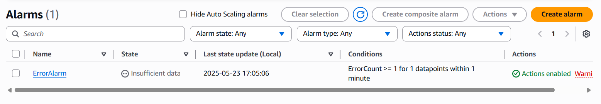
Test işleminin gerçekleştirilmesi amacıyla oluşturmuş olduğumuz EC2 instance bağlanılır ve ```echo "ERROR Manual test $(date)" >> /var/log/myapp.log``` komutu kullanılır.
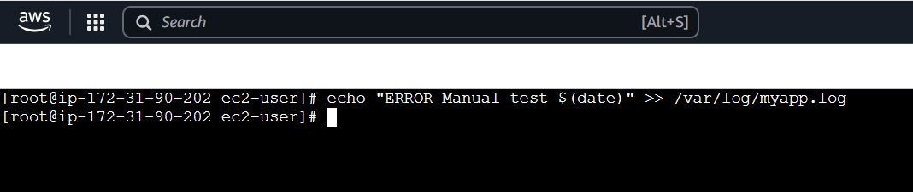

``myapp.log`` dosyasına yapılan bu değişim ardından AWS Cloud üzerinden ``Alarms`` `görüntülenir. Görselde görüldüğü gibi yapılan test işleminden sonra ``In alarm`` görülmektedir.

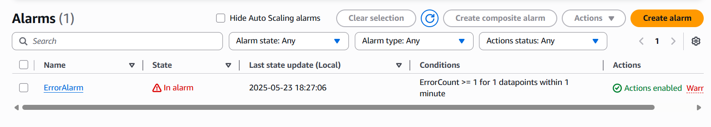

Daha detaylı görüntülemek amacıyla ``ÈrrorAlarm`` 'a tıklanır. Hangi zaman dilimlerinde hata ile karşılaşıldığı görülmektedir.

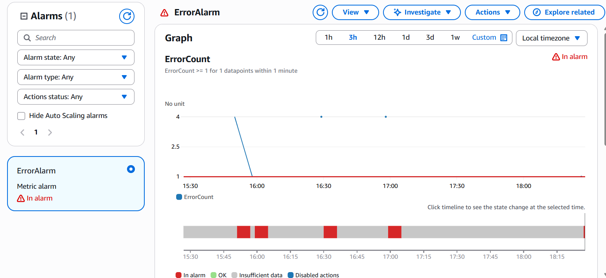

Tanımlamış olduğumuz E-posta adresi konu özelinde hazır mail gelmiştir.


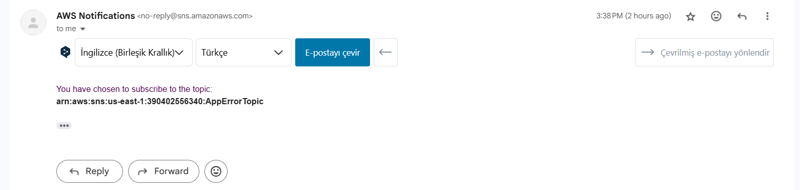

Ortamın sıfırlanması amacıyla aşağıdaki komutları sırasıyla kullanabilirsiniz;

**Terraform ile Oluşturulan Kaynakların Silinmesi için**
``terraform destroy --var="key_name=Key_Monitor" --auto-approve``

**Metric Filter Silinmesi için**
```
aws logs delete-metric-filter `
  --log-group-name "/ec2/app-log" `
  --filter-name "ErrorFilter" `
  --profile vscode
```

**CloudWatch Alarm Silmesi için**

```
aws cloudwatch delete-alarms `
  --alarm-names "ErrorAlarm" `
  --profile vscode
```

**CloudWatch Alarm Silinmesi için**

```
aws cloudwatch delete-alarms `
  --alarm-names "ErrorAlarm" `
  --profile vscode
```
**SNS Subscription ve Topic Silinmesi için**

```
$topicArn = aws sns list-topics --profile vscode | ConvertFrom-Json | Select-Object -ExpandProperty Topics | Where-Object { $_.TopicArn -like "*AppErrorTopic" } | Select-Object -ExpandProperty TopicArn
```
**SNS Topic Silinmesi için**
```
aws sns delete-topic `
  --topic-arn $topicArn `
  --profile vscode
```
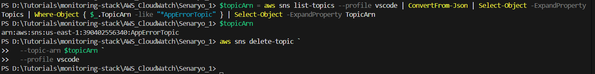

### AWS CloudWatch Uygulamları-2 - AWS CloudWatch & EventBridge ile EC2 Otomatik Yeniden Başlatma (Auto-Remediation) Senaryosu

Bu senaryoda, Amazon EC2 instance'ının "stopped" durumuna geçmesi durumunda otomatik olarak algılanır ve Amazon EventBridge üzerinden tetiklenen bir AWS Lambda fonksiyonu sayesinde EC2 yeniden başlatılır. Bu yapı, sistemlerin self-healing (kendini iyileştirme) yeteneğini artıran bir özelliktir.

İlk öncelikle EC2 instance oluşması amacıyla aşağıdaki ``main.tf`` dosyası kullanılır;

```
provider "aws" {
  region                  = "us-east-1"
  shared_credentials_files = ["~/.aws/credentials"]
  profile                 = "vscode"
}

resource "aws_instance" "my_ec2" {
  ami                    = "ami-0c2b8ca1dad447f8a"
  instance_type          = "t2.micro"
  key_name               = "Key_Monitor"
  associate_public_ip_address = true

  tags = {
    Name = "AutoRecoveryEC2"
  }
}
```
Bu işlemin gerçekleştirilmesi amacıyla kullanılacak olan komutlar aşağıdaki gibidir;

```
terraform init
terraform apply
```
IAM Rolü (Identity and Access Management Role), AWS kaynakları üzerinde belirli eylemleri gerçekleştirmek için verilen geçici izinler kümesidir. Bir kullanıcıya, servise veya başka bir AWS hesabına belirli bir görevi yerine getirirken bu rol atanabilir. IAM rolünü oluşturmak için ilk öncelikle ``trust-policy.json`` dosyası oluşturulur.

**trust-policy.json**
```
{
  "Version": "2012-10-17",
  "Statement": [
    {
      "Effect": "Allow",
      "Principal": {
        "Service": "lambda.amazonaws.com"
      },
      "Action": "sts:AssumeRole"
    }
  ]
}
```

IAM rolünün oluşturulması için aşağıdaki sırasyıla kullanılır;

```
aws iam create-role `
  --role-name LambdaEC2Role `
  --assume-role-policy-document file://trust-policy.json `
  --profile vscode
```

```
aws iam attach-role-policy `
  --role-name LambdaEC2Role `
  --policy-arn arn:aws:iam::aws:policy/AmazonEC2FullAccess `
  --profile vscode
```

```
aws iam attach-role-policy `
  --role-name LambdaEC2Role `
  --policy-arn arn:aws:iam::aws:policy/service-role/AWSLambdaBasicExecutionRole `
  --profile vscode
```

Lambda üzerinden çalışacak olan fonksiyonun hazılanması amacıyla aşağıdaki python scirpt oluşturulur;

**restart_instance.py**
```
import boto3

def lambda_handler(event, context):
    ec2 = boto3.client('ec2')
    instance_id = event['detail']['instance-id']
    print(f"Restarting instance {instance_id}")
    ec2.start_instances(InstanceIds=[instance_id])
    return {"statusCode": 200, "body": f"Restarted {instance_id}"}

```
``restart_instance.py`` 'ın ziplenmesi amacıyla aşağıdaki komut kullanılır;

```
Compress-Archive -Path .\restart_instance.py -DestinationPath .\function.zip -Force
```

Lambda fonksiyonunun oluşturulması amacıyla aşağıdaki komut kullanılır;

```
aws lambda create-function `
  --function-name RestartEC2Instance `
  --runtime python3.12 `
  --handler restart_instance.lambda_handler `
  --role arn:aws:iam::<ACCOUNT_ID>:role/LambdaEC2Role `
  --zip-file fileb://function.zip `
  --region us-east-1 `
  --profile vscode
```
Buradaki komut'ta bulunan ``<ACCOUNT_ID>`` kısmını bulmak için aşağıdaki komut kullanılır;

```
aws sts get-caller-identity --query "Account" --output text --profile vscode
```

EventBridge Kuralının oluşturulması amacıyla ilk öncelikle ``event-pattern.json`` dosyası oluşturulur.

**event-pattern.json**

```
{
  "source": ["aws.ec2"],
  "detail-type": ["EC2 Instance State-change Notification"],
  "detail": {
    "state": ["stopped"]
  }
}
```
Kuralın oluşturulması amacıyla aşağıdaki komut kullanılır;

```
aws events put-rule `
  --name RestartStoppedEC2 `
  --event-pattern file://event-pattern.json `
  --region us-east-1 `
  --profile vscode
```

Lambda'ya yetki verilmesi amacıyla ise;

```
aws lambda add-permission `
  --function-name RestartEC2Instance `
  --statement-id RestartOnStop `
  --action "lambda:InvokeFunction" `
  --principal events.amazonaws.com `
  --source-arn arn:aws:events:us-east-1:<ACCOUNT_ID>:rule/RestartStoppedEC2 `
  --region us-east-1 `
  --profile vscode  
```

EventBridge Kuralının Lambda’ya bağlanması amacıyla aşağıdaki komut kullanılır;

```
aws events put-targets `
  --rule RestartStoppedEC2 `
  --targets "Id=1,Arn=arn:aws:lambda:us-east-1:<ACCOUNT_ID>:function:RestartEC2Instance" `
  --region us-east-1 `
  --profile vscode
```

Yapılan işlemlerin test edilmesi amacıyla oluşturulan EC2 instance durdurulması amacıyla aşağıdaki komut kullanılır;

```
aws ec2 stop-instances `
  --instance-ids <EC2_ID> `
  --region us-east-1 `
  --profile vscode
```

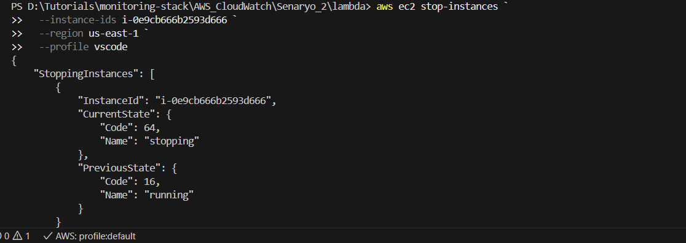

İşlemin kontrol edilmesi amacıyla Amazon Console üzerinden EC2 instance kontrol edilir.

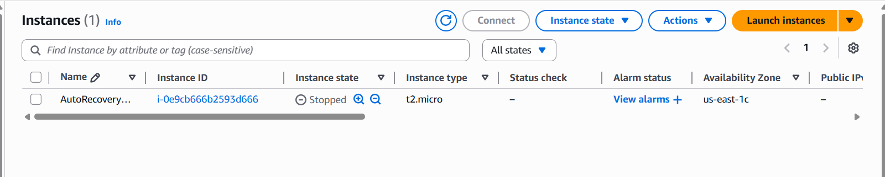

1-2 dakika beklendikten sonra yeniden kontrol edildiğinde EC2 instance yeniden başlatıldığı görülecektir.

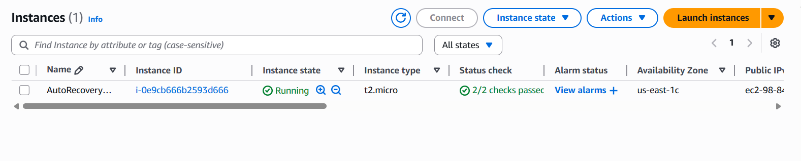

Hangi zaman dilimlerinde EC2 instance yeniden başlatıldığına veya kaç defa yeniden başlatıldığı bilgisine `CloudWatch > Log groups > /aws/lambda/RestartEC2Instance` üzerinden ulaşabilirsiniz.

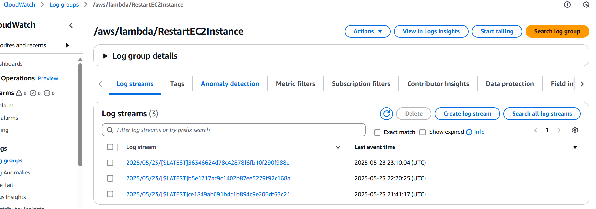

Sistemi temizlenmesi ve oluşturulan obje ve kuralların silinmesi amacıyla aşağıdaki komutları kullanabilirsiniz;

**Terraform kaynaklarının silinmesi için**

```terraform destroy```

**Lambda fonksiyonun silinmesi için**

```
aws lambda delete-function `
  --function-name RestartEC2Instance `
  --region us-east-1 `
  --profile vscode
```

**EventBridge kuralının silinmesi için**

```
aws events remove-targets `
  --rule RestartStoppedEC2 `
  --ids 1 `
  --region us-east-1 `
  --profile vscode

aws events delete-rule `
  --name RestartStoppedEC2 `
  --region us-east-1 `
  --profile vscode
```

**IAM Rolünü ve Policy’lerini Silmesi için**

```
aws iam detach-role-policy `
  --role-name LambdaEC2Role `
  --policy-arn arn:aws:iam::aws:policy/AmazonEC2FullAccess `
  --profile vscode

aws iam detach-role-policy `
  --role-name LambdaEC2Role `
  --policy-arn arn:aws:iam::aws:policy/service-role/AWSLambdaBasicExecutionRole `
  --profile vscode

aws iam delete-role `
  --role-name LambdaEC2Role `
  --profile vscode

```