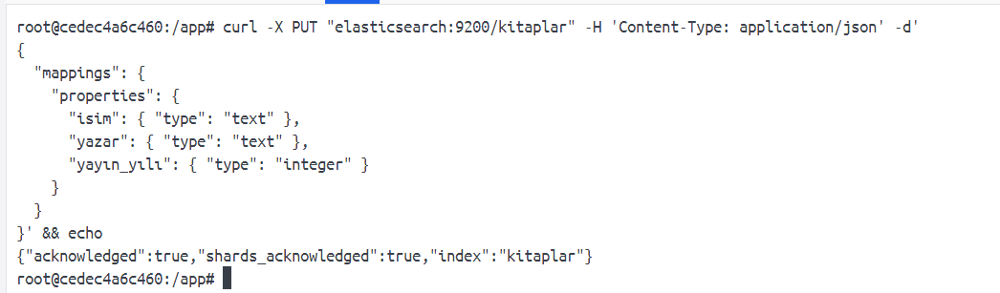
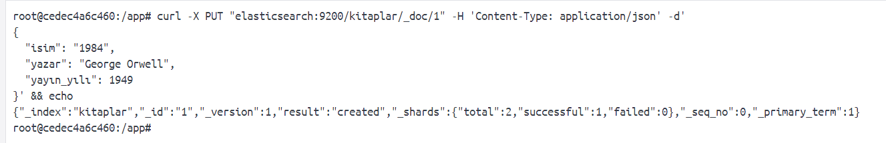
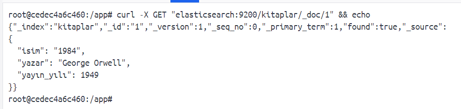
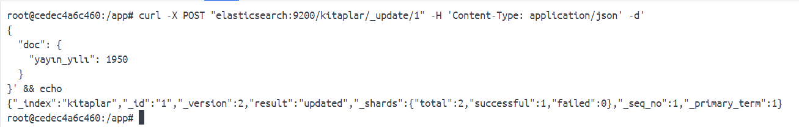
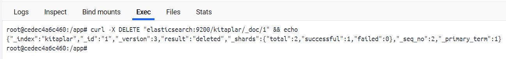
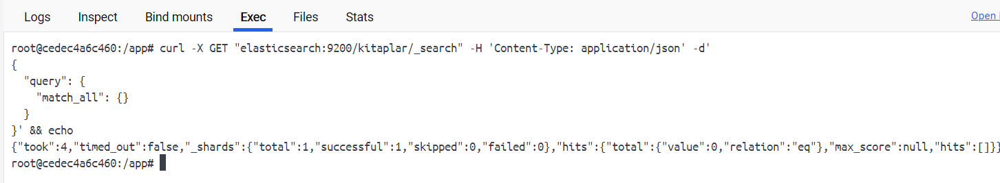
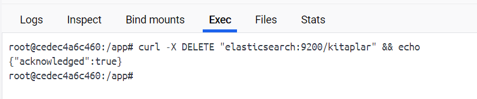

# Elasticsearch Nedir?

Günümüzde veriler hızla artmaktadır ve bu ndenle bu verilerden anlam cıkarmak her geçen gün daha zor gelmektedir. Özellikle log analizi için hızlı ve ölçeklenebilir bir çözüme ihtiyaç duyulmaktadır. Elasticsearch, tam olarak bu noktada devreye girmektedir.
Bu yazımda temel düzeyde elasticsearch nasıl kullanılabileceğini adım adım inceleyeceğiz. 
Elasticsearch, açık kaynaklı bir arama ve analiz motorudur. Verileri neredeyse gerçek zamanlı (real-time) olarak indeksler, arar ve analiz eder.


**Elasticsearch Özellikleri**

* JSON formatında veri saklar.
* Çok hızlı arama ve filtreleme sağlar.
* Veri analizi ve görselleştirme için idealdir.
* RESTful API desteklidir.
* Logstash ve Kibana gibi araçlarla entegre çalışır.

**Elasticsearch Temel Kavramlar**

| Terim        | Açıklama                                                                      |
| ------------ | ----------------------------------------------------------------------------- |
| **Document** | Elasticsearch’te saklanan her bir veri kaydıdır. JSON formatındadır.          |
| **Index**    | Belirli türde dokümanları barındıran yapıdır. Veritabanındaki tabloya benzer. |
| **Field**    | Belgedeki (document) her bir anahtar-değer çifti.                             |
| **Mapping**  | Belirli bir index'teki alanların veri tiplerini tanımlar.                     |
| **Shard**    | Verilerin parçalara bölünmüş halidir. Ölçeklenebilirliği sağlar.              |
| **Replica**  | Shard'ların kopyalarıdır. Yüksek erişilebilirlik sağlar.                      |

Elasticsearch mimarisi ise dağıtık bir yapıya sahiptir. Bu yapının ana birleşenleri;

* **Cluster:** Elasticsearch node'larının bir araya gelmesiyle oluşan yapı.
* **Node:** Elasticsearch’ün çalıştığı her bir sunucu veya instance.
* **Master Node:** Cluster yönetimiyle ilgilenir.
* **Data Node:** Verileri saklar ve arama sorgularını işler.
* **Client/Coordinator Node:** Sorguları yönlendirir.

Elasticsearch üzerinde uygulamalarımızı gerçekleştirebileceğimiz ortamı aşağıdaki ``docker-compose.yml`` ile oluşturabiliriz.

```yml
version: '3.8'

services:
  elasticsearch:
    image: docker.elastic.co/elasticsearch/elasticsearch:8.11.0
    container_name: elasticsearch
    environment:
      - discovery.type=single-node
      - xpack.security.enabled=false
      - ES_JAVA_OPTS=-Xms512m -Xmx512m
    ports:
      - "9200:9200"
    networks:
      - elastic-net
    volumes:
      - esdata:/usr/share/elasticsearch/data

  python-app:
    image: python:3.11
    container_name: python-client
    command: ["sleep", "36000"]
    depends_on:
      - elasticsearch
    networks:
      - elastic-net
    
    volumes:
      - ./python-app:/app
    working_dir: /app
   # command: python3 main.py

volumes:
  esdata:

networks:
  elastic-net:
    driver: bridge
```

Oluşturmuş olduğumuz bu yapı üzerinden öğrenmek ve uygulama geliştirmek için işlemler gerçekleştirebiliriz;

**Index oluşturma**

Mapping, alanların veri türlerini tanımlar. Bu sayede arama ve filtreleme daha doğru çalışır.

``Python Kodu``
```python
from elasticsearch import Elasticsearch

# Elasticsearch istemcisi başlatılır
es = Elasticsearch("http://elasticsearch:9200")

# Mapping ile birlikte "kitaplar" adında bir index oluşturulur
mapping = {
    "mappings": {
        "properties": {
            "isim": {"type": "text"},
            "yazar": {"type": "text"},
            "yayın_yılı": {"type": "integer"}
        }
    }
}

# Index oluşturma işlemi
es.indices.create(index="kitaplar", body=mapping)
```

``Curl Komutu``
```bash
# Mapping bilgisi ile birlikte kitaplar index'i oluşturuluyor
curl -X PUT "elasticsearch:9200/kitaplar" -H 'Content-Type: application/json' -d'
{
  "mappings": {
    "properties": {
      "isim": { "type": "text" },
      "yazar": { "type": "text" },
      "yayın_yılı": { "type": "integer" }
    }
  }
}'

```



**Veri Ekleme (Create / Index)**

Belgeyi ``PUT`` ile eklerken ID belirtilir. ``POST`` kullanılırsa Elasticsearch ID’yi otomatik üretir.

``Python Kodu``

```python
doc = {
    "isim": "1984",
    "yazar": "George Orwell",
    "yayın_yılı": 1949
}

# Belirtilen ID ile kitaplar index'ine veri eklenir
es.index(index="kitaplar", id=1, document=doc)

```

``Curl Komutu``
```bash
# ID 1 ile kitap dokümanı ekleniyor
curl -X PUT "elasticsearch:9200/kitaplar/_doc/1" -H 'Content-Type: application/json' -d'
{
  "isim": "1984",
  "yazar": "George Orwell",
  "yayın_yılı": 1949
}'
```


**Veri Okuma (Read / Get by ID)**

Bu işlemle belirli bir ID’ye sahip veri dokümanı elde edilir.

``Python Kodu``

```python
# Belirtilen ID'ye sahip veri okunur
res = es.get(index="kitaplar", id=1)
print(res["_source"])  # Sadece veri içeriği
```

``Curl Komutu``
```bash
# ID 1 olan kitap verisi okunuyor
curl -X GET "elasticsearch:9200/kitaplar/_doc/1"
```


**Veri Güncelleme (Update)**

Sadece değiştirilecek alanı doc içinde vererek güncelleme yapılır.

``Python Kodu``

```python
# ID 1 olan dokümanın yayın_yılı alanı güncelleniyor
es.update(index="kitaplar", id=1, body={
    "doc": {
        "yayın_yılı": 1950
    }
})

```

``Curl Komutu``
```bash
# yayın_yılı alanı 1950 olarak güncelleniyor
curl -X POST "elasticsearch:9200/kitaplar/_update/1" -H 'Content-Type: application/json' -d'
{
  "doc": {
    "yayın_yılı": 1950
  }
}'

```


**Veri Silme (Delete)**

Belirtilen belge ID’si ile kalıcı olarak silinir.

``Python Kodu``

```python
# ID 1 olan doküman silinir
es.delete(index="kitaplar", id=1)
```

``Curl Komutu``
```bash
# Belirli bir belge silinir
curl -X DELETE "elasticsearch:9200/kitaplar/_doc/1"
```



**Tüm Verileri Listeleme (match_all)**

``match_all`` sorgusu tüm dokümanları getirir. Genellikle veri listeleme için kullanılır.

``Python Kodu``

```python
query = {
    "query": {
        "match_all": {}
    }
}

# Tüm veriler çekilir
results = es.search(index="kitaplar", query=query["query"])
for hit in results["hits"]["hits"]:
    print(hit["_source"])
```

``Curl Komutu``
```bash
# Index'teki tüm veriler getirilir
curl -X GET "elasticsearch:9200/kitaplar/_search" -H 'Content-Type: application/json' -d'
{
  "query": {
    "match_all": {}
  }
}'
```


**Index Silme (Tüm verilerle birlikte)**

Bu işlem, index’teki tüm belgeleri ve tanımı siler. Geri alınamaz.

``Python Kodu``

```python
# kitaplar adlı index tamamen silinir
es.indices.delete(index="kitaplar")
```

``Curl Komutu``
```bash
# kitaplar index'i tüm verilerle birlikte silinir
curl -X DELETE "elasticsearch:9200/kitaplar"
```

