# Logstash Nedir?

Bilişim sistemleri, sürekli olarak log üretmektedir. Bu loglarda; hata tespiti, güvenlik analizi ve performans iyileştirme gibi birçok alanda hayati öneme sahiptir. Ancak bu logların anlamlı hale getirilmesi zordur. Logstash ise log verilerini işler, dönüştürür işler ve merkezi sistemlere göndererek değer üretmemizi sağlar.


Logstash, Elastic Stack'ın bir parçasıdır. Ana görevleri:

* Veriyi alıp (Input),
* İşleyip dönüştürerek (Filter),
* Belirli yerlere aktarılması (Output).

Logstash Mimarisi üç temel bölümden oluşur:

* Input	
* Filter
* Output

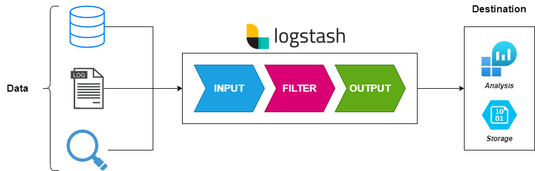

| Bileşen    | Görev                                                                    |
| ---------- | ------------------------------------------------------------------------ |
| **Input**  | Veriyi farklı kaynaklardan alır (dosya, TCP, syslog, beats, Kafka vb.)   |
| **Filter** | Veriyi işler, temizler, dönüştürür (örneğin grok ile parse işlemi)       |
| **Output** | Veriyi Elasticsearch, dosya, stdout, e-posta, Kafka vb. yerlere gönderir |

Logstash 'ın yapısının ve kullanımının daha iyi anlaşılması amacıyla aşağıdaki uygulamaya geçelim.

## Uygulama - Logstash ile Log Analizi

Bu uygulama da python kullanarak log üreteceğiz. Üretilen logların Logstash tarafından işlenmesini sağlamaktır. Bu uygulamadaki amaçlarımız;

* Özel bir uygulama, her saniye bir log üretir.
* Logstash bu logları okur, işler ve Elasticsearch’e yollar.
* Verileri kontrol etmek için Python ile Elasticsearch API’sini kullanacağız.

Uygulama ortamının oluşturulması amacıyla aşağıdaki proje oluşturulur.

**Proje Yapısı**

```
elk-logs/
├── docker-compose.yml
├── log-producer/
│   └── app.py
├── logstash/
│   └── logstash.conf
```

**log-producer/app.py** – Özel Log Üreticisi

```python
import time
import logging
import random
import os

# Log klasörü yoksa oluştur
os.makedirs("/logs", exist_ok=True)

# logging formatında 'log_message' kullandık, 'message' DEĞİL
logging.basicConfig(
    filename="/logs/app.log",
    format="%(asctime)s - %(levelname)s - user:%(user)s - message:%(log_message)s",
    level=logging.INFO
)

users = ['alice', 'bob', 'charlie']
messages = ['Login successful', 'Logout', 'Error occurred', 'Data saved']

while True:
    log_data = {
        "user": random.choice(users),
        "log_message": random.choice(messages)  # ❗️Burası ÖNEMLİ: 'message' değil
    }
    logging.info("event", extra=log_data)
    time.sleep(1)

```

**logstash/logstash.conf**

```conf
input {
  file {
    path => "/logs/app.log"
    start_position => "beginning"
    sincedb_path => "/dev/null"
  }
}

filter {
  grok {
    match => { "message" => "%{TIMESTAMP_ISO8601:timestamp} - %{LOGLEVEL:level} - user:%{WORD:user} - message:%{GREEDYDATA:custom_message}" }
  }
  date {
    match => ["timestamp", "ISO8601"]
    target => "@timestamp"
  }
}

output {
  elasticsearch {
    hosts => ["http://elasticsearch:9200"]
    index => "app_logs"
  }
  stdout { codec => rubydebug }
}
```

**docker-compose.yml**

```yml
version: '3.7'

services:
  elasticsearch:
    image: docker.elastic.co/elasticsearch/elasticsearch:8.11.0
    container_name: elasticsearch
    environment:
      - discovery.type=single-node
      - xpack.security.enabled=false
    ports:
      - "9200:9200"

  logstash:
    image: docker.elastic.co/logstash/logstash:8.9.1
    container_name: logstash
    volumes:
      - ./logstash/logstash.conf:/usr/share/logstash/pipeline/logstash.conf
      - ./logs:/logs
    depends_on:
      - elasticsearch

  log-producer:
    build:
      context: ./log-producer
    command: ["sleep", "360000"]
    volumes:
      - ./logs:/logs
      - ./log-producer/:/app/

```

**log-producer/Dockerfile**

```Dockerfile
FROM python:3.11
WORKDIR /app
COPY app.py .
RUN mkdir /logs
CMD ["python", "app.py"]
```

Sistemin başlatılması amacıyla ``docker-compose up --build`` komutu kullanılır. ``log-producer`` adlı container'a bash olarak login olunur ve ``python3 app.py`` komutu kullanılır ve log oluşturma işlemi başlatılır. Sistem başlatıldıktan sonra sistemin kontrol edilmesi amacıyla aşağıdaki kodu kullabilirsiniz;

**check.py**

```python
import requests
import time

# Elasticsearch hazır olduğunda çalışması için bekleme
time.sleep(10)

url = "http://elasticsearch:9200/app_logs/_search"
payload = {
    "size": 5,
    "sort": [{"@timestamp": "desc"}]
}

res = requests.get(url, json=payload)
for hit in res.json()["hits"]["hits"]:
    print(hit["_source"])
```

Bu kod ile Elasticsearch içindeki app_logs adlı index'ten en son 5 log kaydını çekip terminalde yazdırır. Buradan elde edilen logların Elasticsearch iletildiğini anlamaktayız.

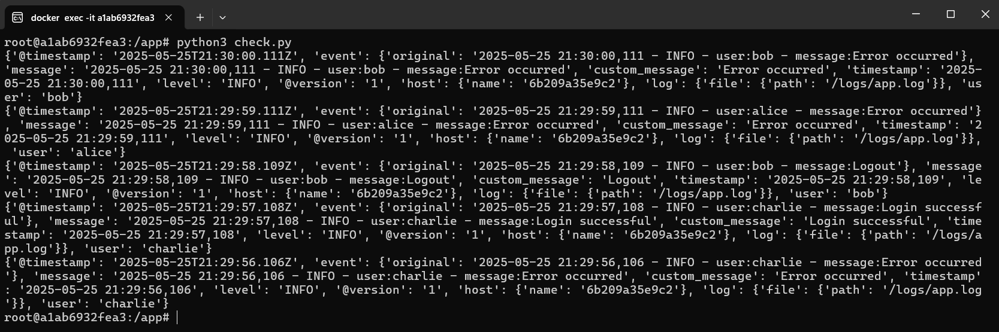

Eğer istenirse Log seviyelerine göre **farklı indexlere** yönlendirebiliriz. (örneğin INFO → info_logs, ERROR → error_logs).
Bu işlem için;

**logstash/logstash.conf**

```yml
input {
  file {
    path => "/logs/app.log"
    start_position => "beginning"
    sincedb_path => "/dev/null"
  }
}

filter {
  grok {
    match => { "message" => "%{TIMESTAMP_ISO8601:timestamp} - %{LOGLEVEL:level} - user:%{WORD:user} - message:%{GREEDYDATA:custom_message}" }
  }
  date {
    match => ["timestamp", "ISO8601"]
    target => "@timestamp"
  }
}

output {
  if [level] == "INFO" {
    elasticsearch {
      hosts => ["http://elasticsearch:9200"]
      index => "info_logs"
    }
  } else if [level] == "ERROR" {
    elasticsearch {
      hosts => ["http://elasticsearch:9200"]
      index => "error_logs"
    }
  } else {
    elasticsearch {
      hosts => ["http://elasticsearch:9200"]
      index => "general_logs"
    }
  }

  stdout { codec => rubydebug }
}
```

**app.py**

```python
import time
import logging
import random
import os

# Log klasörü yoksa oluştur
os.makedirs("/logs", exist_ok=True)

# Log formatı ('log_message' alanını kullanıyoruz)
logging.basicConfig(
    filename="/logs/app.log",
    format="%(asctime)s - %(levelname)s - user:%(user)s - message:%(log_message)s",
    level=logging.INFO
)

users = ['alice', 'bob', 'charlie']
messages = ['Login successful', 'Logout', 'Error occurred', 'Data saved', 'Critical failure']

while True:
    msg = random.choice(messages)
    level = logging.ERROR if 'Error' in msg or 'Critical' in msg else logging.INFO

    log = {
        "user": random.choice(users),
        "log_message": msg  # ❗ 'message' değil 'log_message'
    }

    logging.log(level, "event", extra=log)
    time.sleep(1)

```

Yapılan bu işlemin doğruluğunun kontrol edilmesi amacıyla aşağıdaki python kodu kullanılabilir;

```python
import requests
import time

time.sleep(10)

def check_logs(index):
    url = f"http://elasticsearch:9200/{index}/_search"
    payload = {
        "size": 3,
        "sort": [{"@timestamp": "desc"}]
    }

    res = requests.get(url, json=payload)
    if res.status_code == 200:
        hits = res.json()["hits"]["hits"]
        print(f"\n📁 {index} - Son 3 kayıt:")
        for h in hits:
            print(h["_source"])
    else:
        print(f"Hata: {res.text}")

check_logs("info_logs")
check_logs("error_logs")
```

Bu kodun amacı Elasticsearch içindeki iki farklı index olan ``info_logs`` ve ``error_logs`` için son 3 log kaydını çekmek ve terminale yazdırmak.

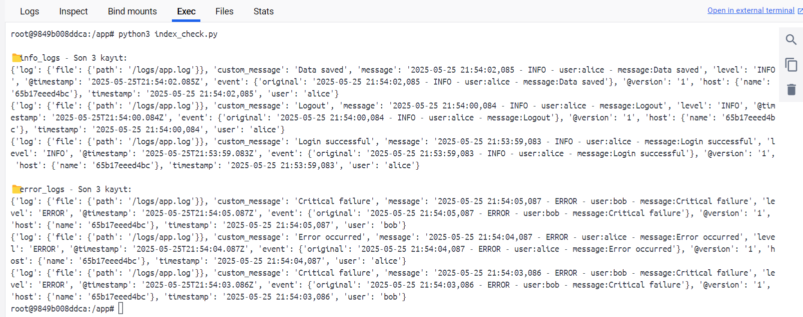

Şimdi bu sistemi bir üst versiona taşıyalım **structured logging (yapılandırılmış JSON loglama)** kullanarak:

* Uygulama loglarını JSON formatında yazacağız.
* Logstash bu JSON verilerini otomatik olarak parse edecek.
* Logstash filtresi sadeleşecek, çünkü veri zaten yapılandırılmış olacak.
* Elasticsearch'e doğrudan anlamlı veri gidecek.
* Python ile logları çekip analiz yapacağız.

Bu işlem için gerekli güncellemelerin gerçekleştirilmelidir.

**log-producer/app.py**

```python
import time
import json
from datetime import datetime
import random

users = ['alice', 'bob', 'charlie']
messages = ['Login successful', 'Logout', 'Error occurred', 'Data saved', 'Critical failure']

with open('/logs/app.log', 'a') as f:
    while True:
        msg = random.choice(messages)
        level = 'ERROR' if 'Error' in msg or 'Critical' in msg else 'INFO'
        log = {
            "timestamp": datetime.utcnow().isoformat(),
            "level": level,
            "user": random.choice(users),
            "message": msg
        }
        f.write(json.dumps(log) + '\n')
        f.flush()
        time.sleep(1)
```

**logstash.conf**

```yml
input {
  file {
    path => "/logs/app.log"
    start_position => "beginning"
    sincedb_path => "/dev/null"
    codec => "json"
  }
}

filter {
  date {
    match => ["timestamp", "ISO8601"]
    target => "@timestamp"
  }
}

output {
  if [level] == "INFO" {
    elasticsearch {
      hosts => ["http://elasticsearch:9200"]
      index => "json_info_logs"
    }
  } else if [level] == "ERROR" {
    elasticsearch {
      hosts => ["http://elasticsearch:9200"]
      index => "json_error_logs"
    }
  } else {
    elasticsearch {
      hosts => ["http://elasticsearch:9200"]
      index => "json_other_logs"
    }
  }

  stdout { codec => rubydebug }
}
```

Bu işlemin check edilmesi amacıyla ``json_check.py`` dosyası kullanılır. 

**json_check.py**
```python
import requests
import time

time.sleep(10)

def check_json_logs(index):
    url = f"http://elasticsearch:9200/{index}/_search"
    payload = {
        "size": 5,
        "sort": [{"@timestamp": "desc"}]
    }

    res = requests.get(url, json=payload)
    print(f"\n📂 {index} - Son 5 kayıt:")
    for hit in res.json()["hits"]["hits"]:
        print(hit["_source"])

check_json_logs("json_info_logs")
check_json_logs("json_error_logs")

def count_logs_by_user(index):
    url = f"http://elasticsearch:9200/{index}/_search"
    payload = {
        "size": 0,
        "aggs": {
            "by_user": {
                "terms": {"field": "user.keyword"}
            }
        }
    }

    res = requests.get(url, json=payload)
    print(f"\n👤 Kullanıcı bazlı sayım ({index}):")
    for bucket in res.json()["aggregations"]["by_user"]["buckets"]:
        print(f"{bucket['key']}: {bucket['doc_count']} log")

count_logs_by_user("json_info_logs")

```
Bu Python kodu, Elasticsearch’teki log index’lerinden veri çekmek ve analiz yapmak için yazılmıştır. Kodun işlevi;

* ``json_info_logs`` ve ``json_error_logs`` index’lerinden **son 5 log kaydını** yazdırmak
* ``json_info_logs`` index’inde kullanıcı **bazlı log sayımını** göstermek

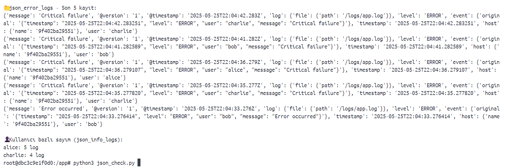


Bu işlemin ardından loglara IP adresi ekleyeceğiz, Logstash bu IP’yi kullanarak konum bilgisi (ülke, şehir, koordinat) çıkaracak ve Elasticsearch’e bu bilgileri de gönderecek. Bu işlemin gerçekleştirilmesi için aşağıdaki güncellemeleri gerçekleştirmeliyiz.


**log-producer/app.py**

```python
import time
import json
from datetime import datetime
import random

users = ['alice', 'bob', 'charlie']
messages = ['Login successful', 'Logout', 'Error occurred', 'Data saved', 'Critical failure']
ips = ['8.8.8.8', '1.1.1.1', '185.60.216.35', '203.0.113.10']  # Örnek IP'ler

with open('/logs/app.log', 'a') as f:
    while True:
        msg = random.choice(messages)
        level = 'ERROR' if 'Error' in msg or 'Critical' in msg else 'INFO'
        log = {
            "timestamp": datetime.utcnow().isoformat(),
            "level": level,
            "user": random.choice(users),
            "message": msg,
            "ip": random.choice(ips)
        }
        f.write(json.dumps(log) + '\n')
        f.flush()
        time.sleep(1)
```

**logstash/logstash.conf** - Filter bölümü eklenir

```yml
filter {
  if [ip] {
    geoip {
      source => "ip"
      target => "[geoip]"  # 💡 GeoIP bilgileri bu alana yazılacak
    }
  }

  date {
    match => ["timestamp", "ISO8601"]
    target => "@timestamp"
  }
}
```

Bu güncellemelerin ardından sistem sistem yeniden başlatılır. Sistemin kontrol edilmesi amacıyla aşağıdaki python kodunu kullanabilirsiniz;

```python
import requests
import time

time.sleep(10)

def show_geoip_logs(index):
    url = f"http://elasticsearch:9200/{index}/_search"
    payload = {
        "size": 5,
        "sort": [{"@timestamp": "desc"}]
    }

    res = requests.get(url, json=payload)
    
    if res.status_code == 200:
        print(f"\n📍 GeoIP kontrollü kayıtlar ({index}):")
        for hit in res.json()["hits"]["hits"]:
            source = hit["_source"]
            ip = source.get('ip', '❓ IP yok')
            country = source.get('geoip', {}).get('country_name', '❓ Ülke yok')
            city = source.get('geoip', {}).get('city_name', '❓ Şehir yok')
            print(f"{ip} ➡ {country} - {city}")
    else:
        print(f"❌ Hata: {res.status_code} - {res.text}")

show_geoip_logs("json_info_logs")

```

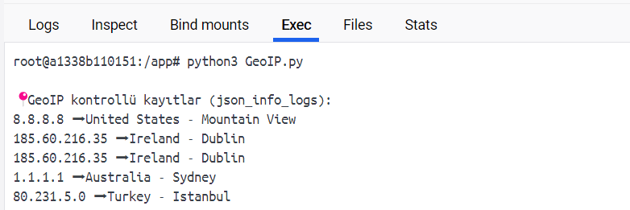

Bu sistemi **threshold tabanlı uyarı sistemi** haline getirebiliriz. Bu yeni sistemde hedefimiz;

* Aynı kullanıcı veya aynı IP, kısa sürede 3 veya daha fazla ERROR logu üretirse Python ile bunu tespit edeceğiz.
* Uyarının console yazılması sağlanacaktır. (Eğer istenirse smtp ile mail olarak iletilebilir.)

Bu işlem için kullanılacak python script'i kullanılabilir.

```python
import requests
from datetime import datetime, timedelta
from collections import defaultdict

# 15 dakika öncesi
time_range_start = (datetime.utcnow() - timedelta(minutes=15)).isoformat()

url = "http://elasticsearch:9200/json_error_logs/_search"
payload = {
    "size": 1000,
    "query": {
        "range": {
            "@timestamp": {
                "gte": time_range_start
            }
        }
    }
}

res = requests.get(url, json=payload)
if res.status_code != 200:
    print("Elasticsearch bağlantı hatası:", res.text)
    exit()

hits = res.json()["hits"]["hits"]

# Kullanıcı ve IP bazlı log sayımı
user_errors = defaultdict(int)
ip_errors = defaultdict(int)

for hit in hits:
    source = hit["_source"]
    user = source.get("user", "unknown")
    ip = source.get("ip", "unknown")
    user_errors[user] += 1
    ip_errors[ip] += 1

# Uyarı eşikleri
threshold = 3

print("🚨 Uyarılar (son 15 dakika):")
for user, count in user_errors.items():
    if count >= threshold:
        print(f"⚠️  Kullanıcı '{user}' → {count} ERROR logu oluşturdu")

for ip, count in ip_errors.items():
    if count >= threshold:
        print(f"⚠️  IP '{ip}' → {count} ERROR logu oluşturdu")
```

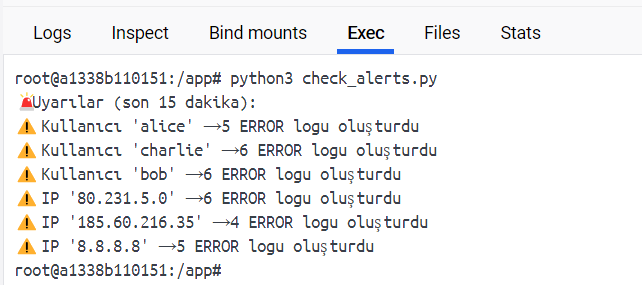


Şimdide Elasticsearch üzerinden alınan verilerin görselleştirelim. Bu işlem için Flask tabanlı sade bir web arayüzü kullanacağız. Bunun öncesinde log üretecek olan python kodu ve ``logstash.conf`` aşağıdaki gibidir;

**logstash.conf**

```conf
input {
  file {
    path => "/logs/app.log"
    codec => json
    start_position => "beginning"
    sincedb_path => "/dev/null"
  }
}

filter {
  date {
    match => ["timestamp", "ISO8601"]
    target => "@timestamp"
  }

  geoip {
    source => "ip"
  }
}

output {
  elasticsearch {
    hosts => ["http://elasticsearch:9200"]
    index => "json_error_logs"
  }
  stdout { codec => rubydebug }
}
```

**app_log_producer.py**

```python
import time
import json
from datetime import datetime
import random
import os

LOG_DIR = "/logs"
LOG_FILE = os.path.join(LOG_DIR, "app.log")

# Dosya klasörü oluştur
os.makedirs(LOG_DIR, exist_ok=True)

users = ["alice", "bob", "charlie"]
messages = [
    "Login successful",
    "Logout",
    "Error occurred",
    "Data saved",
    "Access denied",
    "Session expired",
    "Critical failure"
]
ips = ["8.8.8.8", "1.1.1.1", "185.60.216.35", "203.0.113.10"]

while True:
    msg = random.choice(messages)
    level = "ERROR" if "Error" in msg or "Critical" in msg or "denied" in msg else "INFO"

    log_entry = {
        "timestamp": datetime.utcnow().isoformat(),
        "level": level,
        "user": random.choice(users),
        "message": msg,
        "ip": random.choice(ips)
    }

    with open(LOG_FILE, "a") as log_file:
        log_file.write(json.dumps(log_entry) + "\n")

    print(f"✅ Yeni log yazıldı: {log_entry}")
    time.sleep(5)
```

Flask web kodları aşağıdaki gibidir;

**Flask Web Dizin Yapısı**

```
log-monitor/
├── app.py
├── templates/
│   └── index.html
├── └── errors.html
├── └── chart.html
```

**app.py**

```python
from flask import Flask, render_template, request
import requests

app = Flask(__name__)
ELASTIC_URL = "http://elasticsearch:9200/json_error_logs/_search"

@app.route("/", methods=["GET"])
def index():
    query = request.args.get("q", "")
    user = request.args.get("user", "")
    level = request.args.get("level", "")

    # Elasticsearch query
    filters = []
    if query:
        filters.append({"match": {"message": query}})
    if user:
        filters.append({"match": {"user": user}})
    if level:
        filters.append({"match": {"level": level}})

    search_query = {
        "size": 50,
        "sort": [{"@timestamp": "desc"}],
        "query": {
            "bool": {
                "must": filters if filters else [{"match_all": {}}]
            }
        }
    }

    res = requests.get(ELASTIC_URL, json=search_query)
    if res.status_code == 200:
        logs = [hit["_source"] for hit in res.json()["hits"]["hits"]]
    else:
        logs = []

    return render_template("index.html", logs=logs, query=query, user=user, level=level)

@app.route("/errors", methods=["GET"])
def error_logs():
    user = request.args.get("user", "")
    ip = request.args.get("ip", "")

    filters = [{"match": {"level": "ERROR"}}]

    if user:
        filters.append({"match": {"user": user}})
    if ip:
        filters.append({"match": {"ip": ip}})

    query = {
        "size": 100,
        "sort": [{"@timestamp": "desc"}],
        "query": {
            "bool": {
                "must": filters
            }
        }
    }

    res = requests.get(ELASTIC_URL, json=query)
    logs = [hit["_source"] for hit in res.json()["hits"]["hits"]] if res.status_code == 200 else []

    return render_template("errors.html", logs=logs, user=user, ip=ip)


@app.route("/error-chart")
def error_chart():
    url = "http://elasticsearch:9200/json_error_logs/_search"

    payload = {
        "size": 0,
        "query": {
            "match": {
                "level": "ERROR"
            }
        },
        "aggs": {
            "users": {
                "terms": {
                    "field": "user.keyword",
                    "size": 10
                }
            }
        }
    }

    res = requests.get(url, json=payload)
    buckets = res.json()["aggregations"]["users"]["buckets"] if res.status_code == 200 else []

    labels = [b["key"] for b in buckets]
    counts = [b["doc_count"] for b in buckets]

    return render_template("chart.html", labels=labels, counts=counts)


if __name__ == "__main__":
    app.run(debug=True, host="0.0.0.0", port=5000)
```

**templates/index.html**
```html
<!DOCTYPE html>
<html>
<head>
    <title>Log Viewer</title>
    <style>
        body { font-family: Arial; margin: 20px; }
        table { border-collapse: collapse; width: 100%; margin-top: 20px; }
        th, td { border: 1px solid #ccc; padding: 8px; text-align: left; }
        th { background-color: #f2f2f2; }
        input { margin-right: 10px; }
    </style>
</head>
<body>
    <h1>🔍 Log Viewer</h1>
    <form method="get">
        Mesaj Ara: <input type="text" name="q" value="{{ query }}">
        Kullanıcı: <input type="text" name="user" value="{{ user }}">
        Seviye: <input type="text" name="level" value="{{ level }}">
        <button type="submit">Filtrele</button>
    </form>

    <table>
        <tr>
            <th>Zaman</th>
            <th>Kullanıcı</th>
            <th>IP</th>
            <th>Seviye</th>
            <th>Mesaj</th>
        </tr>
        
        <tr>
            <td>{{ log["@timestamp"] }}</td>
            <td>{{ log["user"] }}</td>
            <td>{{ log["ip"] }}</td>
            <td>{{ log["level"] }}</td>
            <td>{{ log["message"] }}</td>
        </tr>
        
    </table>
</body>
</html>

```
**templates/errors.html**
```html
<!DOCTYPE html>
<html>
<head>
    <title>ERROR Logları</title>
    <style>
        body { font-family: sans-serif; padding: 20px; }
        table { border-collapse: collapse; width: 100%; }
        th, td { border: 1px solid #aaa; padding: 8px; text-align: left; }
        th { background-color: #f44336; color: white; }
        tr:nth-child(even) { background-color: #f9f9f9; }
        input { margin-right: 10px; }
    </style>
</head>
<body>
    <h1>🚨 ERROR Logları</h1>

    <form method="get">
        Kullanıcı: <input type="text" name="user" value="{{ user }}">
        IP: <input type="text" name="ip" value="{{ ip }}">
        <button type="submit">Filtrele</button>
    </form>

    <table>
        <tr>
            <th>Zaman</th>
            <th>Kullanıcı</th>
            <th>IP</th>
            <th>Mesaj</th>
        </tr>
        
        <tr>
            <td>{{ log["@timestamp"] }}</td>
            <td>{{ log["user"] }}</td>
            <td>{{ log["ip"] }}</td>
            <td>{{ log["message"] }}</td>
        </tr>
        
    </table>

    <p>{{ logs|length }} kayıt bulundu.</p>
</body>
</html>

```
**templates/chart.html**
```
<!DOCTYPE html>
<html>
<head>
    <title>ERROR Log Grafiği</title>
    <script src="https://cdn.jsdelivr.net/npm/chart.js"></script>
    <style>
        body { font-family: sans-serif; padding: 20px; }
        canvas { max-width: 800px; margin: auto; display: block; }
    </style>
</head>
<body>
    <h2>🚨 Kullanıcılara Göre ERROR Log Sayısı</h2>
    <canvas id="errorChart"></canvas>

    <script>
        const ctx = document.getElementById('errorChart').getContext('2d');
        const errorChart = new Chart(ctx, {
            type: 'bar',
            data: {
                labels: {{ labels|tojson }},
                datasets: [{
                    label: 'ERROR Log Sayısı',
                    data: {{ counts|tojson }},
                    backgroundColor: 'rgba(255, 99, 132, 0.7)'
                }]
            },
            options: {
                responsive: true,
                scales: {
                    y: { beginAtZero: true }
                }
            }
        });
    </script>
</body>
</html>
```

İlk öncelikle logların üretilmesi amacıyla ``python3 app_log_producer.py`` komutu kullanılır.

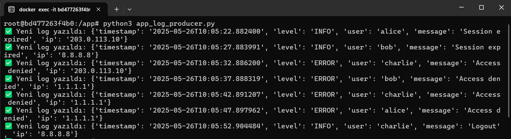

log üretme işlemi başarılı bir şekilde başlatıldığında Flask Web server 'ın başlatılması amacıyla ``python3 app.py`` komutu ile başlatılır.

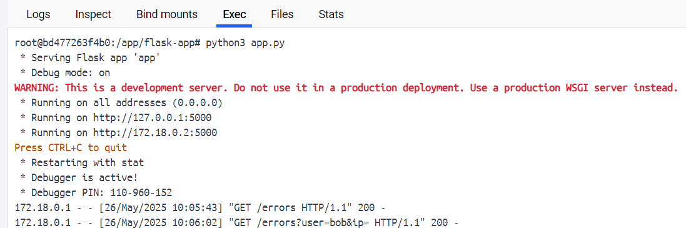

Web browser üzerinden ``http://localhost:5000/`` adresine bağlanılır;

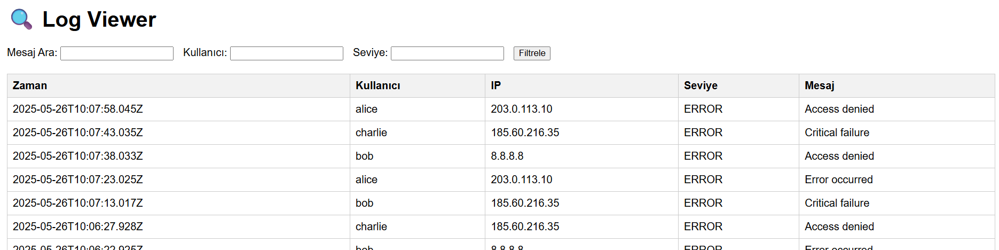

Görselde görüldüğü gibi Elasticsearch üzerinden alınan log verileri bir tablo olarak görülmektedir. Filterlar kullanılarak istenilen loglar görülebilemektedir. ``http://localhost:5000/errors`` adresi üzerinden ise sadece ``ERROR`` seviyesinde olan loglar görüntülenir.

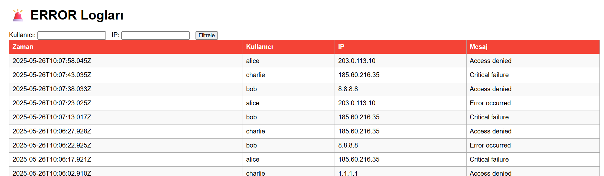

Log seviyesi ``ERROR`` seviyesinde olanların kaç adet olduğunu gösteren bir tabloyu ise ``http://localhost:5000/error-chart`` adresi üzerinden ulaşabilirsiniz.

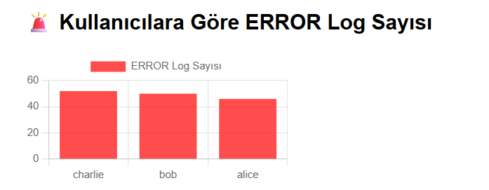