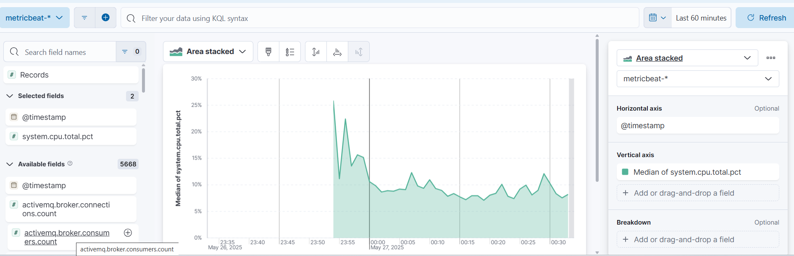

# Kibana Nedir?


Kibana, Elastic Stack’in bir parçası olan açık kaynaklı bir veri görselleştirme ve keşif aracıdır. **Elasticsearch** üzerindeki verileri analiz etmenizi, sorgulamanızı ve anlamlı grafiklerle görselleştirmenizi sağlar. Kibana, özellikle log yönetimi, gerçek zamanlı veri analizi ve dashboard oluşturma gibi konularda sistem yöneticileri, geliştiriciler ve veri analistlerinin vazgeçilmezidir. Kibana, çok yönlü bir araçtır. Öne çıkan yetenekleri:


| Özellik              | Açıklama                                                       |
| -------------------- | -------------------------------------------------------------- |
| **Discover**         | Elasticsearch'teki verileri arayüzde keşfedin                  |
| **Visualize / Lens** | Grafikler, tablolar, pie chart’lar oluşturun                   |
| **Dashboard**        | Birden fazla görseli tek sayfada birleştirin                   |
| **Dev Tools**        | Elasticsearch API’sine direkt erişim sağlayın                  |
| **Alerting**         | Belirli koşullarda uyarılar oluşturun (Basic lisansla sınırlı) |
| **Maps & Geo**       | Coğrafi verileri harita üzerinde görselleştirin                |

Kibana için dört temel lisans modeli sunar:

| Lisans Türü    | Ücretsiz mi? | Hedef Kullanıcı                  | Anahtar Özellikler                                                 |
| -------------- | ------------ | -------------------------------- | ------------------------------------------------------------------ |
| **Basic**      | ✅ Evet       | Geliştirici, küçük ekipler       | Dashboard, Discover, Dev Tools, Lens                               |
| **Gold**       | ❌ Hayır      | Orta ölçekli ekipler             | Role-based erişim, Alerting, Monitoring                            |
| **Platinum**   | ❌ Hayır      | Büyük ekipler                    | Machine Learning, SSO, Canvas                                      |
| **Enterprise** | ❌ Hayır      | Kurumsal, regülasyonlu sektörler | Advanced security, Searchable snapshots, Cross-cluster replication |


Kibananın daha iyi anlaşılması amacıyla aşağıdaki Senaryolar üzerinde çalışabiliriz. Bu sayede hem uygulama yaparken hemde kibana kullanımındaki deneyimlerinizi arttırabiliriz.

## Senaryo 1 - Nginx Access Logs’in ELK ile izlenmesi

Bu senaryoda nginx tarafından üretilenlorların incelenmesi ve görselleştirilmesi sağlanacaktır.

**Dizin Yapısı**

```
elk-nginx-logs/
├── docker-compose.yml
├── access-logs/                  # Nginx loglarının yazıldığı klasör
│   └── access.log                # Nginx burada access.log dosyasına yazar
├── nginx/
│   └── nginx.conf                # Nginx yapılandırma dosyası
├── logstash/
│   └── pipeline/
│       └── nginx-pipeline.conf  # Logstash input-filter-output ayarı
```

``docker-compose.yml``

```yml
version: '3.7'
services:
  elasticsearch:
    image: docker.elastic.co/elasticsearch/elasticsearch:8.11.0
    container_name: elasticsearch
    environment:
      - discovery.type=single-node
      - xpack.security.enabled=false
    ports:
      - "9200:9200"
    volumes:
      - esdata:/usr/share/elasticsearch/data

  logstash:
    image: docker.elastic.co/logstash/logstash:8.11.0
    container_name: logstash
    depends_on:
      - elasticsearch
    volumes:
      - ./logstash/pipeline:/usr/share/logstash/pipeline
      - ./access-logs:/access-logs
    ports:
      - "5000:5000"

  kibana:
    image: docker.elastic.co/kibana/kibana:8.11.0
    container_name: kibana
    depends_on:
      - elasticsearch
    ports:
      - "5601:5601"
    environment:
      - ELASTICSEARCH_HOSTS=http://elasticsearch:9200

  nginx:
    image: nginx:alpine
    container_name: nginx
    ports:
      - "8080:80"
    volumes:
      - ./nginx/nginx.conf:/etc/nginx/nginx.conf:ro
      - ./access-logs:/var/log/nginx

volumes:
  esdata:

```

``nginx/nginx.conf``

```conf
events {}

http {
    access_log /var/log/nginx/access.log combined;

    server {
        listen 80;
        server_name localhost;

        location / {
            return 200 'Nginx log testi başarili!';
            add_header Content-Type text/plain;
        }
    }
}
```

``logstash/pipeline/nginx-pipeline.conf``

```conf
input {
  file {
    path => "/access-logs/access.log"
    start_position => "beginning"
    sincedb_path => "/dev/null"
  }
}

filter {
  grok {
    match => { "message" => "%{COMBINEDAPACHELOG}" }
  }
  mutate {
    remove_field => ["ident", "auth"]
  }
  date {
    match => ["timestamp", "dd/MMM/yyyy:HH:mm:ss Z"]
    target => "@timestamp"
  }
}


output {
  elasticsearch {
    hosts => ["http://elasticsearch:9200"]
    index => "nginx-logs"
  }
}
```

Sistemin başlatılması amacıyla ``docker-compose up -d`` komutu kullanılır. Sistem başlatıldıktan sonra ``http://localhost:5601/`` adresine bağlanılır. bağlanıldıktan sonra kontrol edilmesi gereken iki bölüm vardır. İlk öncelikle ``Stack Management > Index Management`` yolu izlenir ve  ``nginx-logs`` var olup/olmadığı kontrol edilir.


``Kibana > Data Views`` yolu izlenir ve ``nginx-*`` var olup/olmadığı kontrol edilir. 


Bu kontrol işleminin ardından ``Analytics > Visualize Library`` yolu izlenir ve ``Create new Visualization`` butonuna tıklanılır. Açılan pencere üzerinden ``Lens`` seçilir. 


``Horizontal axis`` kısmında ``@timestamp``, ``Vertical axis`` kısmında ise ``Count`` seçilir. Bu seçim işleminden sonra nginx üzerinde yapılan isteklerle ilgili bir grafiğe sahip olmaktayız.


Bu işlemi kaydettikten sonra ``Analytics > Visualize Library`` yolu izlenerek grafiği görmekteyiz.


Bu işlemi test edilmesi için;
Linux sistemlerde;

```bash
curl http://localhost:8080/
```

Windows Sistemlerde;

```powershell
while ($true) {
    try {
        Invoke-WebRequest -Uri "http://localhost:8080/" -UseBasicParsing | Out-Null
        Write-Host "İstek gönderildi: $(Get-Date -Format 'HH:mm:ss')"
    } catch {
        Write-Host "Hata oluştu: $_"
    }
    Start-Sleep -Seconds 1
}
```

## Senaryo 2 - Sistem Kaynak Kullanımının Görselleştirilmesi

Sistem üzerinden kullanılan CPU, RAM vb kaynaklarının kullanımının düzenli olarak izlenebilir. Bu sayede ani CPU veya RAM kullanımları tespit edilerek sunucu üzerinde olası hizmet kesintilerinin önüne geçilmesi sağlanabilir. İşte tam da bu nedenle, **gerçek zamanlı sistem izlemesi ve performans görselleştirmesi**, modern IT altyapılarının vazgeçilmez bir parçasıdır.
Bu senaryoda hangi verileri toplayabiliriz;

* CPU kullanımı (system.cpu.total.pct)
* Bellek kullanımı (system.memory.actual.used.pct)
* Disk I/O (system.diskio.*)
* Ağ trafiği (system.network.*)

Bu veriler otomatik olarak her saniye toplanır ve Elasticsearch’e gönderilebilir. Bu verilerin görselleştirilmesi için Kibana kullanılabilir.

Uygulamayı gerçekleştirebileceğimiz projenin yapısı ve konfigürasyon dosyalarının içeriği aşağıdaki gibidir;

**Proje Dizin Yapısı**

```
elk-system-monitoring/
├── docker-compose.yml
├── metricbeat/
│   └── metricbeat.yml
```

**docker-compose.yml**

```yml
version: '3.7'
services:
  elasticsearch:
    image: docker.elastic.co/elasticsearch/elasticsearch:8.11.0
    container_name: elasticsearch
    environment:
      - discovery.type=single-node
      - xpack.security.enabled=false
    volumes:
      - esdata:/usr/share/elasticsearch/data
    ports:
      - "9200:9200"

  kibana:
    image: docker.elastic.co/kibana/kibana:8.11.0
    container_name: kibana
    ports:
      - "5601:5601"
    environment:
      - ELASTICSEARCH_HOSTS=http://elasticsearch:9200
    depends_on:
      - elasticsearch

  metricbeat:
    image: docker.elastic.co/beats/metricbeat:8.11.0
    container_name: metricbeat
    user: root
    volumes:
      - ./metricbeat/metricbeat.yml:/usr/share/metricbeat/metricbeat.yml:ro
      - /var/run/docker.sock:/var/run/docker.sock
      - /sys/fs/cgroup:/hostfs/sys/fs/cgroup:ro
      - /proc:/hostfs/proc:ro
      - /:/hostfs:ro
    depends_on:
      - elasticsearch
    command: ["--strict.perms=false"]

volumes:
  esdata:

```

**metricbeat/metricbeat.yml**

```yml
metricbeat.config.modules:
  path: ${path.config}/modules.d/*.yml
  reload.enabled: false

setup.kibana:
  host: "http://kibana:5601"

output.elasticsearch:
  hosts: ["http://elasticsearch:9200"]

processors:
  - add_host_metadata: ~
  - add_cloud_metadata: ~

setup.dashboards.enabled: true

```

Kibana üzerinden görselleştirme işleminin gerçekleştirilmesi için  ``Analytics > Visualize Library`` yolu izlenir ve ``Create new Visualization`` butonuna tıklanılır. Açılan pencere üzerinden ``Lens`` seçilir. 


Açılan pencere üzerinden ``Horizontal axis`` kısmında ``@timestamp``, ``Vertical axis`` kısmında ise ``system.cpu.total.pct`` eklenir. Bu işlem ile CPU bilgileri grafik olarak görünür hale gelmektedir.



Sıralı olarak RAM ve Disk tüketimini eklemek için;

| Field Adı                         | Açıklama                                          |
| --------------------------------- | ------------------------------------------------- |
| `system.memory.total`             | Toplam RAM miktarı (byte)                         |
| `system.memory.used.bytes`        | Kullanılan RAM miktarı (byte)                     |
| `system.memory.used.pct`          | Kullanılan RAM yüzdesi (0-1 arası değer)          |
| `system.memory.free`              | Boş RAM miktarı (byte)                            |
| `system.memory.actual.used.bytes` | Gerçek kullanılan RAM (cache ve buffer'lar hariç) |
| `system.memory.actual.used.pct`   | Gerçek kullanım yüzdesi (cache hariç)             |
| -------------------------------   | ------------------------------------------------- |
| `system.filesystem.device_name`   | Disk aygıt adı (örn. sda1, xvda1)                 |
| `system.filesystem.mount_point`   | Diskin mount edildiği dizin (örn. `/`, `/home`)   |
| `system.filesystem.total`         | Diskin toplam kapasitesi (byte)                   |
| `system.filesystem.used.bytes`    | Kullanılan disk alanı (byte)                      |
| `system.filesystem.used.pct`      | Kullanılan disk yüzdesi (0-1 arası)               |
| `system.diskio.read.bytes`        | Okunan veri miktarı (byte)                        |
| `system.diskio.write.bytes`       | Yazılan veri miktarı (byte)                       |

Belirtilen promtlar kullanılabilir. 

