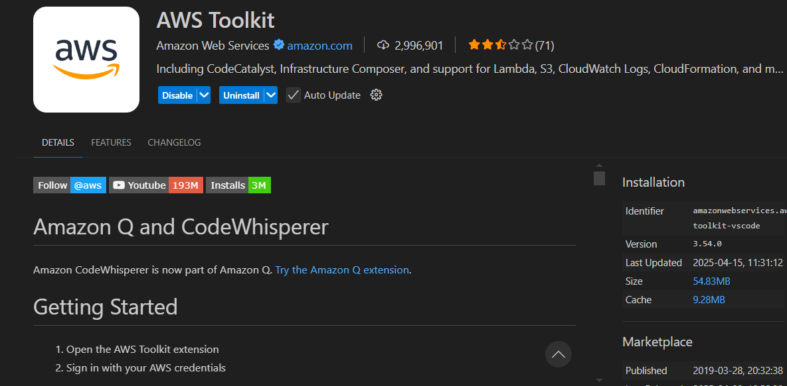
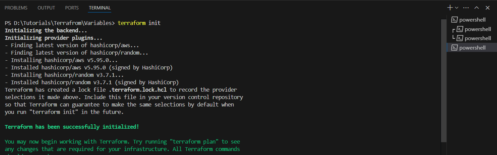
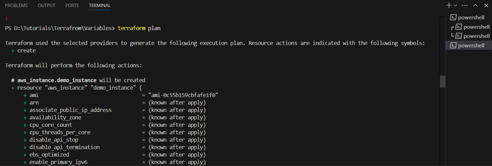
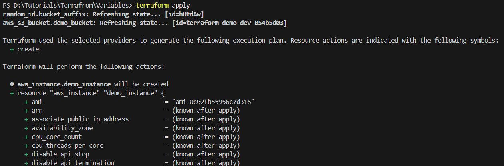
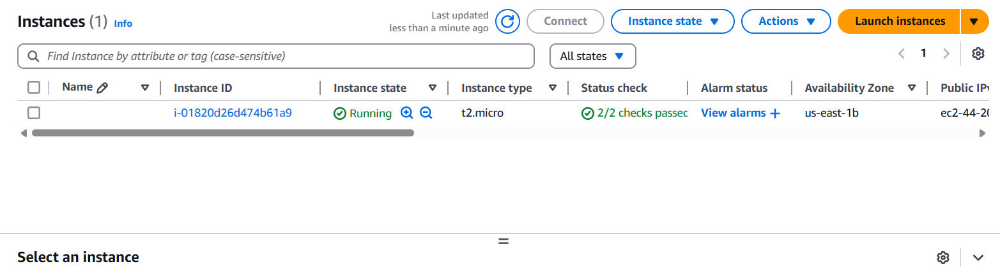
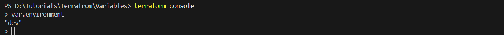
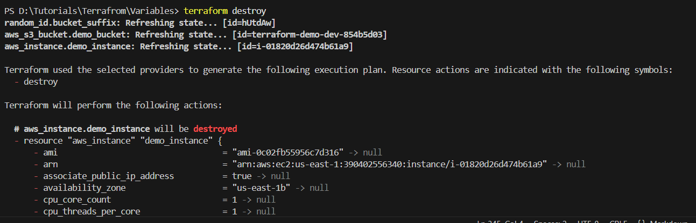

# 🌍 Terraform ile AWS Üzerinde Değişken Kullanımı ve Değişken Tipleri

Selamlar bu yazımda Terrafrom üzerinde değişkenlerin nasıl kullanıılabileceği konusunu anlatmaktayım. Terrafrom hakkındaki bir önceki yazıma [Buradan](https://xxxx) ulaşabilirsiniz. 


## 🧩 Terraform Değişken Tipleri

Terraform’da 3 ana değişken tipi vardır:

| Tip             | Açıklama                          |
|----------------|-----------------------------------|
| `string`        | Tek bir metin değeri              |
| `number`        | Sayısal değer                     |
| `bool`          | `true` veya `false`               |
| `list(<type>)`  | Dizi/tüm liste                    |
| `map(<type>)`   | Anahtar-değer çifti               |
| `object({...})` | Karmaşık yapı (JSON benzeri)      |

### 📌 Input Variables (Girdi Değişkenleri)

**Input variable**’lar ```variables.tf``` dosyasında tanımlanır ve ```terraform.tfvars``` dosyası ya da CLI ile değer verilir.

**🎯 Örnek: AWS EC2 için değişken kullanımı**

```variables.tf```

```hcl
variable "region" {
  description = "AWS region"
  type        = string
  default     = "us-east-1"
}

variable "instance_type" {
  description = "EC2 instance tipi"
  type        = string
  default     = "t2.micro"
}

variable "tags" {
  description = "Ortak tag değerleri"
  type        = map(string)
  default     = {
    Environment = "dev"
    Owner       = "murat"
  }
}

```


```terraform.tfvars```

```hcl
region        = "eu-central-1"
instance_type = "t3.micro"
```


```main.tf```

```hcl
provider "aws" {
  region = var.region
}

resource "aws_instance" "example" {
  ami           = "ami-0c55b159cbfafe1f0" # örnek Amazon Linux 2 AMI
  instance_type = var.instance_type
  tags          = var.tags
}

```

### ⚙️ Local Variables (Yerel Değişkenler)

**Yerel değişkenler**, küçük projelerde veya tekrar eden değerleri tutmak için kullanılır. ```locals``` bloğunda tanımlanır.

**Örnek:**

```hcl
locals {
  common_tags = {
    Environment = "staging"
    Project     = "TerraformIntro"
    Owner       = "Murat"
  }
}

resource "aws_s3_bucket" "example" {
  bucket = "my-terraform-bucket-123456"
  tags   = local.common_tags
}
```

### 📤 Output Variables (Çıktı Değişkenleri)

**Output Variables**, Terraform çalıştıktan sonra önemli değerleri (örneğin IP adresi) terminalde göstermek için kullanılır.

**Örnek:**

```hcl
output "instance_public_ip" {
  description = "Oluşturulan EC2 instance'ın public IP'si"
  value       = aws_instance.example.public_ip
}
```

## 🧪 Terraform'da Değişken Önceliği (Variable Precedence in Terraform)


Terraform'da **aynı değişken** birden fazla yerde tanımlanmışsa **hangi değerin kullanılacağını** belirleyen bir **öncelik sırası (precedence order)** vardır. Bu sistem sayesinde, projeyi farklı ortamlarda (dev, staging, prod) kolayca yönetebilirsin.

**🥇 1. Komut Satırı Üzerinden ``-var`` veya ``-var-file``**

Değişkenlerin yüksek önceliğe sahip olması.

```bash
terraform apply -var="region=us-west-2"
terraform apply -var-file="prod.tfvars"
```
💡 Bu yöntem, genellikle otomasyon sistemlerinde ya da farklı ortamlar için hızlıca değer geçmek istediğinde kullanılır.

**🥈 2. Ortam Değişkenleri (``TF_VAR_`` prefix'i ile)**

Terraform, sistemdeki environment değişkenlerini ```TF_VAR_``` ile başlıyorsa otomatik olarak tanır.

```bash
export TF_VAR_region="us-west-1"
terraform apply
```
Bu durumun nedeni Terraform, ortam değişkenlerinden değer alabilmesi için özel bir adlandırma kuralı kullanır.
Kural:
```
TF_VAR_<variable_name>
``` 
şeklindedir. Bu durum;

* CI/CD pipeline'larında (örneğin Jenkins), environment değişkenleri üzerinden deploy ortamını (dev, staging, prod) belirlemek için çok kullanışlıdır.

* Sensitive veri içeren değişkenlerde .tfvars dosyasına yazmak yerine TF_VAR_ ile dışarıdan geçmek daha güvenlidir (örneğin bir TF_VAR_db_password tanımlamak gibi).


**🥉 3. ``terraform.tfvars`` veya ``.auto.tfvars`` Dosyaları**

**📄 terraform.tfvars**:
Terraform’un varsayılan olarak otomatik okuduğu dosyadır. Dosya sabittir ve adı ``terraform.tfvars``'dır

**📄 *.auto.tfvars**
Sonu ``.auto.tfvars`` ile biten tüm dosyalar da otomatik olarak yüklenir. Birden fazla ortam veya yapılandırma varsa ``dev.auto.tfvars``, ``prod.auto.tfvars`` gibi birden çok dosya ile çalışabilirsin.

| Özellik                         | `terraform.tfvars`              | `*.auto.tfvars`                                      |
|---------------------------------|----------------------------------|------------------------------------------------------|
| Dosya adı sabit mi?             | Evet                             | Hayır (ama `.auto.tfvars` ile bitmeli)              |
| Otomatik yüklenir mi?           | Evet                             | Evet                                                 |
| Birden fazla kullanılabilir mi? | Hayır                            | Evet (`dev.auto.tfvars`, `qa.auto.tfvars` vs.)       |
| Kullanım amacı                  | Tek ortam yapılandırması         | Çoklu ortam ve yapılandırma seçimi                   |


**🏅 4. ``default`` Değer**

En düşük önceliğe sahiptir. Yukarıdaki hiçbir yöntemle değer verilmemişse kullanılır.

**variables.tf**

```hcl
variable "region" {
  type    = string
  default = "us-east-1"
}
```

**``default`` Neden Önemli**:
* **👷‍♂️ Kullanıcı hata yaparsa sistem bozulmasın diye:** Değişkenin değerini geçmeyi unutursan bile planlama ve apply işlemleri aksamaz.

* **🧪 Test ve demo ortamları için:** Varsayılan bir region, instance tipi gibi değerler önceden tanımlanabilir.

* **🔐 Opsiyonel değişkenleri esnek bırakmak için:** Her zaman tanımlanması gerekmeyen ama gerekiyorsa değiştirilmesi mümkün olan alanlar için kullanılır.


## 📚 Uygulamalı Örnek: AWS EC2 ve S3 Kaynakları ile Değişken Kullanımı

Terraform özelinde yönetimsel işlemlerin gerçekleştirilmesi amacıyla vscode içerisinde bulunan **Extensions** kullanmaktayım.
İlk öncelikle AWS Cloud tarafındaki yönetimsel işlemleri için **AWS Toolkit** kullanılmaktadır.


Terraform yönetilmesi ve kullanılması amacıyla **Terraform** extensions 'ı kullanılmaktadır.


Bu örnekte Terraform ile:

- Bir EC2 instance (sanallaştırılmış sunucu),
- Bir S3 bucket (depolama hizmeti),
- Ortak tag’ler ve ortam isimleri gibi değişkenler

oluşturacağız. Böylece **input, local ve output değişkenlerin nasıl birlikte kullanıldığını** pratik bir örnek gösterilmektedir..

---

### 1️⃣ `variables.tf`

```hcl
variable "environment" {
  description = "Deployment environment name, e.g. dev or prod"
  type        = string
  default     = "dev"
}

```

🔹 **🟩 Açıklama:**
Bu kod, `environment` adında bir string türünde Terraform değişkeni tanımlar ve varsayılan değerini `"dev"` olarak ayarlar.  
Kullanıcı isterse bu değeri `terraform.tfvars` dosyasında veya komut satırında geçerek değiştirebilir.  
Genellikle kaynak adlandırmalarında hangi ortamda (dev, prod, vs.) çalışıldığını belirtmek için kullanılır.

---

### 2️⃣ `locals.tf`

```hcl
locals {
  common_tags = {
    Environment = var.environment
    Project     = "TerraformDemo"
  }
}

```

🔹 **Açıklama:**
Bu kod, `common_tags` adında bir yerel (local) değer tanımlar.  
İçinde ortam bilgisini (`var.environment`) ve proje adını (`TerraformDemo`) etiket olarak tutar.  
Bu etiketler, kaynaklara otomatik olarak eklenerek yönetimi kolaylaştırır.

---

### 3️⃣ `main.tf`

```hcl
locals {
  common_tags = {
    Environment = var.environment
    Project     = "TerraformDemo"
  }
}

resource "random_id" "bucket_suffix" {
  byte_length = 4
}

resource "aws_instance" "demo_instance" {
  ami           = "ami-0c55b159cbfafe1f0" # Amazon Linux 2 AMI
  instance_type = "t2.micro"
  tags          = local.common_tags
}

resource "aws_s3_bucket" "demo_bucket" {
  bucket = "terraform-demo-${var.environment}-${random_id.bucket_suffix.hex}"
  tags   = local.common_tags
}

```

🔹 **Açıklama:**

Bu kod, `aws_instance` kaynağı ile `t2.micro` türünde bir EC2 instance oluşturur ve etiket olarak `local.common_tags` değerlerini kullanır.  
Ayrıca, benzersiz bir S3 bucket adı oluşturmak için `random_id` kaynağıyla rastgele bir ek üretir ve `aws_s3_bucket` ile bir S3 bucket oluşturur.  
Her iki kaynak da ortak etiketlerle (`environment`, `project`) tanımlanır, bu da kaynakların sınıflandırılmasını ve yönetimini kolaylaştırır.

---

### 4️⃣ `outputs.tf`

```hcl
output "instance_public_ip" {
  description = "EC2 instance'ın public IP adresi"
  value       = aws_instance.demo_instance.public_ip
}

output "s3_bucket_name" {
  description = "Oluşturulan S3 bucket ismi"
  value       = aws_s3_bucket.demo_bucket.id
}
```

🔹 **Açıklama:**
Bu kod, oluşturulan EC2 instance'ın public IP adresini ve S3 bucket'ın ismini Terraform çıktısı olarak gösterir.  
`output` blokları sayesinde bu değerler `terraform apply` işleminden sonra terminalde görüntülenebilir.  
Bu çıktılar, diğer modüller veya kullanıcılar tarafından kolayca erişilebilir hale gelir.


### 5️⃣ `providers.tf` 

```hcl
terraform {
  required_providers {
    aws = {
        source = "hashicorp/aws"
    }
  }
}

provider "aws" {
  region                  = "us-east-1"
  shared_credentials_files = ["~/.aws/credentials"]
  profile                 = "vscode"
}
```
🔹 **Açıklama:**

Bu kod, Terraform'un AWS sağlayıcısını (`hashicorp/aws`) kullanacağını belirtir ve gerekli sağlayıcıyı tanımlar.  
`provider` bloğunda, kaynakların oluşturulacağı AWS bölgesi olarak `us-east-1` (N. Virginia) seçilmiştir.  
AWS kimlik bilgileri, `~/.aws/credentials` dosyasından okunur.  
`profile = "vscode"` satırı ise bu kimlik dosyasındaki `[vscode]` isimli profili kullanacağını belirtir.  
Bu yapı, Terraform’un AWS kaynaklarını oluşturabilmesi için gerekli bağlantı ve kimlik bilgilerini sağlar.


---

### 🧪 Terraform Komutları

Yukarıda kodları belirtilen uygulamanın çalıştırılması amacayıla aşağıdaki komutlar uygulanır;

1. `terraform init`  
   Terraform projesini başlatır ve gerekli sağlayıcı (provider) eklentilerini indirir.  
   Bu komut, `.terraform` klasörünü oluşturur ve yapılandırmayı hazırlar.

  

2. `terraform plan`  
   Yapılandırma dosyalarını analiz eder ve neyin değişeceğini gösteren bir yürütme planı (execution plan) oluşturur.  
   Gerçek bir değişiklik yapmaz, sadece **nelerin oluşturulacağını, silineceğini veya değişeceğini** gösterir.

  

3. `terraform apply`  
   `plan` ile gösterilen değişiklikleri uygular ve kaynakları AWS gibi sağlayıcılarda oluşturur/günceller.  
   Kullanıcıdan onay alarak işlemleri gerçekleştirir.

  

   İşlem başarılı bir şekilde gerçekleşmesinin ardından kontrol edilmesi amacıyla AWS cloud 'a bağlanılır ve EC2 instance kontrol edilir.
   

   Tanımlamış olduğumuz değişkenlerin görüntülenmesi amacıyla ``terraform console`` komutu kullanılmaktadır. Console çalıştırıldıktan sonra ``var.{Değişken_adı}`` ile değişlemler görüntülenebilir.
   
   


4. `terraform destroy`  
   Daha önce oluşturulan tüm altyapı kaynaklarını siler.  
   Özellikle test ortamlarını temizlemek için kullanılır.

   
