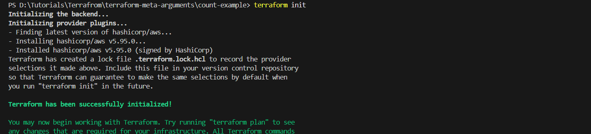
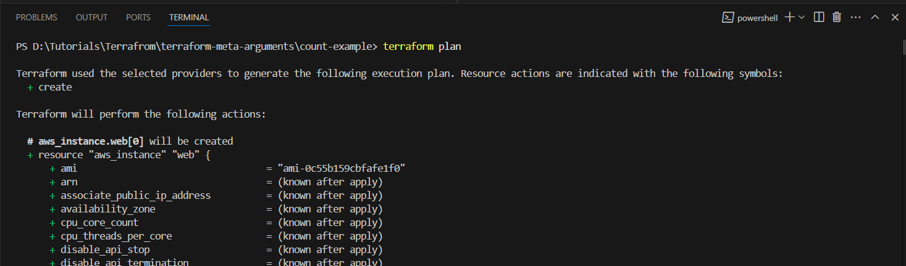
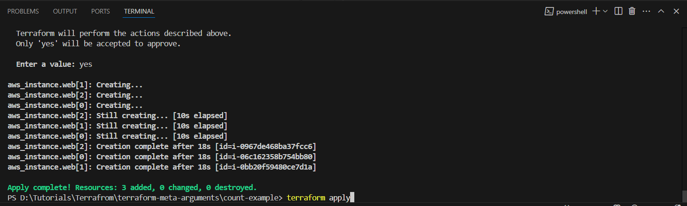
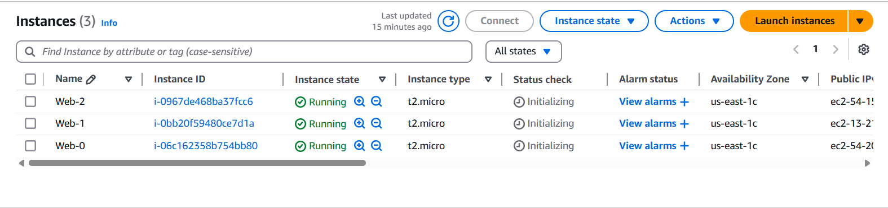
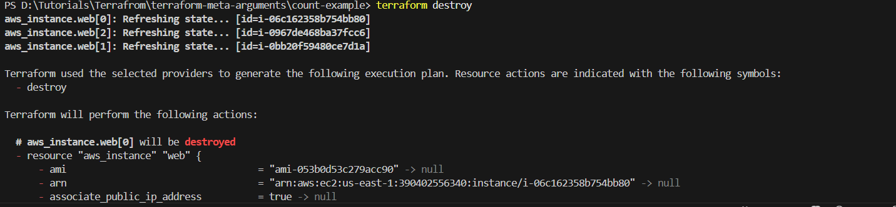
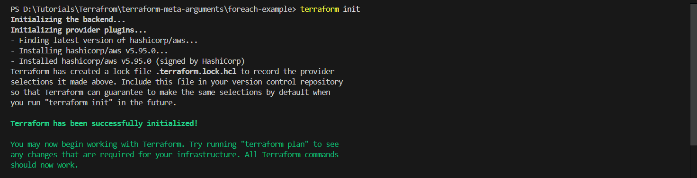
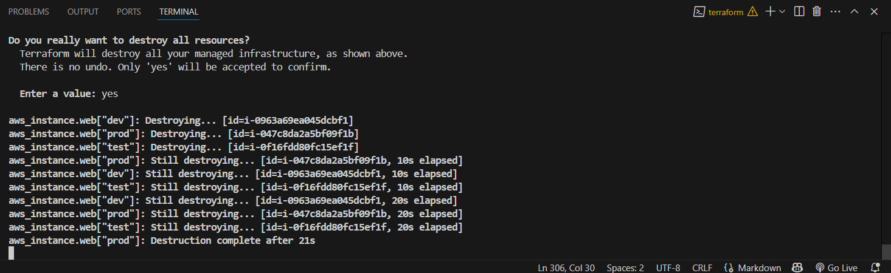

# 🌱 Terraform Resource Meta Arguments: count VS for_each

Selamlar bu blog yazısında ``count`` ve ``for_each`` meta argümanlarından bahsedeceğim. Bir önceki blog yazıma [Buradan](https://medium.com/@muratasnb/terraform-ile-aws-%C3%BCzerinde-de%C4%9Fi%C5%9Fken-kullan%C4%B1m%C4%B1-ve-de%C4%9Fi%C5%9Fken-tipleri-b25f1e79aeaa) ulaşabilirsiniz. Terraform ile cloud kaynaklarını tanımlanırken, kaynaklakların birden fazla kopyasını oluşturuken kullanılmaktadır.


Bu yazıda;

* ``count`` ve ``for_each``’ün farklarını,
* Hangi durumlarda hangisinin tercih edilmesi gerektiğini,
* AWS ile kullanım örnekleri,
* Dezavantaj ve dikkat edilmesi gereken noktaları ele alacağız.

### 🧩 1. ``count`` Nedir?

``count``, bir kaynağın kaç kopyasının oluşturulacağını belirlemek için kullanılır. Genellikle aynı türde kaynkaların tekrarı için idealdir.

**🛠 Kullanım Örneği:**

```hcl
resource "aws_instance" "web" {
  count         = 3
  ami           = "ami-0c55b159cbfafe1f0"
  instance_type = "t2.micro"
  tags = {
    Name = "web-${count.index}"
  }
}
```
**🎯 Ne işe yarar?**
* 3 tane ``aws_instance.web[0]``, ``[1]``, ``[2]`` oluşturur.
* ``count.index`` ile her kopyaya özel bilgi atanabilir.


### 🔁 2. for_each Nedir?

```for_each``, liste veya map gibi koleksiyonları döngüye sokarak kaynakları oluşturur. Her obje benzersiz bir anahtara sahip olur.

**🛠 Kullanım Örneği (Map ile):**

```hcl
variable "instances" {
  default = {
    "dev"  = "t2.micro"
    "test" = "t2.small"
    "prod" = "t2.medium"
  }
}

resource "aws_instance" "web" {
  for_each      = var.instances
  ami           = "ami-0c55b159cbfafe1f0"
  instance_type = each.value
  tags = {
    Name = each.key
  }
}
```

**🎯 Ne işe yarar?**

* ``aws_instance.web["dev"]``, ``["test"]``, ``["prod"]`` gibi benzersiz anahtarlarla kaynaklar oluşturur.`
* ``ach.key`` ve ``each.value`` ile detaylara erişilebilir.

**⚖️ count VS for_each Karşılaştırması**

| **Özellik**         | **count**                       | **for_each**                          |
|---------------------|----------------------------------|----------------------------------------|
| **Veri Tipi**       | Sayı (`number`)                 | Liste veya Map                         |
| **Benzersiz Kimlik**| `count.index` (sıralı numara)   | `each.key` (anahtar değeri)           |
| **Hedef Kullanım**  | Aynı yapıdaki kopyalar          | Benzersiz özellikleri olan kopyalar   |
| **Silme/Düzenleme** | Kaynak sırasını etkileyebilir | Daha kararlı, key üzerinden çalışır |


**⚠️ Dikkat Edilmesi Gerekenler**

#### ``count`` Kullanırken:

* Araya kaynak silinir veya eklenirse index kayar. Bu da istenmeyen kaynak değiştirme/silme işlemlerine yol açabilir.

#### ``for_each`` Kullanırken:

* ``set`` (listelerde) kullanırsan anahtar değeri sıra değil **değerin kendisi** olur.
* Bu yüzden tekrarlayan değerler kullanılamaz.

## 🧪 Terraform Meta Arguments Senaryosu

``count`` ve ``for_each`` senaryo örnekleri aşağıdaki gibidir. Öncelikle örnek için gerekli olan klasör yapısı;

```
terraform-meta-arguments/
│
├── count-example/
│   ├── main.tf
│   ├── variables.tf
│   └── terraform.tfvars
│
├── foreach-example/
│   ├── main.tf
│   ├── variables.tf
│   └── terraform.tfvars
│
└── sg-foreach-dynamic/
    ├── main.tf
    ├── variables.tf
    └── terraform.tfvars
```

### ``📂 count-example/``

#### ``🔹 main.tf``

```hcl
provider "aws" {
  region                  = "us-east-1"
  shared_credentials_files = ["~/.aws/credentials"]
  profile                 = "vscode"
}

resource "aws_instance" "web" {
  count         = var.instance_count
  ami           = "ami-053b0d53c279acc90"  # ✅ Güncellenmiş AMI ID
  instance_type = "t2.micro"

  tags = {
    Name = "Web-${count.index}"
  }
}
```

#### ``🔹 variables.tf``

```hcl
variable "instance_count" {
  type        = number
  description = "Kaç adet EC2 oluşturulacak"
  default     = 2
}
```

#### ``🔹 terraform.tfvars``

```hcl
instance_count = 3
```
### ``📂 foreach-example/``

#### ``🔹 main.tf``

```hcl
provider "aws" {
  region = "us-east-1"
}

resource "aws_instance" "web" {
  for_each = var.instances

  ami           = "ami-0c55b159cbfafe1f0"
  instance_type = each.value

  tags = {
    Name = each.key
  }
}
```

#### ``🔹 variables.tf``

```hcl
variable "instances" {
  type = map(string)
  default = {
    dev  = "t2.micro"
    test = "t2.small"
    prod = "t2.medium"
  }
}
```
#### ``🔹 terraform.tfvars``

```hcl
instances = {
  dev  = "t2.micro"
  test = "t2.small"
  prod = "t2.medium"
}
```

### ``📂 sg-foreach-dynamic/``

#### ``🔹 main.tf``

```hcl
provider "aws" {
  region = "us-east-1"
}

resource "aws_security_group" "example" {
  name        = "dynamic-sg"
  description = "Dynamic SG example"
  vpc_id      = var.vpc_id

  dynamic "ingress" {
    for_each = var.ingress_rules
    content {
      from_port   = ingress.value.from
      to_port     = ingress.value.to
      protocol    = ingress.value.protocol
      cidr_blocks = ingress.value.cidr
    }
  }
}
```

#### ``🔹 variables.tf``

```hcl
variable "vpc_id" {
  description = "VPC ID"
  type        = string
}

variable "ingress_rules" {
  description = "List of ingress rules"
  type = map(object({
    from     = number
    to       = number
    protocol = string
    cidr     = list(string)
  }))
}
```

#### ``🔹 terraform.tfvars``

```hcl
vpc_id = "vpc-xxxxxxxx"

ingress_rules = {
  ssh = {
    from     = 22
    to       = 22
    protocol = "tcp"
    cidr     = ["0.0.0.0/0"]
  },
  http = {
    from     = 80
    to       = 80
    protocol = "tcp"
    cidr     = ["0.0.0.0/0"]
  }
}
```

### 🔍 foreach-example vs sg-foreach-dynamic Farkı

| **Özellik**           | **foreach-example**                           | **sg-foreach-dynamic**                                               |
|------------------------|-----------------------------------------------|----------------------------------------------------------------------|
| **Kaynak Türü**        | `aws_instance` (EC2)                          | `aws_security_group`                                                |
| **for_each Kullanımı** | `map(string)` içinde `key = name`, `value = instance type` | `map(object)` içinde `key = rule name`, `value = port/protocol/cidr` |
| **Değer Erişimi**      | `each.key` ve `each.value` (string)           | `ingress.value.from`, `.to`, `.protocol`, `.cidr`                   |
| **Dynamic Block Kullanımı** | Yok                                       | ✅ Evet                                                              |
| **Kullanım Amacı**     | Her biri farklı `instance_type` olan EC2'ler  | Farklı kurallarla tek bir Security Group’a birden çok ingress kuralı |

### 🧪 Terraform Komutları & Uygulama 

Yukarıdaki klasör yapısını oluşturduktan sonra uygulamaların çalıştırılması amacıyla aşağıdaki adımlar uygulanır.

Count uygulamasının gerçekleştirilmesi amacıyla ``count-example`` klasörü içerisinde Terraform uygulaması için gerekli eklentilerin oluşturulması amacıyla ``terraform init`` komutu kullanılır.



Olası hatalara karşı ``terraform plan`` komutu ile gerekli kontroller sağlanır.



Uygulamının gerçekleştirilmesi/uygulanması amacıyla ``terraform apply`` komutu kullanılarak EC2 instance oluşturulur.




Oluşturma işleminin ardından kontrol işleminin gerçekleştirilmesi amacıyla AWS Cloud 'a bağlanılır. EC2 instance kontrol edilir;



EC2 Instance kaldırılması amacıyla ``terraform destroy`` komutu kullanılır.




foreach uygulamasının gerçekleştirilmesi amacıyla ``foreach-example`` klasörü içerisinde Terraform uygulaması için gerekli eklentilerin oluşturulması amacıyla aşağıdaki komutlar sırasıyla kullanılmaktadır;

 * ``terraform init``
 * ```terraform plan``
 * ``terraform apply``



Sıralı bir şekilde işlemler yapıldıktan sonra AWS üzerinden yapıl işlem kontrol edilmesi amacıyla EC2 altında bulunan Instance kontrol edilir.


Görselde görüldüğü gibi  oluşturulan Instance name kısmıdan atamış olduğumuz isimler görülmektedir. ``for_each`` ile EC2 instance oluşturmak, **birden fazla instance'ı tek bir kaynak bloğuyla** dinamik şekilde tanımlamayı sağlar. Bu yöntem, **kod tekrarını azaltır, yönetimi kolaylaştırır ve kolay ölçeklenebilirlik** sunar.

Oluşturulan EC2 Instance silinmesi amacıyla ``terraform destroy`` komutu kullanılır.



**``for_each`` ve  ``sg-foreach-dynamic`` Arasındaki Farklar**

| Özellik              | `for_each` Kullanımı                          | `dynamic` Blok Kullanımı (`sg-foreach-dynamic`)           |
|----------------------|-----------------------------------------------|------------------------------------------------------------|
| Amaç                 | Tüm bir kaynağı çoğaltmak                     | Kaynak içindeki alt blokları dinamik oluşturmak           |
| Kullanım Yeri        | `resource` seviyesinde                        | `resource` içindeki `ingress`, `egress`, vb. bloklarda     |
| Veri Türü            | `map` veya `set`                              | `list` veya `map`                                          |
| Örnek Kullanım       | `aws_instance`, `aws_security_group`          | `ingress`, `egress`, `tags`, `rules`, vb. bloklar          |
| Uygulama Senaryosu   | Her instance/SG için farklı kaynak oluşturmak | Tek bir SG içinde birden çok ingress/egress kuralı tanımı  |
| Kod Karmaşıklığı     | Genelde daha basit ve okunabilir              | Daha esnek ama biraz daha karmaşık                         |
| Esneklik              | Orta – kaynak sayısı kadar esnek              | Yüksek – nested yapıların detaylı kontrolü sağlanır        |
