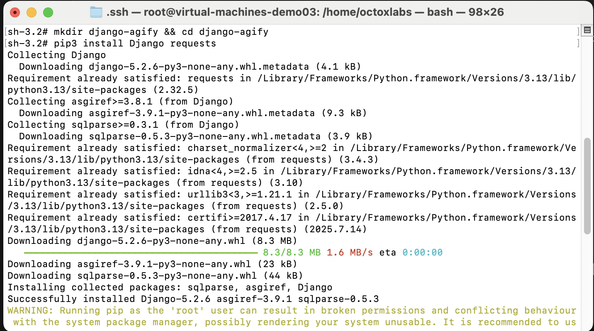
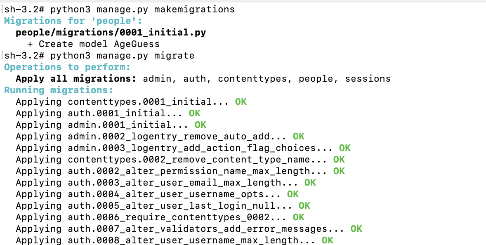
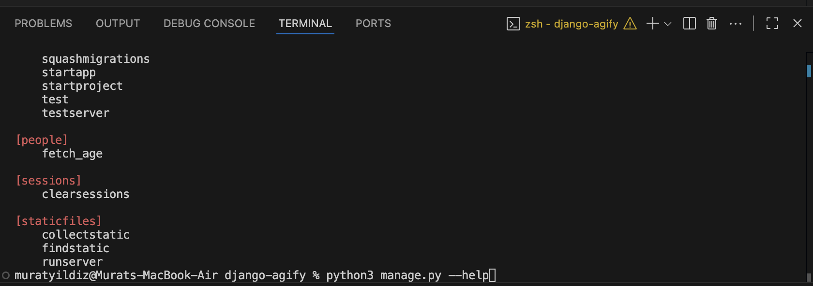
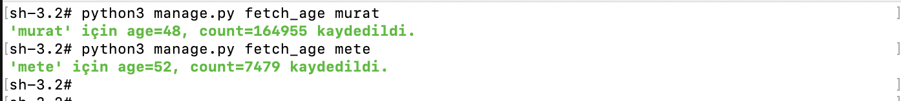
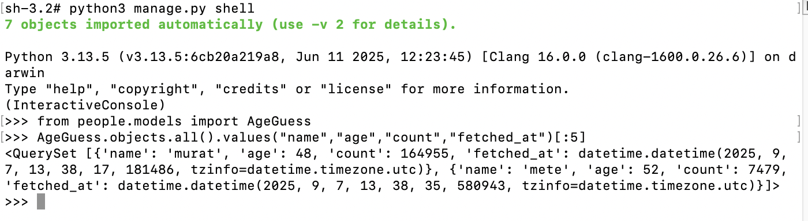

# Django’da Özel Yönetim Komutları (Custom Management Commands)

Django, Python ile yazılmış açık kaynaklı bir web framework'tür. Django 'nun temel amacı, geliştiricilere hızlı, güvenilir ve ölçeklenebilir web uygulamalarının geliştirilmesine imkan sunmaktadır. **Batteries-included** felsefesiyle, kullanıcı kimlik doğrulama, yönetici paneli ve güvenlik mekanizmları gibi birçok özellik hazır olarak gelmektedir.

Django 'nun güçlü yanları;

* **Hızlı geliştirme:** Tekrar eden işleri otomatikleştirerek kod yazmayı hızlandırmaktadır.
* **Güvenlik:** SQL injection, XSS, CSRF gibi zafyetlere karşı güçlü korumalar sağlar.
* **Ölçeklenebilirlik:** Birçok farklı ölçekli web uygulamalarında sorunsuz kullanılabilir.
* **Topluluk:** Büyük bir topluluğa ve zengin paket desteğine sahiptir. 

Instagram, Pinterest, Disqus gibi birçok büyük ölçekli platform Django ile geliştirilmiştir.


Django 'nun **Custom Management Commands** özelliği ile kendi özel komutlarımız tanımlayabiliriz. Bu durum tek satır komut ile bakım, onarım ve test süreçleri kolaylaştırılabilir. Bu sayede;
* Veri temizleme (Eski verilerin temizlenmesi)
* API entegrasyonu (Anlık dış API adreslerinden veri çekilip veri tabanına kaydedilebilir)
* Dummy data oluşturma işlemi (Test kullanıcısı oluşturma işlemi)
* Bakım işlemleri (Kullanıcı paralolarını sıfırlama veya inaktif hesapların kapatılması)
* Cron Job Entegrasyonu (Düzenli olarak gerçekleştirilmesi gereken işlemler için kullanılır.)

Bu konun daha iyi anlaşılması amacıyla aşağıdaki adımları izleyerek gerçekleştirebiliriz;

Projenin oluşturulması amacıyla aşağıdaki komutlar sırasıya kullanılabilir;
```bash
mkdir django-agify && cd django-agify
pip3 install Django requests
django-admin startproject config .
python3 manage.py startapp people
```


Kullanılan komutlar ile artık temel düzeyde bir Django projesine sahip olundu. Bu işlemin ardından ``config/settings.py`` dosyası içerisinde var olan ``INSTALLED_APPS`` listesine ``people`` eklenir.

```python
INSTALLED_APPS = [
    'people',
]
```
Bu birleştirme işleminin ardından ``agify.io``'dan gelen yaş tahminlerini db kaydedecek modelin oluşturulması amacıyla ``people/models.py`` dosyasına aşağıdaki kod eklenir;

```python
from django.db import models

class AgeGuess(models.Model):
    name = models.CharField(max_length=50)
    age = models.IntegerField(null=True, blank=True)
    count = models.IntegerField(default=0)
    fetched_at = models.DateTimeField(auto_now_add=True)

    class Meta:
        indexes = [models.Index(fields=["name", "fetched_at"])]

    def __str__(self):
        return f"{self.name} -> age={self.age} (count={self.count})"

```
Ekleme işleminin ardından aşağıdaki komutlar kullanılır;

```bash
python3 manage.py makemigrations
python3 manage.py migrate
```



Oluşturacağımız özel komut için ``people/management/commands`` klasörü ve boş ``__init__.py`` dosyaları oluşturulur(paket olarak tanımlaması için):

```bash
mkdir -p people/management/commands
touch people/management/__init__.py
touch people/management/commands/__init__.py
```

``fetch_age.py`` adlı dosya oluşturulur(``people/management/commands/fetch_age.py`` dizinine):

```python
import requests
from django.core.management.base import BaseCommand, CommandError
from people.models import AgeGuess

class Command(BaseCommand):
    help = "agify.io'dan verilen isim için yaş tahmini çeker ve veritabanına kaydeder."

    def add_arguments(self, parser):
        # Zorunlu konum argümanı: name
        parser.add_argument("name", type=str, help="Tahmin alınacak isim")
        # Opsiyonel: timeout
        parser.add_argument("--timeout", type=int, default=8, help="HTTP zaman aşımı (saniye)")

    def handle(self, *args, **opts):
        name = opts["name"].strip()
        timeout = opts["timeout"]

        if not name:
            raise CommandError("İsim boş olamaz.")

        url = "https://api.agify.io"

        try:
            # Basit GET isteği: https://api.agify.io?name=murat
            resp = requests.get(url, params={"name": name}, timeout=timeout)
            resp.raise_for_status()
            data = resp.json()
        except requests.RequestException as e:
            raise CommandError(f"API isteği başarısız: {e}")
        except ValueError:
            raise CommandError("API yanıtı JSON değil veya parse edilemedi.")

        # Beklenen örnek yanıt: {"name":"murat","age":34,"count":12345}
        age = data.get("age")
        count = data.get("count", 0)

        # Basit şekilde kaydediyoruz (idempotent gerekmiyorsa create yeterli)
        AgeGuess.objects.create(name=name, age=age, count=count)

        self.stdout.write(self.style.SUCCESS(f"'{name}' için age={age}, count={count} kaydedildi."))

```

Bu işlemin ardından özel komutun eklendiğinden emin olunması amacıyla ``python3 manage.py --help`` komutu kullanılabilir.


Görselde görüldüğü gibi ``people`` alanına ``fetch_age`` fonksiyonu eklenmiş durumdadır. Bu komutun kullanılması amacıyla aşağıdaki örneklerle gerçekleştirilebilir;

```bash
python manage.py fetch_age murat
python manage.py fetch_age mete --timeout 5
```


Görselde görüldüğü özel komut başarıyla çalışmıştır. Bu işlemin ardından gelen verilerin görülmesi amacıyla aşağıdaki komutlar sırasıyla kullanılır;

```bash
python manage.py shell
from people.models import AgeGuess
AgeGuess.objects.all().values("name","age","count","fetched_at")[:5]
```


