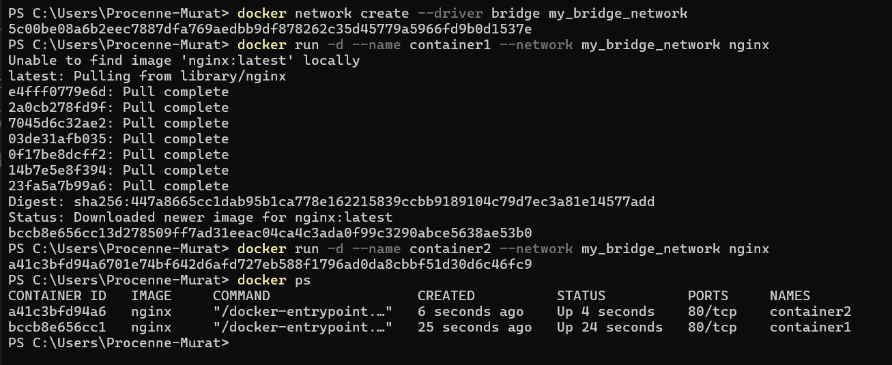
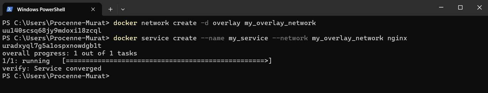
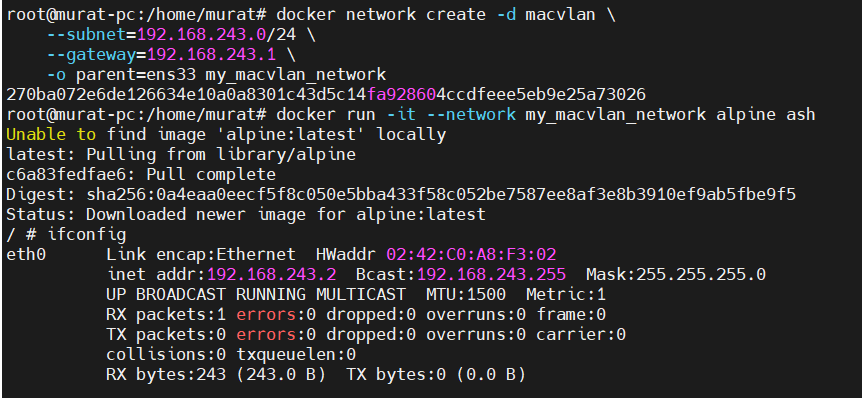
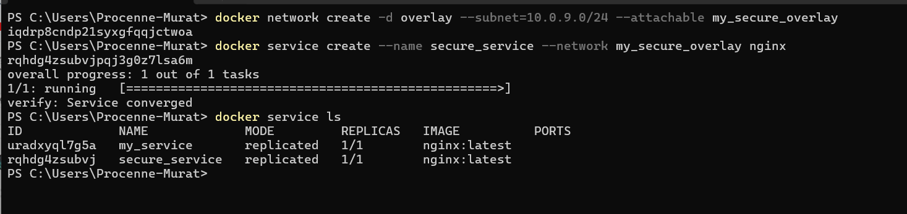

# Docker Networking


Docker containerları gerek birbirleriyle gerekse dış networkle iletişim kurmak için farklı network yapıları kullanmaktadır. Bu network modelleri aşağıdaki;

* Bridge
* Overlay
* Macvlan

## Docker'da Network Modelleri

### Bridge Network Modeli

**Bridge Network** Docker üzerinde varsayılan network modelidir. Bu network modeli ile containerlar birbirleriyle iletişim kurabilirler ancak dış dünya ile NAT (Network Address Translation) ile bağlanırlar.

Örnek:
```bash
docker network create --driver bridge my_bridge_network
```
```bash
docker run -d --name container1 --network my_bridge_network nginx
```
```bash
docker run -d --name container2 --network my_bridge_network nginx
```



Bu örnekte, **container1** ve **container2** aynı bridge network 'ü üzerinden çalışır ve birbirleriyle iletişim kurabilirler. 

### Overlay Network Modeli

Overlay network, Docker swarm veya kubernetes gibi çoklu host(mode) ortamlarında containerları birbirine bağlamak için kullanılır. Bu network modeli, farklı fiziksel makinelerdeki containerların aynı ağda gibi davranmalarını sağlar.

Örnek:
```bash
docker network create -d overlay my_overlay_network
```
```bash
docker service create --name my_service --network my_overlay_network nginx
```



Bu komutlar iler bir overlay network oluşturur ve bu network 'e bağlı bir servis başlatır. Servisin çalıştığı containerlar farklı node'lar üzerinde olsa bile, aynı network üzerinden iletişim kurabilirler.

### Macvlan Network Modeli

Macvlan Network, containerları main network üzerindeki fiziksel bir MAC adresi sağlar. Bu sayede container 'lar ana bilgisayarın network 'ünde fiziksel bir cihaz gibi davranabilirler.

Örnek:
```bash
docker network create -d macvlan \
    --subnet=192.168.243.0/24 \
    --gateway=192.168.243.1 \
    -o parent=ens33 my_macvlan_network
```
```bash
docker run -it --network my_macvlan_network alpine ash

```


Bu komutlarla, **ens33** network 'ünü kullanarak bir macvlan network oluşturur ve bir network 'e bağlı bir container başlatır. Container, bu ağda fiziksel bir cihaz gibi davranacaktır.

##  Docker Compose ile Çoklu Container Network Yapılandırmaları

Docker Compose, birden fazla container 'ı tanımlama ve yönetmek için kullanılan bir araçtır. Birden fazla container aynı ağ üzerinde veya farklı ağlar arasında kullanılabilmekedir.

**Örnek:**

```yaml
version: '3'
services:
  app:
    image: my_app_image
    networks:
      - frontend
      - backend
  db:
    image: postgres
    networks:
      - backend

networks:
  frontend:
  backend:
```
Bu örnekte, app servisi hem frontend hem de backend networklerine bağlıdır Bu yapılandırma ile hem fronted container 'ı hem de db container ' iletişim kurabilirler.

## Docker Swarm ve Kubernetes'de Network Politikaları

### Docker Swarm'da Network Politikaları

Docker Swarm, Overlay network 'ü üzerinde çalışan servislerin güvenliğini sağlamak için kullanılabilmektedir. Bu politikalr, hangi servisin hangi diğer servislerle iletişim kuralları tanımlanabilir.

Örnek:
```bash
docker network create -d overlay --subnet=10.0.9.0/24 --attachable my_secure_overlay
```

```bash
docker service create --name secure_service --network my_secure_overlay nginx
```



Bu örnekte, bir overlay network oluşturuldu ve secure_service servisini bu network 'e eklendi. Bu servis,  sadece bu networkdeki servislerle iletişim kurabilir.

## Kubernetes'de Network Politikaları

Kubernetes'te, NetworkPolicy kaynakları, pod'lar arasındaki ve dış dünya ile olan trafiği kontrol etmek için kullanılır.

örnek:

```yaml
apiVersion: networking.k8s.io/v1
kind: NetworkPolicy
metadata:
  name: allow-same-namespace
  namespace: default
spec:
  podSelector:
    matchLabels:
  policyTypes:
  - Ingress
  ingress:
  - from:
    - podSelector:
        matchLabels:
          app: my_app
```

Bu NetworkPolicy, sadece aynı namespace içindeki my_app etiketli pod'lardan gelen trafiğe izin verir. Diğer tüm giriş trafiği engellenecektir.

