## Docker Registry Yönetimi: Docker Hub ve Özel Docker Registry Kurulumu ve Yönetimi


Docker, uygulamaların hızlı bir şekilde kurulması ve uygulamaların test edilmesi için yaygın olarak kullanılan bir platformdur. Docker Registry, Docker image 'ların depolamak ve dağıtmak için kullanılır. Bu blog yazısında Docker hub ve özel bir Docker registry 'in nasıl kurulacağı ve yönetileceğine dair bilgiler verilmektedir. 

### Docker Hub

Docker Hub, Docker 'ın resmi ve ücretsiz image'ların depolandığı alandır. Docker Hub 'a kullanıcıları tarafından image yüklenebilmekte ve kullanılmaktadır.

**Adım 1: Docker Hub Hesabı Oluşturma**

1. [Docker Hub](https://hub.docker.com/) sitesine gidin.
2. "Sign Up" butonuna tıklayarak yeni bir hesap oluşturun.
3. Giriş yaptıktan sonra, "Repositories" sekmesine giderek yeni bir depo oluşturun.

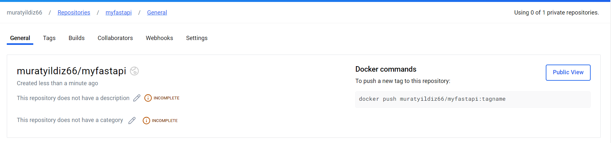

Görseldeki gibi "myfastapi" repositories oluşturulur.

**Adım 2: İmajı Docker Hub'a Yükleme**
1. Docker Hub'da bir depo oluşturduktan sonra, komut satırında aşağıdaki komutları kullanarak imajınızı Docker Hub'a yükleyebilirsiniz:

Oluşturulmuş olan repositories 'ye yüklenmesi amacıyla myfastapi image oluşturulur.

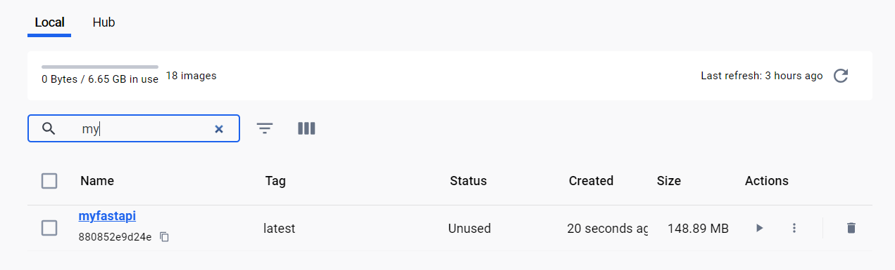
```docker
# Docker imajını tag'leme
docker tag myfastapi:latest muratyildiz66/myfastapi:latest
```
```docker
# Docker Hub'a giriş yapma
docker login
```
```docker
# İmajı yükleme
docker push muratyildiz66/myfastapi:latest
```
Yükleme işlemi için gerekli docker komutları kulanılır.
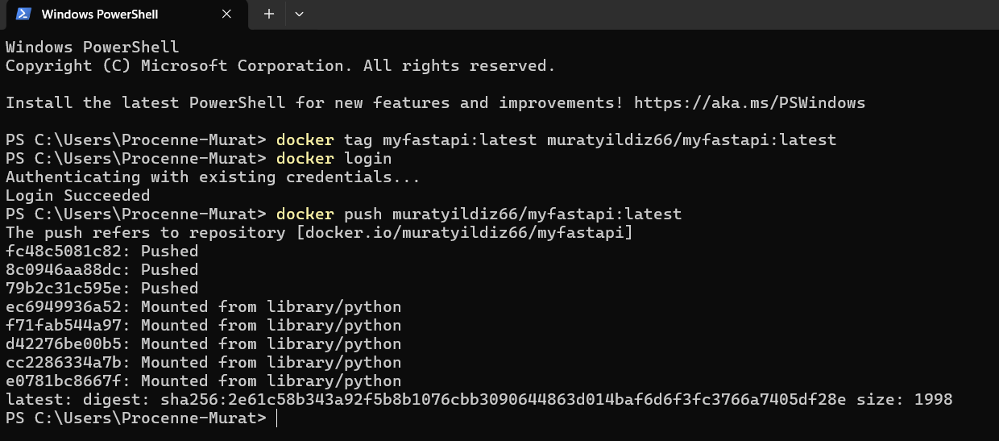

### Özel Docker Registry Kurulumu ve Yönetimi

Kendi projlerimizde kullanmak üzere Docker Registry kurulabilir. Özel registry kurmak için Docker hub 'da var olan registry image bulunmaktadır.

**Adım 1:** Özel Registry Kurulumu: Aşağıdaki komutla özel bir registry kurulabilir.

```bash
docker run -d -p 5000:5000 --name my-registry registry:2
```
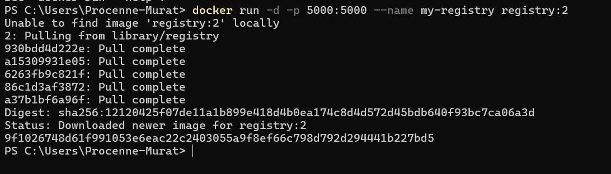

Adım 2: İmajı Özel Registry'e Yükleme: Yerel imajınızı özel registry'ye yüklemek için aşağıdaki komutlar kullanılır.
```bash
# Docker imajını tag'leme
docker tag myfastapi:latest localhost:5000/myfastapi:latest
```
```bash
# İmajı özel registry'ye yükleme
docker push localhost:5000/myfastapi:latest
```
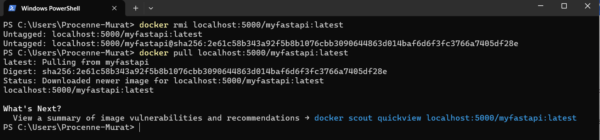

Özel registry 'ye yüklenmiş olan imagelerın görüntülenmesi amacıyla 5000 portuna GET isteği göndererek öğrenebilmekteyiz. Örneğin;

1. Register'da Bulunan Image'ları Listeleme:

Docker registry içerisinde bulunan image'ları listelemek için **http://localhost:5000/v2/_catalog** adresine GET isteğinde bulunulur.

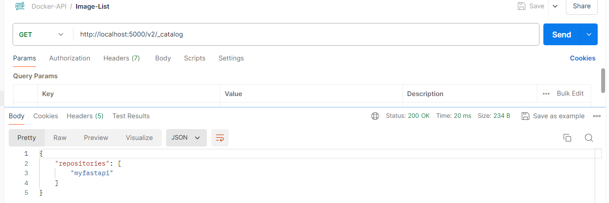

2. Belirli Bir Repository'deki Tag'leri Listeleme

Image tag 'ına göre GET isteğinde bulunularak Image 'a ait bütün version bilgi listelenebilmektedir.

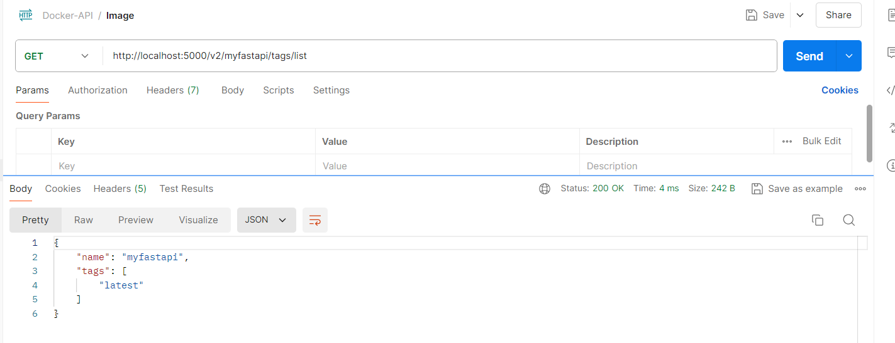

### İmaj Versiyonlama ve İmaj Temizliği

#### İmaj Versiyonlama

Image versionlama, genelikle gelistirici ortam yapısının korunması ve düzenli bir şekilde genişletimesi için kullanılmaktadır. Image versionlarının taglanması ile kolaylıkla versiolar izlenebilir ve bir önceki versiona geri dönülebilir. Örneğin;

```bash
docker tag myfastapi:latest myfastapi:v1.1
```
```bash
docker tag myfastapi:v1.1 myfastapi:v1.2
```
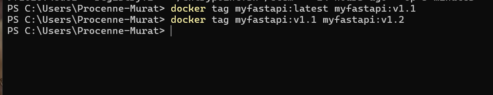

#### İmaj Temizliği

Gereksiz image'ların temizlenmesi disk alanını optimize eder ve registry'nin performansını artırır.

Local Docker üzerinde gereksiz dockerların silinmesi için;

```bash
docker image prune -a
```
Kullanılan bu komut hali hazırda kullanılmayan bütün imageların silinmesine neden olamktadır.

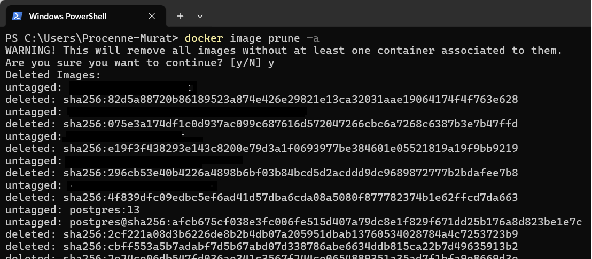

Kullanmakta olduğumuz registry içindeki imageların silinmesi amacıyla aşağıdaki komut kullanılmaktadır.

```bash
docker exec -it my-registry bin/registry garbage-collect /etc/docker/registry/config.yml
```
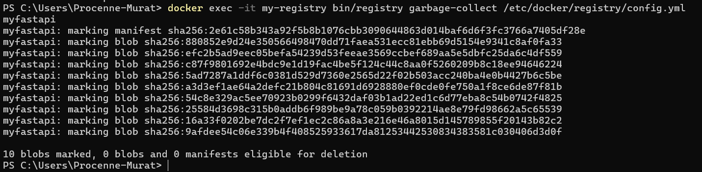

özel olarak bir image silinmesi amacıyla aşağıdaki işlem adımları uygulanabilir;

**1. Silinmesi image 'ın versionlarının listelenmesi**

**http://localhost:5000/v2/<image_name>/tags/list** URL adresine GET isteğinde bulunulur.

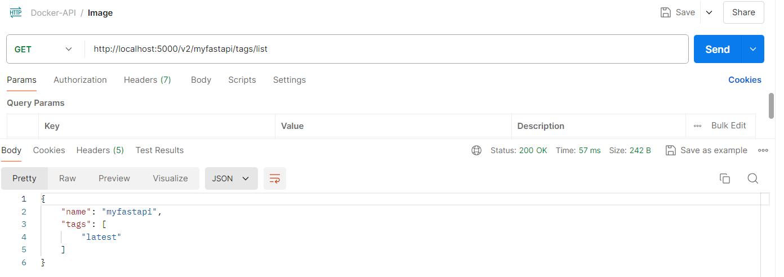

Elde edilmiş tag bilgisi kullanılarak **Docker-Content-Digest** bilgisini bulmak için kullanılır.

**2. Tag'in Manifest Bilgilerini Almak**

Bu kapsamda "http://localhost:5000/v2/<image_name>/manifests/latest" adresine GET isteğinde bulunulur.

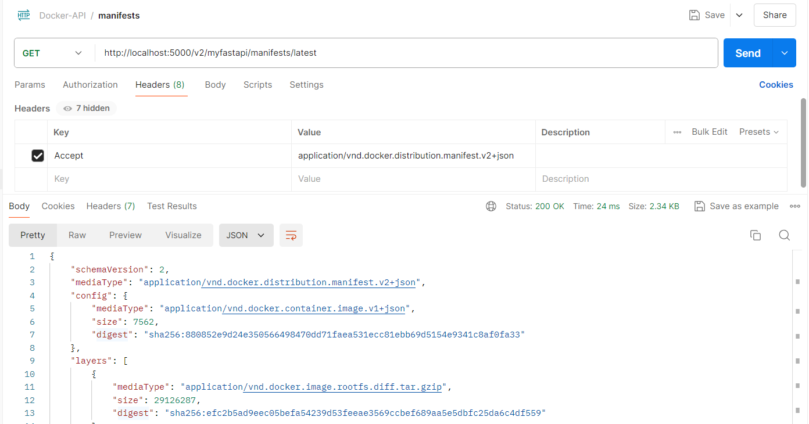

Buradaki önemli not ise Postman üzerinden bu isteği göndermek istedğimizde **Headers** sekmesindeki Key ve Value kısımları doldurulması gerekmetedir. 

* Key: Accept
* Value: application/vnd.docker.distribution.manifest.v2+json

Görselde görünün **digest** bilgisi ile hedef image silinmesine olanak sağlamaktadır.

**Adım 3: İmajı Silmek**

Image silinmesi amacıyla "DELETE" methodu kullanılarak "http://localhost:5000/v2/<digest>/manifests/<digest>" URL adresine istekte bulunulur.


### Docker Trusted Registry

Docker Trusted Registry (DTR), Docker Enterprise'ın bir bileşeni olarak kurumsal düzeyde güvenli bir Docker Image yönetimi sağlar. DTR, Imageların güvenli bir şekilde saklanmasını, dağıtılmasını ve taranmasını sağlar. Güvenlik açıklarının tespiti için kullanılmaktadır.

#### DTR'nin Temel Özellikleri

1. Image 'ın Güvenlik Açığı Analizi:

    * DTR, Docker image inceleyerek olası güvenlik açıklarını tespit eder. Bu inceleme işlemi için veri kaynağı olarak CVE gibi kaynakları kullanır.

    * Image tarar sonuçları, potansiyel riskleri ve açığın giderilmesi amacıyla önerilerde bulunur.

2. Image imzalama ve Güvenlik Politikaları:

    * Docker Content Trust (DCT) ile DTR, Image imzalama ve doğrulama işlemlerini sağlar. Bu Image orjinalliğini ve bütünlüğü garanti eder.
    * Güvenlik politikalrı oluşturarak, yalnızca imzalı ve güvenli imageların dağtılmasını sağlayabiliriz.

3. Erişim Kontrolü ve Rol Tabanlı Erişim Yönetimi (RBAC):

    * DTR, kullanıcıların ve kullanıcı gruplarının Imagelara erişimini kontrol etmek için RBAC sağlar.
    * Kullancıların ve gruplar için farklı erişim seviyelerini tanımlayarak imagelar için güvcenlik seviyesini arttırabiliriz.

4. Gelişmiş Log İzleme:

    * DTR, Imagelara yapılan erişim ve değişiklikleri izler ve kayıt altına alır.

Docker Trusted Registry (DTR) belirli bir lisans ile kullanılabilmektedir. 

