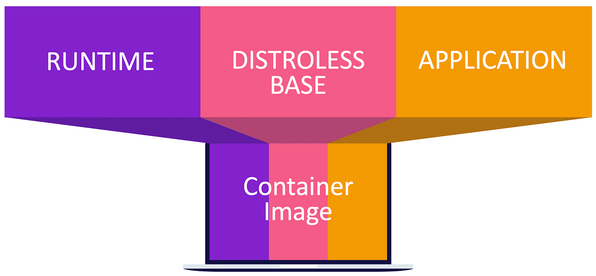
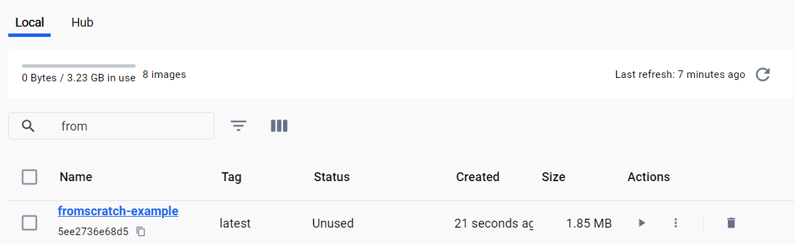
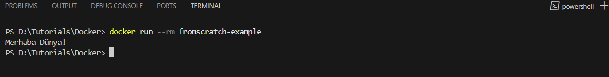
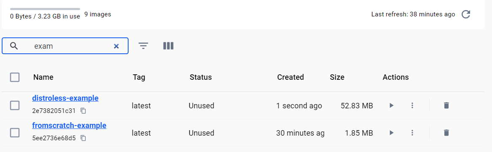
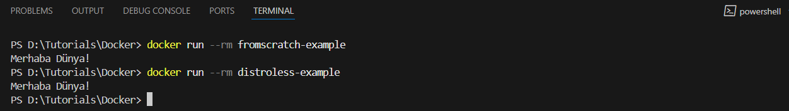

# Distroless ve From Scratch Builds

Yazılım geliştirme süreçlerinde Docker imajlarının minimal boyutun ve güvenliğinin sağlanması kritik bir hedefdir. Bu noktada, Distroless ve From Scratch yapıları, öne çıkan iki yaklaşımdır. Bu iki yaklaşımın kullanımı aşağıdaki gibidir;



## From Scratch Builds

**FROM stratch**, Docker imajı oluştururken herhangi bir işletim sistemi katmanı kullanmadan derlenmiş uygulamanın çalışmasına imkan sunar. Derlenmiş uygulama için gerekli olan dosyalarla beraber bir docker imajının oluşturulmasına imkan sunmaktadır. **Avantajları;**

* **Küçük Boyut:** Docker imajın boyutu oldukça küçüktür.
* **Güvenlik:** İşletim sisteminde kaynaklı olabilecek güvenlk açıklarının önüne geçer.
* **Performans:** Daha az bağımlılık ile daha hızlı çalışır.

Örnek Go uygulaması aşağıdaki gibidir;

Basit golang uygulamasının kodu ve Dockerfile aşağıdaki gibidir;
**Go Kodu:**

```golang
package main

import "fmt"

func main() {
    fmt.Println("Merhaba Dünya!")
}
```
**Dockerfile:**

```Dockerfile
# Birinci Aşama: Derleme
FROM golang:1.20 as builder
WORKDIR /app
COPY main.go main.go
RUN go build -o main .

# İkinci Aşama: From Scratch
FROM scratch
COPY --from=builder /app/main /main
CMD ["/main"]
```
Uygulamanın derlenmesi ve Docker imajın oluşturulması için kullanılacak olan komutlar aşağıdaki gibidir;
1. Docker imajı oluşturmak:
```bash
docker build -f "Distroless_Scratch\Dockerfile.scratch" -t fromscratch-example .
```


2. Konteyneri çalıştırmak:
```bash
docker run --rm fromscratch-example
```



## Distroless Builds

Distroless yaklaşımı From Scratch 'ten farklı olarak uygulamanın çalışması için gerekli olan temel kütüphaneleri ve runtime desteğini içermektedir. Özellikle Python, Java veya Node.js gibi runtime gerektiren dillerde kullanılmaktadır. Distroless yaklaşımının avantajlarıaşağıdaki gibidir;

* **Kötü Amaçlı Kullanıma Karşı Koruma:** Amacı dışında olan ekstra kütüphane veya dosyalara izin vermemektedir.

* **Minimal Yapı:** Sadece gerekli olan birleşenlerle çalıştığı için imaj boyutu oldukça düşüktür.

* **Kolay Kullanım:** Runtime desteği sayesinde daha genış uygulama desteği sunar.

Konu özelinde örnek python uygulaması aşağıdaki gibidir;

**Python Kodu:**

```bash
print("Merhaba Dünya!") 
```
**Dockerfile:**

```bash
# Birinci Aşama: Bağımlılıkları Yükleme
FROM python:3.10-slim as builder
WORKDIR /app
COPY . .

# İkinci Aşama: Distroless ile Dağıtım
FROM gcr.io/distroless/python3
WORKDIR /app
COPY --from=builder /app /app
CMD ["main.py"]
```

---------------------------------------------------


### Örnek: Python Uygulaması

Basit bir Python uygulamasını Distroless kullanarak paketleyelim.

**Python Kodu:**

```bash
print("Merhaba Dünya!") 
```
**Dockerfile:**

```bash
# Birinci Aşama: Bağımlılıkları Yükleme
FROM python:3.10-slim as builder
WORKDIR /app
COPY . .

# İkinci Aşama: Distroless ile Dağıtım
FROM gcr.io/distroless/python3
WORKDIR /app
COPY --from=builder /app /app
CMD ["main.py"]
```
**Komutlar:**

1. Docker imajı oluşturmak:
```bash
docker build -t distroless-example .
```


2. Konteyneri çalıştırmak:
```bash
docker run --rm distroless-example
```


## From Scratch ve Distroless Karşılaştırması
| **Özellik**            | **From Scratch**             | **Distroless**               |
|-------------------------|------------------------------|------------------------------|
| **Boyut**              | Çok küçük                    | Küçük                        |
| **Bağımlılıklar**       | Hiçbir bağımlılık yoktur      | Minimal bağımlılıklar bulunur |
| **Esneklik**           | Düşük (runtime gerekebilir)   | Yüksek (runtime desteği mevcut) |
| **Güvenlik**           | Maksimum güvenlik            | Çok yüksek güvenlik           |
| **Kullanım Alanları**  | Go, Rust, C gibi diller      | Python, Node.js, Java         |


## Sonuç

Distroless ve From Scratch yaklaşımları, Docker imajlarınızı daha hızlı, güvenli ve minimal hale getirmek için etkili yöntemlerdir. Uygulamanızın ihtiyacına göre doğru yaklaşımı seçerek, CI/CD süreçlerinizi optimize edebilir ve daha verimli bir DevOps deneyimi sunabilirsiniz.
