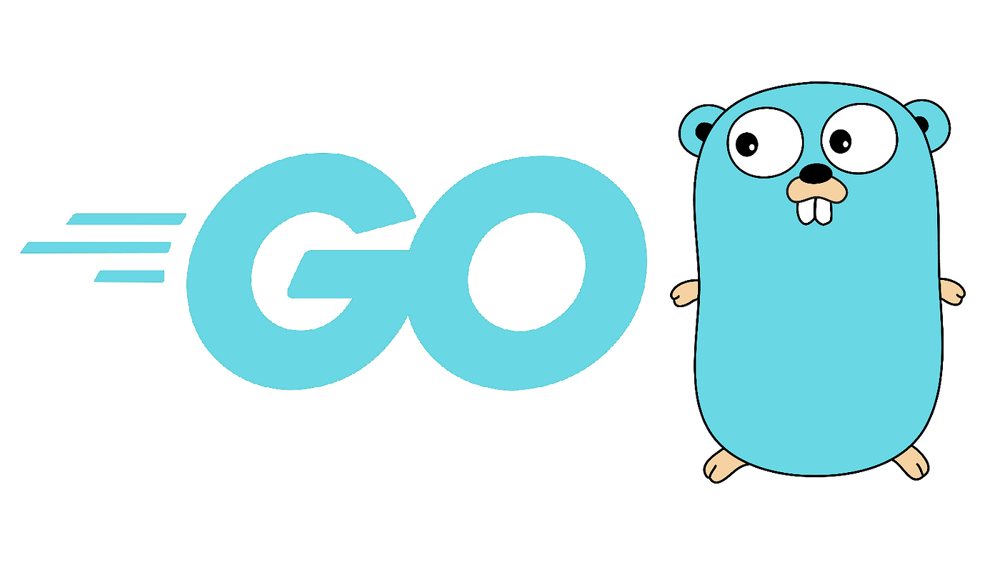

# API Güvenliği

Bilişim sistemlerinde **API (Application Programming Interface)** uygulamaları, uygulamaların birbiriyle sorunsuz bir şekilde iletişim kurmasını sağlamaktadır. API'ler birbirinden farklı servisler için kullanılmakta ve bir araya gelerek **entegrasyon, otomasyon ve ölçeklenebilirlik** avantajlar sunmaktadır.Mobil uygulamalar, web servisleri, IoT cihazları ve SaaS platformları gibi birçok alanda API'ler kritik bir rol oynamaktadır.

Bu geniş kullanım alanı ile birlikte **siber saldırılar için de hedef** haline gelmektedir. API uygulamalarının güvenliğinin sağlanması amacıyla aşağıdaki API günvenlik kriterlerine dikkat edilmelidir.



## **API Güvenliği ve Kritik Riskler**  

- **Cross-Origin Resource Sharing (CORS):** Yanış yapılandırmış CORS politikaları saldırganın API'lere erişimine sebeb olabilmektedir.

- **Error Disclosure (Hata Açıklama):** Olası hataların çözümünü kolaylaştırmak için hata mesajları önem arz etmektedir.

- **Information Leak (Bilgi Sızıntısı):** Kullanıcılar ve sistem hakkındaki bilgi sızıntısının önüne geçilmesi amacıyla önem arz etmektedir

- **Insecure Cookies (Güvensiz Çerezler):** API'lerin oturum çerezleri yanlış yapılandırıldığında ele geçirilebilir. Çerezlerin **HTTPOnly**, **Secure**, **SameSite** gibi güvenlik flagler ile korunması gerekmektedir.  

- **Path Traversal (Dosya Yolu Manipülasyonu):** Kötü niyetli kullanıcılar, dizin gezme saldırıları ile API’nin yetkisiz dosyalara erişmesini sağlayabilir. API uç noktaları girişleri doğrulamalı ve dosya yollarını güvenli hale getirmelidir.  

- **Rate Limiting (İstek Sınırlama):** API'lerin sınırsız istek alması, kötüye kullanıma ve hizmet kesintilerine yol açabilir. **Rate limiting** (hız sınırlama) ile belirli bir süre içinde API'ye yapılan istekler kısıtlanmalıdır.  


### API Güvenliği - Cross-Origin Resource Sharing (CORS)

CORS, farklı kaynaklardan gelen HTTP isteklerine nasıl yanıt verileceğini belirleyen bir güvenlik politikasıdır. Tarayıcılar, aynı kaynak politikası (Same-Origin Policy - SOP) nedeniyle, farklı bir kaynaktan gelen istekleri engelleyebilir. Ancak bazı durumlarda, belirli domain'lere API erişimi açmak gerekir ve burada CORS devreye girer.

Örneğin, frontend uygulaman https://app.com adresinde, backend API'n ise https://api.app.com adresinde çalışıyorsa, frontend tarafından yapılan API istekleri CORS politikasına takılabilir. Bunun önüne geçmek için API sunucusunda CORS ayarlarını doğru yapılandırman gerekir.

#### Golang ve Gin ile CORS Yapılandırması

Docker teknolojisi kullanılarak Golang imajı ile CORS yapılandırmasını nasıl yapılabileceğine dair örnek Dockerfile aşağıdaki gibidir;

```Dockerfile
# Golang'ın lightweight versiyonunu temel al
FROM golang:1.21-alpine

# Çalışma dizinini belirle
WORKDIR /app

# Bağımlılıkları yüklemek için gerekli paketleri ekleyelim
RUN apk add --no-cache git

# Uygulama dosyasını kopyala
COPY main.go .

# Go modülü oluştur ve bağımlılıkları yükle
RUN go mod init my-gin-app \
    && go get -d -v ./...

# Uygulamayı build et
RUN go build -o server .

# Konteyner çalıştırıldığında uygulamayı başlat
CMD ["/app/server"]
```

CORS desteğinin kullanılabilmesi için **github.com/gin-contrib/cors** paketi kullanılmaktadır. Bu paketin yüklenmesi için aşağıdaki komut kullanılabilmektedir.

```bash
go get github.com/gin-contrib/cors
```
Örnek CORS yapılandırmasına ait örnek aşağıdaki gibidir;

```go
package main

import (
	"github.com/gin-contrib/cors"
	"github.com/gin-gonic/gin"
	"time"
)

func main() {
	r := gin.Default()

	// CORS yapılandırmasını ekleyelim
	r.Use(cors.New(cors.Config{
		AllowOrigins:     []string{"https://app.com"}, // Belirli bir domain'e izin ver
		AllowMethods:     []string{"GET", "POST", "PUT", "DELETE"},
		AllowHeaders:     []string{"Content-Type", "Authorization"},
		ExposeHeaders:    []string{"Content-Length"},
		AllowCredentials: true, // Çerez (cookie) ile kimlik doğrulama gerekiyorsa bunu aç
		MaxAge:           12 * time.Hour,
	}))

	// API endpoint tanımlamaları
	r.GET("/ping", func(c *gin.Context) {
		c.JSON(200, gin.H{"message": "pong"})
	})

	r.Run(":8080") // 8080 portunda çalıştır
}
```

Örnekte gösterilmiş olan Dockerfile imaj oluşturulması için **docker build --pull --rm -f 'cors-app\Dockerfile' -t 'my-gin-app' 'cors-app'** komutu kullanılır.


Oluşturulan imajın çalıştırılması amacıyla **docker run -p 8080:8080 my-gin-app** komutu kullanılır.


### CORS ile Güvenliği Artırma

CORS yapılandırmasını daha güvenli hale getirmek için aşağıdaki adımlar izlenebilir:

**1. Wildcard Kullanımını Engelle**

Sadece belirli domainlerin izinli hale getirilmesine imkan sunmaktadır. AllowOrigins: []string{"*"} gibi bütün domainlere izin verilmesinden kaçınmaktadır.

✅ **Güvenli:**
```go
AllowOrigins: []string{"https://trusted.app.com"}
```
❌ **Güvenli Değil:**

```go
AllowOrigins: []string{"*"}
```

**2. Sadece Gerekli HTTP Metodlarına İzin Ver**

Kullanılan methodlar belirlenmeli ve sadece ihtiyaç duyulan methodlara izin verilmelidir. AllowMethods kısmını sınırlandırmalısın.

```go
AllowMethods: []string{"GET", "POST"}
```
Bu kural, istemcilerin API’ye **gereksiz DELETE veya PUT istekleri göndermesini** engeller.

**3. Gerekli Olan Başlıkları (Headers) Tanımla**

API sadece belirli headers desteklemelidir. Örneğin, Authorization ve Content-Type harici başlıkları kabul etmemek güvenliği artırır.
```go
AllowHeaders: []string{"Content-Type", "Authorization"}
```
En çok kullanılanlar aşağıdaki tablodaki gibidir;
| **Header Adı**      | **Açıklama** |
|---------------------|-------------|
| **Authorization**   | Kullanıcının kimliğini doğrulamak için kullanılır. Genellikle `Bearer <token>` formatında olur. |
| **Content-Type**    | Gönderilen veya alınan içeriğin türünü belirtir. Örnek: `application/json`, `text/html` |
| **Accept**         | İstemcinin hangi içerik türlerini kabul ettiğini belirtir. Örnek: `application/json` |
| **User-Agent**      | İstemcinin kullandığı tarayıcı veya istemci yazılımı hakkında bilgi içerir. Örnek: `Mozilla/5.0` |
| **Host**           | Hangi sunucuya istek yapıldığını belirtir. Örnek: `Host: app.com` |
| **Cache-Control**   | Önbellekleme politikasını belirler. Örnek: `no-cache, no-store, must-revalidate` |


**4. Çerez Kullanımı (Cookies) İçin Dikkatli Ol**

Eğer API kimlik doğrulama amacıyla JWT veya Session Cookie kullanıyorsa AllowCredentials özelliği kullanılmalıdır.

```go
AllowCredentials: true
```
Eğer bu seçenek true olarak ayarlanırsa, AllowOrigins kısmına wildcard (*) olarak kullanılamaz.

**5. Preflight Request Süresini Optimize Et**

Tarayıcılar, bir CORS isteği yapmadan önce preflight (OPTIONS) isteği gönderir. Bunu gereksiz tekrarları önlemek için cache süresini artırabilirsiniz:

```go
MaxAge: 24 * time.Hour
```
Bu, tarayıcının OPTIONS isteklerini cache’leyerek sunucuya gereksiz yük olmasını engellemektedir. 


### Error Disclosure Güvenliği

Error Disclosure, bir API'nin hata mesajlarını client tarafına fazla detaylı şekilde döndürmesidir. Bu durum saldırganların sistem hakkında bilgi edinmesine neden olabilir.
Gin framework 'ü ile API geliştirme sürecinde, hataların nasıl güvenli bir şekilde geri dönüş yapılabileceği kontrol edilebilir ve yönetilebilir.

Hataların açık bir şekilde döndürülmesi saldırganların;
	* Veritabanı
	* Dosya yolları
	* framework bilgileri
	* Sistem 
hakkında bilgi edilmesine neden olabilmektedir.

Örneğin aşağıdaki gibi hata client tarafına döndürüldüğünde API'nin PostgreSQL kullandığı ve hangi tablonun eksik olduğu hakkında bilgi vermektedir.

```json
{
  "error": "pq: column \"username\" does not exist in table \"users\""
}
```

Bu tür bilgi açıkları SQL injection ve benzeri açıklara neden olabilmektedir.

API geliştirme aşamasında hataların doğrudan istemciye döndürülmesinden kaçınılmalıdır.
Örneğin;

```golang
package main

import (
	"errors"
	"github.com/gin-gonic/gin"
	"net/http"
)

func main() {
	r := gin.Default()

	r.GET("/user/:id", func(c *gin.Context) {
		id := c.Param("id")

		// Örnek bir hata üretelim
		if id == "0" {
			err := errors.New("veritabanı hatası: bağlantı zaman aşımına uğradı")
			c.JSON(http.StatusInternalServerError, gin.H{"error": err.Error()}) // ⚠ Tehlikeli uygulama
			return
		}

		c.JSON(http.StatusOK, gin.H{"message": "User found"})
	})

	r.Run(":8080")
}
```

Örnekte görülen kod neden güvensiz;
* **err.Error()** doğrudan client tarafına gönderilmiştir.
* Bu şekilde bir kullanım ile saldırgan tarafa Veritabanı hakkında bilgi verilmesine neden olabilmektedir.

Kodun daha güvenli hale getirilmesi amacıyla hata için genel hata mesajları client tarafına iletilebilir.

```golang
package main

import (
	"errors"
	"log"
	"net/http"

	"github.com/gin-gonic/gin"
)

func main() {
	r := gin.Default()

	r.GET("/user/:id", func(c *gin.Context) {
		id := c.Param("id")

		// Örnek hata üretimi
		if id == "0" {
			err := errors.New("veritabanı bağlantı hatası")
			
			// Hata detaylarını sadece log'a yaz
			log.Println("Internal Server Error:", err)

			// Kullanıcıya genel bir hata mesajı döndür
			c.JSON(http.StatusInternalServerError, gin.H{"error": "Beklenmeyen bir hata oluştu. Lütfen daha sonra tekrar deneyin."}) // ✅ Güvenli uygulama
			return
		}

		c.JSON(http.StatusOK, gin.H{"message": "User found"})
	})

	r.Run(":8080")
}
```
Yukarıda görülen kod neden daha güvenli bir kullanım sunmakta;

* Alınan hata kayıt altına alınmakta fakat client tarafına gösterilmemekte.
* Client tarafı genel hata mesajalrı görmekte bu sayede saldırgan veritabanı hakkında bilgi edinmemektedir.


Daha büyük projede hataların tek bir merkezden yönetilmesi amacıyla **global bir hata işleyici (middleware)** kullanılmaktadır.
Aşağıdaki fonksiyon örneğinde görüldüğü gibi tüm hatalar kaydedilmekte ancak client tarafına genel hata mesajları döndürülmektedir.

Örnek;
```go

func ErrorHandler() gin.HandlerFunc {
	return func(c *gin.Context) {
		c.Next() // Middleware işlemi tamamlandıktan sonra çalışır

		// Eğer hata varsa
		if len(c.Errors) > 0 {
			for _, err := range c.Errors {
				// Hata detaylarını sadece log'a yaz
				log.Println("Error:", err.Err)
			}

			// Kullanıcıya genel bir hata mesajı dön
			c.JSON(http.StatusInternalServerError, gin.H{"error": "Bir hata oluştu. Lütfen daha sonra tekrar deneyin."})
		}
	}
}

func main() {
	r := gin.Default()

	// Global hata yakalama middleware'i ekle
	r.Use(ErrorHandler())

	r.GET("/test", func(c *gin.Context) {
		// Örnek hata
		c.Error(errors.New("database connection failed"))
	})

	r.Run(":8080")
}
```
Bu yöntemin avantajları;

* Hatalar tek noktadan yönetilebilmektedir.
* Client tarafına genel hata mesajları gönderilmektedir.
* Geliştiriciler hatalar hakkında bilgi sahip olmaları için hata mesajları kaydedilir.

Ek olarak büyük projleri için nasıl bir json formatında olacağının da belirlenmesi mümkündür örneğin;

örnek;

```golang
type ErrorResponse struct {
	Code    int    `json:"code"`
	Message string `json:"message"`
}

func main() {
	r := gin.Default()

	r.GET("/test", func(c *gin.Context) {
		err := errors.New("database connection timeout")
		log.Println("Hata:", err)

		// Genel hata mesajı ile JSON formatında döndür
		c.JSON(http.StatusInternalServerError, ErrorResponse{
			Code:    500,
			Message: "Sunucu hatası. Lütfen daha sonra tekrar deneyin.",
		})
	})

	r.Run(":8080")
}
```

Geliştirici ortamında loglar fazlasıyla detaylı yazılabilmektedir. Prod ortamlarda bu durumun önüne geçilmesi amacıyla **gin.SetMode(gin.ReleaseMode)** kullanılabilmektedir.

Örneğin;
```golang

func main() {
	gin.SetMode(gin.ReleaseMode) // Production moduna al
	r := gin.Default()

	r.GET("/test", func(c *gin.Context) {
		c.JSON(http.StatusOK, gin.H{"message": "OK"})
	})

	r.Run(":8080")
}
```
