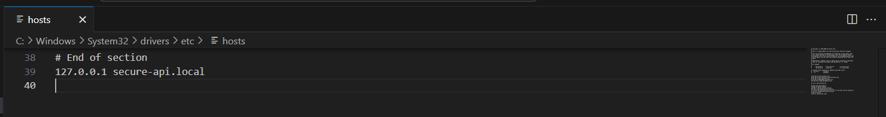
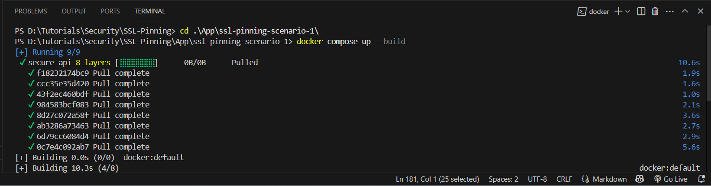
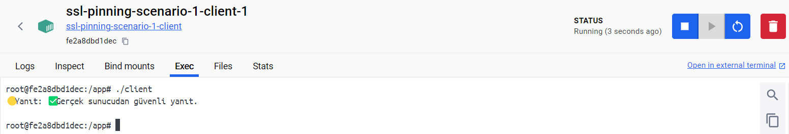
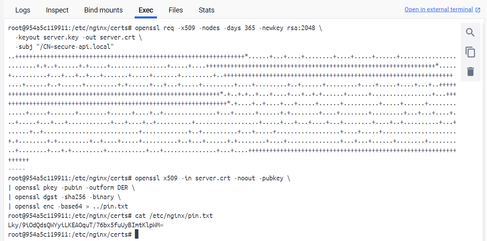
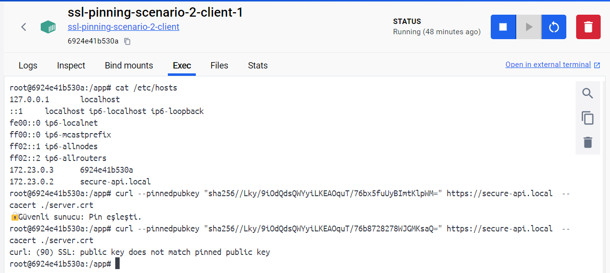

# SSL Pinning

SSL Pinning, mobil uygulamalar ve mikroservisler gibi client-sunucu iletişimi için gerektiren sisiemlerde güvenliğin artıran önemli bir tekniltir. Bu blog yazısında bu konuyu adım adım işleyeceğiz;


1. SSL Pinning Nedir?
2. SSL Pinning Hataları ve Olası Etkileri
3. Senaryo 1: SSL Pinning Hatası Olan Uygulama
4. Senaryo 2: SSL Pinning Hatası Giderilmiş Uygulama


-------------
## 🔐 SSL Pinning Nedir?

SSL Pinning, Client (Mobil uygulama veya API client), sunucunun kimliğini doğrulamak için belirli bir SSL/TLS sertifikasını veya public keyin kullanılması işlemidir. Yani sadece "Güvenilen sertfika otoritesinden geldiği için güven" değil "belirli sertifikaya güven" yaklaşımıdır.

**Avantajları:**

* Man-in-the-Middle (MitM) saldırılarına karşı koruma sağlar.
* Sertifika otoriteleriden kaynaklanan güvenlik açıklarından bağımsızdır.
* Özellikle mobil uygulamalarda 3. parti sniffing ve trafik yönlendirme araçlarına karşı güçlü koruma sunar.

## ❌ SSL Pinning Hataları ve Olası Etkileri

Bir uygulama SSL Pinning yapılmazsa veya yanlış uygularsa, saldırganlar:

* Sertifikayı kendi self-signed sertifikasıyla değiştirip trafiği dinleyebilir.
* API keys, kullanıcı bilgilerini veya oturum bilgilerini ele geçirebilir.
* Sunucu ile yapılan tüm HTTPS trafiği izlenebilir veya manipüle edilebilir.

## 🔓 Senaryo 1 – SSL Pinning Uygulanmamış Uygulama

Bu uygulama docker teknolojisi kullanılarak SSL pinning senaryosu taklit edilecektir. 

**🎯 Amaç**

Geliştiriciler tarafından client'da sertifika doğrulamasını ``InsecureSkipVerify: true `` ile iptal eder. Bu durum Man-in-the-Middle (MitM) saldırılarına yol açabilir. Bu senaryoda:

* HTTPS sunucusu kurulacak.
* Sertifikası doğrulanmayan Go Client geliştirilecek.
* Saldırgan, sahte bir HTTPS sunucusu kurarak kullanıcı verilerini ele geçirecek.

------------------------------
**📁 Proje Dosya Yapısı**

```
ssl-pinning-scenario-1/
│
├── certs/
│   ├── server.crt          → Gerçek sunucu sertifikası
│   └── server.key          → Gerçek sunucu özel anahtarı
│
├── nginx.conf              → Gerçek sunucunun NGINX konfigürasyonu
│
├── client/
│   ├── client-unsafe.go    → Go istemci (InsecureSkipVerify)
│   └── Dockerfile          → Go uygulaması için Dockerfile
│
├── docker-compose.yml      → Tüm yapıyı ayağa kaldıran compose dosyası
└── index.html              → Saldırganın sahte yanıtı
```

## 🛠️ 1. Gerçek Sunucu Kurulumu (NGINX + HTTPS)

**Sertifika Oluştur**

``ssl-pinning-scenario-1/certs`` klasöründe:
```bash
mkdir certs && cd certs
openssl req -x509 -nodes -days 365 -newkey rsa:2048 \
  -keyout server.key -out server.crt \
  -subj "/CN=secure-api.local"
```

**NGINX Konfigürasyonu (nginx.conf)**

``ssl-pinning-scenario-1/nginx.conf``
```conf
events {}

http {
  server {
    listen 443 ssl;
    server_name secure-api.local;

    ssl_certificate /etc/nginx/certs/server.crt;
    ssl_certificate_key /etc/nginx/certs/server.key;

    location / {
      return 200 "✅ Gerçek sunucudan güvenli yanıt.\n";
    }
  }
}
```
-----------------------------

## 💻 2. Go İstemcisi – Insecure (client-unsafe.go)

```ssl-pinning-scenario-1/client/client-unsafe.go```

```golang
package main

import (
	"crypto/tls"
	"fmt"
	"io"
	"net/http"
)

func main() {
	// Sertifika doğrulaması devre dışı!
	http.DefaultTransport.(*http.Transport).TLSClientConfig = &tls.Config{
		InsecureSkipVerify: true,
	}

	resp, err := http.Get("https://secure-api.local")
	if err != nil {
		panic(err)
	}
	defer resp.Body.Close()

	body, _ := io.ReadAll(resp.Body)
	fmt.Println("🟡 Yanıt:", string(body))
}
```
--------------------------------
## 📦 3. Dockerfile (Go İstemci için)

``ssl-pinning-scenario-1/client/Dockerfile``

```dockerfile
FROM golang:1.21-alpine

WORKDIR /app

COPY client-unsafe.go .

# go mod init satırı burada
RUN go mod init client && \
    go mod tidy

RUN go build -o client .

CMD ["./client"]

```

## 🧩 4. Docker Compose

``ssl-pinning-scenario-1/docker-compose.yml``

```yaml
version: '3.9'

services:
  secure-api:
    image: nginx:alpine
    container_name: secure-api
    ports:
      - "443:443"
    volumes:
      - ./certs:/etc/nginx/certs
      - ./nginx.conf:/etc/nginx/nginx.conf

  client:
    build:
      context: ./client
    depends_on:
      - secure-api

```

## Senaryo-1 Uygulaması

Senaryo-1 özelinde gerekli dosyalar yukarıdaki gibidir. Bu dosyalar oluşturulduktan sonra aşağıdaki işlemler sırasıyla uygulanır.

1. ``/etc/hosts`` dosyası düzenlenir(Windows sistemler için ``C:\Windows\System32\drivers\etc\hosts``).
```
127.0.0.1 secure-api.local
```


2. Docker üzerinden ortam başlatılır;
```
cd <path>
docker compose up --build
```


Bütün işlemlerin doğru olması durumunda client tarafının çıktısı aşağıdaki  görseldeki gibidir;



Bu adımdan sonra şu düşünülmeli network içerisinde olan saldırgan hali hazırda yayında olan sitenin bir kopyasını oluşturabilir ve sahte bir sunucu kurarak bütün verilerin ele geçirmeyi başarabilir. Bu işlemin yapılabilmesi için yapılabilecek örnek saldırı türleri aşağıdaki gibidir;

### 💥 1. DNS Spoofing / Poisoning

* Saldırgan, kurbanın DNS yanıtlarını manipüle eder.
* ``secure-api.local`` gibi bir domain, gerçekte 192.168.1.10 IP'sine gidiyorsa…
* Saldırgan kurbanın ağındaki DNS cevabını değiştirip ``secure-api.local`` → ``192.168.1.200`` (kendi IP’si) yapar.

🧠 Gerçek sunucu çalışıyor, ama kullanıcı DNS manipülasyonuyla başka bir IP’ye yönlendirilmiş olur.

### 💥 2. ARP Spoofing

* Aynı ağda olan saldırgan, **Modem veya Gateway** IP’sini taklit eder.
* Kurbanın gönderdiği trafik önce saldırgana, sonra gerçek sunucuya yönlendirilir.
* Böylece **gerçek sunucu kapanmadan** trafik görülür, değiştirilebilir.

🎯 Bu yöntemle saldırgan hem trafiği dinleyebilir hem de müdahale edebilir.

### 💥 3. Local Hosts Override (Test Ortamlarında)

Bizim senaryomuzda bu yöntem kullanılıyor. ``/etc/hosts`` dosyasında şu şekilde bir kayıt yapılıyor:

```
127.0.0.1 secure-api.local
```
Bu demektir ki, her ne kadar DNS'e ``secure-api.local`` için başka bir IP kayıtlı olsa da, işletim sistemi bunu **öncelikle hosts dosyasından çözümler.**
🧠 Bu sayede sen şunu yapabilirsin:

* Gerçek sunucu internette çalışıyor olabilir.
* Ama ``/etc/hosts`` ile kendi sahte sunucuna yönlendirirsin → Gerçek sunucu devredeyken bile **trafik sana gelir.**

## Örnek Saldırı Senaryosu
Sisteme uygun olarak yukarıda belirtilen saldırı yöntemleri ile network üzerinde MITM (Man-in-the-Middle) saldırısı ile gerçekleştirilebilir.
Örnek saldıra adımları aşağıdaki gibidir;

**🔸 Sahte Sertifika Oluştur:**

```bash
openssl req -x509 -newkey rsa:2048 -nodes \
  -keyout attacker.key -out attacker.crt \
  -subj "/CN=secure-api.local" -days 365
```
**🔸 Sahte Yanıt Hazırla:**
Dosya: ``index.html``
```
😈 Sahte sunucudan geldim. Verilerini çaldım!
```
Sunucu farklı koşullar altında başlatılabilir. Örneğin;

```bash
sudo python3 -m http.server 443 --bind 0.0.0.0 \
  --certfile attacker.crt --keyfile attacker.key
```
Network üzerinde gerçekleştirilen MITM saldırısı ile client tarafından atılan istekler sahte sunucuya yönlendirilmektedir.
Bu tarz saldırıların önüne geçilmesi amacıyla SSL Pinning yöntemi kullanılmaktadır. 

## Senaryo 2: SSL Pinning Hatası Giderilmiş Uygulama

Bu uygulamamız da MITM saldırısında etkilenmemek adına yapılabilecek işlem anlatılmaktadır. 

**🎯 Amaç**
Bu senaryoda, client sadece belirli bir sunucuya bağlanır. Yani:
  client **"Ben sadece SHA256 hash’i XxxX... olan public key’e sahip sunucuya bağlanırım."** der.

Bu sayede:

* Saldırgan sahte sunucu kursa bile bağlantı yapılamaz.
* DNS veya ARP spoofing etkisiz kalır.
* Veriler yalnızca doğru sertifikaya sahip sunucuya gider.

**📁 Senaryo Dosya Yapısı**

```
ssl-pinning-scenario-2/
│
├── certs/
│   ├── server.crt          → Gerçek sunucunun TLS sertifikası
│   └── server.key          → Özel anahtarı
│
├── nginx.conf              → HTTPS sunucu yapılandırması
│
├── client/
│   └── Dockerfile          → Go istemcisi için Dockerfile
│
├── docker-compose.yml      → Ortamı ayağa kaldıran yapı
└── pin.txt                 → Pin değeri (SHA256 hash)
```

### 🛠️ 1. Gerçek Sunucu Kurulumu

**Sertifika Oluştur**

Sertifika üretme işlemi gerçekleştirilir;

```bash
mkdir certs && cd certs

openssl req -x509 -nodes -days 365 -newkey rsa:2048 \
  -keyout server.key -out server.crt \
  -subj "/CN=secure-api.local"

```

### 📌 2. Public Key SHA256 Pin Hesaplama

```bash
openssl x509 -in server.crt -noout -pubkey \
| openssl pkey -pubin -outform DER \
| openssl dgst -sha256 -binary \
| openssl enc -base64 > ../pin.txt
```



**🔐 Örnek çıktı (pin.txt):**

```ini
Lky/9iOdQdsQWYyiLKEAOquT/76bx5fuUyBImtKlpWM=
```

### ⚙️ 3. NGINX Sunucu Konfigürasyonu

``nginx.conf``

```nginx
events {}

http {
  server {
    listen 443 ssl;
    server_name secure-api.local;

    ssl_certificate /etc/nginx/certs/server.crt;
    ssl_certificate_key /etc/nginx/certs/server.key;

    location / {
      return 200 "🔐 Güvenli sunucu: Pin eşleşti.\n";
    }
  }
}
```

### 🧩 5. Docker Compose Dosyası

``docker-compose.yml``
```yaml
version: '3.9'

services:
  secure-api:
    image: nginx
    container_name: secure-api
    ports:
      - "443:443"
    volumes:
      - ./certs:/etc/nginx/certs
      - ./nginx.conf:/etc/nginx/nginx.conf
    command: ["sleep","360000"]
    
  client:
    image: ubuntu
    depends_on:
      - secure-api
    command: ["sleep","360000"]
```
### 🧪 6. Test Ortamı

``/etc/hosts``

```lua
127.0.0.1 secure-api.local
```
* Uygulamayı çalıştırılır:
```bash
docker compose up --build
```

Sistem başlatıldı. Başlatılan sistem üzerinde curl komutu kullanarak sistem test edilmektedir. Aşağıdaki görselde sırasıyla ``/etc/hosts`` dosyası kontrol edilmektedir. Aşağıdaki curl komutları sıralı birşekilde kullanıalarak ssl-pin test edilmiştir.
Kullanılan komutlar;

* curl --pinnedpubkey "sha256//Lky/9iOdQdsQWYyiLKEAOquT/76bx5fuUyBImtKlpWM=" https://secure-api.local  --cacert ./server.crt
* curl --pinnedpubkey "sha256//Lky/9iOdQdsQWYyiLKEAOquT/76b8728278WJGMKsaQ=" https://secure-api.local  --cacert ./server.crt




### 📊 Özet Karşılaştırma

**🔒 Saldırı başarısız! Çünkü pin doğru değil.**

| Özellik                     | SSL Pinning Yok (InsecureSkipVerify: true) | SSL Pinning Var (SHA256 Pin) |
|----------------------------|--------------------------------------------|-------------------------------|
| Sertifika Doğrulama        | Yok                                        | Var                           |
| Sahte TLS Kabul Edilir     | Evet                                       | Hayır                         |
| Man-in-the-Middle Koruma   | Yok                                        | Var                           |
| Kullanıcı Verisi           | Çalınabilir                                | Güvende                       |
