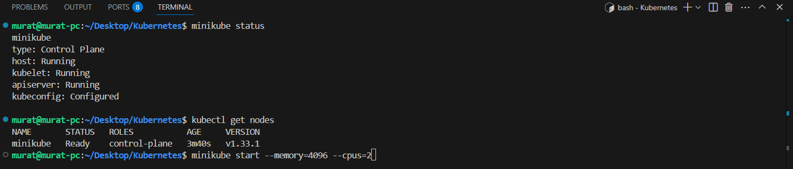
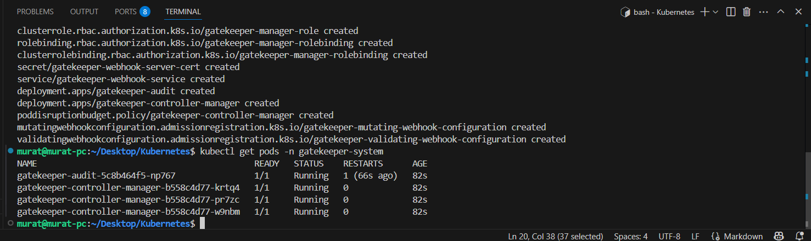
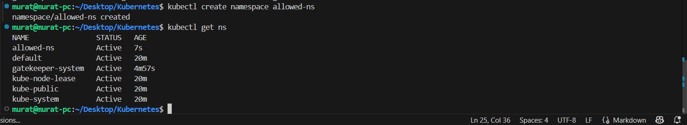
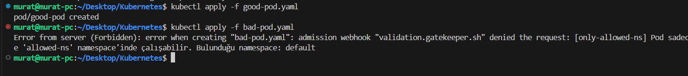

# 🔐 OPA Gatekeeper ile Pod Güvenlik Politikası

**OPA Gatekeeper**, Kubernetes kümelerinde politikaları tanımlamak ve uygulamak için kullanılan bir güvenlik aracıdır. Bu tool'un ne işe yaradığı soruna aşağıdaki cevaplar verilebilir.

* Kubernetes nesnelerinin (Pod, Namespace, Ingress vb.) belirli kurallara göre oluşturulmasını **zorunlu kılar**.
* Hatalı ya da güvenliksiz yapılandırmaların kümeye eklenmesini **engeller**.
* Tüm politikalar **deklaratif olarak YAML** ile tanımlanabilir.
* Hem **enforcement** (uygulama) hem de **audit** (izleme) modlarında çalışabilir.

örnek olarak bu aracın nasıl kullanıabileceğin aşağıdaki örnek üzerinden anlatabilirim. İlk öncelikle uygulamamızın amacı sadece ``allowed-ns`` namespace’inde pod çalıştırılmasına izin veren diğer namespace'leri ise engelleyen bir yapı kurmak istiyoruz. Bu hedefin adımları aşağıdaki gibidir;

İlk öncelikle bize bir kubernetes ortamı gerekmektedir. Bu nedenle minikube kullanacağım. örnek olarak ``minikube start --memory=4096 --cpus=2`` komutu kullanılabilir. 


Bu işlemin aradından ``OPA Gatekeeper`` kurlum işlemi için aşağıdaki komut kullanılmaktadır;

```bash
kubectl apply -f https://raw.githubusercontent.com/open-policy-agent/gatekeeper/release-3.14/deploy/gatekeeper.yaml
```
Kurulumun kontrol edimesi amacıyla ``kubectl get pods -n gatekeeper-system`` komutu kullabilir.


Şimdi pod oluşturabileceğimiz, çalıştırabileceğimiz ``allowed-ns`` adlı namespace'in oluşturulabilmesi amacıyla aşağıdaki komut kulanılabilir. 
```bash
kubectl create namespace allowed-ns
```


Politikanın oluşturulabilemesi amacıyla ``template-allowed-namespace.yaml`` ve ``constraint-allowed-namespace.yaml`` dosyaları oluşturulur. 

**template-allowed-namespace.yaml**
```yaml
apiVersion: templates.gatekeeper.sh/v1beta1
kind: ConstraintTemplate
metadata:
  name: k8sallowednamespace
spec:
  crd:
    spec:
      names:
        kind: K8sAllowedNamespace
  targets:
    - target: admission.k8s.gatekeeper.sh
      rego: |
        package k8sallowednamespace

        violation[{"msg": msg}] {
          input.review.kind.kind == "Pod"
          not input.review.object.metadata.namespace == "allowed-ns"
          msg := sprintf("Pod sadece 'allowed-ns' namespace'inde çalışabilir. Bulunduğu: %v", [input.review.object.metadata.namespace])
        }

```
**constraint-allowed-namespace.yaml**
```yaml
apiVersion: constraints.gatekeeper.sh/v1beta1
kind: K8sAllowedNamespace
metadata:
  name: only-allowed-ns
spec:
  match:
    kinds:
      - apiGroups: [""]
        kinds: ["Pod"]
```


Bu yaml dosyaları ile sadece ``allowed-ns`` namespace'inde Pod oluşturulmasına **izin vermek**. Diğer namespace'lerde Pod oluşturulursa Gatekeeper bu isteği **reddeder**. ``kubectl apply -f template-allowed-namespace.yaml`` ve ``kubectl apply -f constraint-allowed-namespace.yaml`` komutları ile işlem gerçekleştirilir.

Bu işlemlerin ardından yapılan işlemlerin kontrol edilebilemesi amacıyla ilk öncelikle ``allowed-ns`` namespace 'inde bir pod oluşturulması amacıyla aşağıdaki ``good-pod.yaml`` dosyası kullanılabilir.

**good-pod.yaml**
```yaml
apiVersion: v1
kind: Pod
metadata:
  name: good-pod
  namespace: allowed-ns
spec:
  containers:
    - name: nginx
      image: nginx
```
``good-pod.yaml`` dosyasının kullanılması amacıyla  ``kubectl apply -f good-pod.yaml`` komutu kullanılır. Default namespace bir pod oluşturulması amacıyla ``bad-pod.yaml`` dosyası kullanılır. 

**bad-pod.yaml**
```yaml
apiVersion: v1
kind: Pod
metadata:
  name: bad-pod
  namespace: default
spec:
  containers:
    - name: nginx
      image: nginx

```
``bad-pod.yaml`` dosyasının kullanılması amacıyla  ``kubectl apply -f bad-pod.yaml`` komutu kullanılır.



Görselde görüldüğü gibi ``Error from server ([only-allowed-ns] Pod sadece 'allowed-ns' namespace'inde çalışabilir. Bulunduğu: default): error when creating "bad-pod.yaml"`` hatası alınmaktadır. Bu hata polikamıza uygun olarak sistemin çalıştığını göstermektedir.
