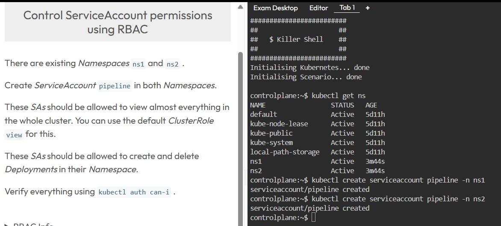
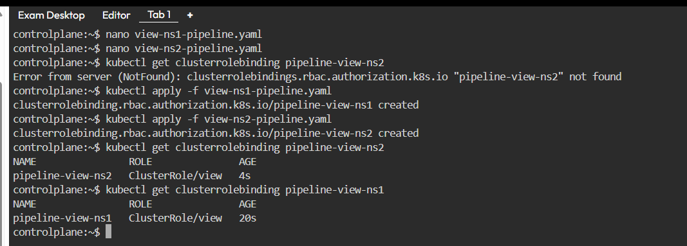
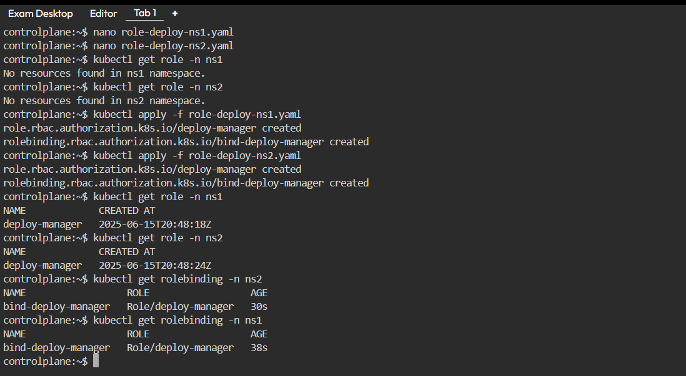
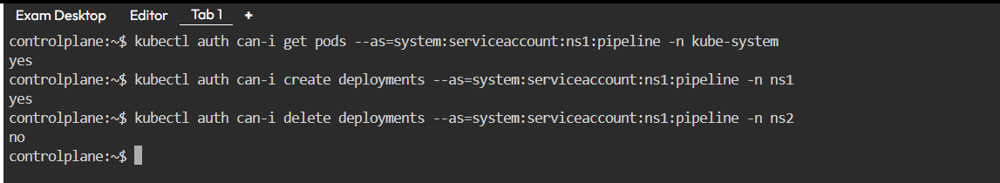
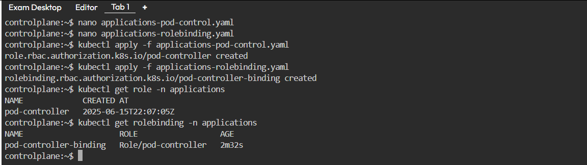
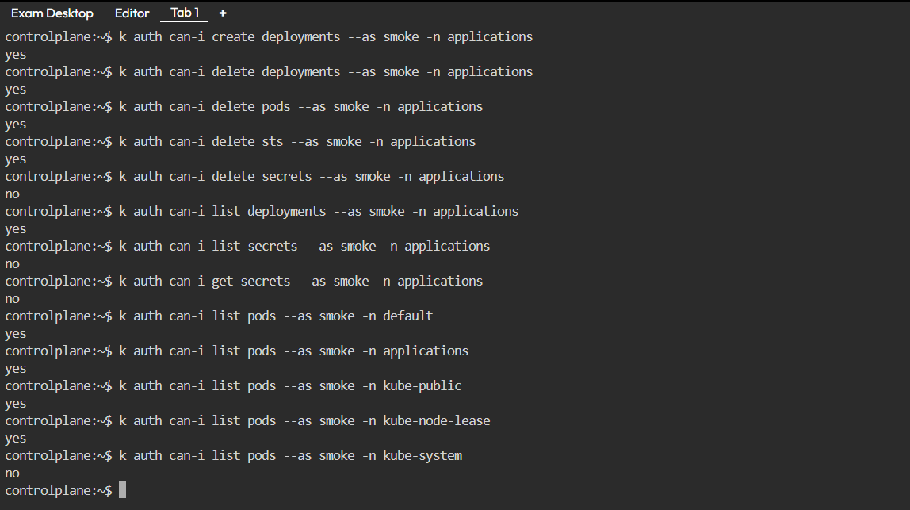

# 🔐 Kubernetes RBAC (Role-Based Access Control)

**RBAC,** Kubernetes üzerinde kullanıcıların veya servislerin hangi kaynaklara erişebileceğini **kısıtlamak veya izin vermek** amacıyla kullanılan yetkilendirme (authorization) sistemidir. Kubernetes 1.6 sürümündne beri yerleşik olarak sunulmaktadır.

RBAC, kim neyi, nerede, ne kadar yapabilir sorusuna yanıt verir.

## 📦 RBAC’ın Temel Kavramları

| Kavram                 | Açıklama                                                                                        |
| ---------------------- | ----------------------------------------------------------------------------------------------- |
| **Role**               | Belirli bir **namespace içindeki** kaynaklara (pod, configmap vs.) erişim kurallarını tanımlar. |
| **ClusterRole**        | Tüm cluster genelindeki kaynaklara erişimi tanımlar. Örnek: node, namespace erişimi.            |
| **RoleBinding**        | Bir **Role**’ü bir kullanıcıya, gruba veya servis hesabına **belirli bir namespace**’te bağlar. |
| **ClusterRoleBinding** | Bir **ClusterRole**’ü bir kullanıcıya, gruba veya servis hesabına **cluster genelinde** bağlar. |
| **ServiceAccount**     | Pod'ların kimliği gibi davranır. Pod'lar bu hesaplarla API sunucusuna kimliklerini gösterir.    |
| **Verbs (Fiiller)**    | `get`, `list`, `create`, `delete`, `watch` gibi eylemleri tanımlar.                             |
| **Resources**          | Pod, Deployment, Service, ConfigMap, Secret gibi Kubernetes nesneleridir.                       |


## 🧭 RBAC Kullanım Alanları

| 💡 Kullanım Alanı                       | 📌 Açıklama                                                                                                 |
| --------------------------------------- | ----------------------------------------------------------------------------------------------------------- |
| **Namespace bazlı erişim kontrolü**     | Geliştiricilere yalnızca kendi namespace’lerinde kaynakları (örn. pod) görme yetkisi verilir.               |
| **Yalnızca okuma erişimi verme**        | `get`, `list`, `watch` gibi sadece görüntüleme yetkileriyle gözlemci (auditor) rolleri tanımlanır.          |
| **Servis hesaplarına sınırlı yetki**    | Uygulama veya otomasyon servislerine yalnızca gerekli API eylemlerini yapacak kadar izin verilir.           |
| **Cluster yönetici yetkilerinin devri** | Kullanıcılara sadece belirli cluster kaynaklarına (örn. `nodes`, `persistentvolumes`) erişim izni verilir.  |
| **CI/CD araçlarına özel yetkiler**      | Jenkins, ArgoCD gibi araçlara sadece deploy, güncelleme gibi görevleri yerine getirecek izinler tanımlanır. |


Bu kavramın daha iyi anlaşılması amacıyla örnek iki alıştırma yapabiliriz.[KillerCoda](https://killercoda.com/killer-shell-cka) adresinde bulunan örnek RBAC senaryolarını çözülebilir. İlk senaryoya [Buradan](https://killercoda.com/killer-shell-cka/scenario/rbac-serviceaccount-permissions) ulaşabilirsiniz. Senaryo çözümü aşağıdaki gibidir;

İlk öncelikle mevcut namespaces kontrol ederek başlıyorum. Sonrasında soruda bahsi geçen ``ns1`` ve ``ns2`` için ``pipeline`` adında ServiceAccount oluşturulması için;

```bash
kubectl create serviceaccount pipeline -n ns1
kubectl create serviceaccount pipeline -n ns2
```
Bu ServiceAccount daha sonra RBAC ile yetkilendirilerek API server’a erişim sağlayacak.




İkinci adımda her ServiceAccount'a tüm cluster genelinde görüntüleme yetkisi veriyoruz. Aşağıdaki ``view-ns1-pipeline.yaml`` ve ``view-ns2-pipeline.yaml`` dosyaları kullanılarak gerekli kural oluşturulabilir;

**view-ns1-pipeline.yaml**

```yaml
# view-ns1-pipeline.yaml
apiVersion: rbac.authorization.k8s.io/v1
kind: ClusterRoleBinding
metadata:
  name: pipeline-view-ns1
subjects:
- kind: ServiceAccount
  name: pipeline
  namespace: ns1
roleRef:
  kind: ClusterRole
  name: view
  apiGroup: rbac.authorization.k8s.io

```

**view-ns2-pipeline.yaml**

```yaml
# view-ns2-pipeline.yaml
apiVersion: rbac.authorization.k8s.io/v1
kind: ClusterRoleBinding
metadata:
  name: pipeline-view-ns2
subjects:
- kind: ServiceAccount
  name: pipeline
  namespace: ns2
roleRef:
  kind: ClusterRole
  name: view
  apiGroup: rbac.authorization.k8s.io

```

Bu işlem için kullanılacak komutlar aşağıdaki gibidir;
```bash
kubectl apply -f view-ns1-pipeline.yaml
kubectl apply -f view-ns2-pipeline.yaml
```


üçünçü adımda, sadece kendi namespace’inde ``Deployment`` oluşturma ve silme izni tanımlıyoruz. Bu ``Role`` sadece kendi namespace içinde geçerlidir. Daha geniş bir kapsam istenseydi ``ClusterRole`` kullanılır.

Bu işlem için;
**role-deploy-ns1.yaml**
```yaml
# role-deploy-ns1.yaml
apiVersion: rbac.authorization.k8s.io/v1
kind: Role
metadata:
  namespace: ns1
  name: deploy-manager
rules:
- apiGroups: ["apps"]
  resources: ["deployments"]
  verbs: ["create", "delete"]
---
apiVersion: rbac.authorization.k8s.io/v1
kind: RoleBinding
metadata:
  name: bind-deploy-manager
  namespace: ns1
subjects:
- kind: ServiceAccount
  name: pipeline
  namespace: ns1
roleRef:
  kind: Role
  name: deploy-manager
  apiGroup: rbac.authorization.k8s.io

```

**role-deploy-ns2.yaml**
```yaml
# role-deploy-ns2.yaml
apiVersion: rbac.authorization.k8s.io/v1
kind: Role
metadata:
  namespace: ns2
  name: deploy-manager
rules:
- apiGroups: ["apps"]
  resources: ["deployments"]
  verbs: ["create", "delete"]
---
apiVersion: rbac.authorization.k8s.io/v1
kind: RoleBinding
metadata:
  name: bind-deploy-manager
  namespace: ns2
subjects:
- kind: ServiceAccount
  name: pipeline
  namespace: ns2
roleRef:
  kind: Role
  name: deploy-manager
  apiGroup: rbac.authorization.k8s.io

```

Oluşturma işlemi için;

```bash
kubectl apply -f role-deploy-ns1.yaml
kubectl apply -f role-deploy-ns2.yaml
```



Yapılan bu işlemleri kontrol edilmesi amacıyla;
```bash
# ns1 içindeki pipeline SA'nın tüm podları görüntüleyip görüntüleyemediğini kontrol et
kubectl auth can-i get pods --as=system:serviceaccount:ns1:pipeline -n kube-system

# ns1 içindeki pipeline SA'nın ns1 içinde Deployment oluşturup oluşturamayacağını kontrol et
kubectl auth can-i create deployments --as=system:serviceaccount:ns1:pipeline -n ns1

# ns1 SA'nın ns2 içindeki Deployment silme yetkisi olmadığını kontrol et (beklenen sonuç: no)
kubectl auth can-i delete deployments --as=system:serviceaccount:ns1:pipeline -n ns2

```


Birinci senaryonun çözümü bu şekilde ikinci senaryoya [Buradan](https://killercoda.com/killer-shell-cka/scenario/rbac-user-permissions) ulaşabilirsiniz. Bu senaryonun çözülmesi amacıyla uygulanması gereken adımlar aşağıdaki gibidir;

İlk olarak ``smoke`` adlı kullanıcıya sadece bu namespace içinde Pod, Deployment ve StatefulSet kaynaklarının Create ve delete yetkisi veilmesi için;

**applications-pod-control.yaml**
```yaml
apiVersion: rbac.authorization.k8s.io/v1
kind: Role
metadata:
  name: pod-controller
  namespace: applications
rules:
- apiGroups: ["", "apps"]
  resources: ["pods", "deployments", "statefulsets"]
  verbs: ["create", "delete"]

```

RoleBinding ile ``smoke`` kullanıcısına bu rolü bağlamak için:
**applications-rolebinding.yaml**
```yaml
apiVersion: rbac.authorization.k8s.io/v1
kind: RoleBinding
metadata:
  name: pod-controller-binding
  namespace: applications
subjects:
- kind: User
  name: smoke
  apiGroup: rbac.authorization.k8s.io
roleRef:
  kind: Role
  name: pod-controller
  apiGroup: rbac.authorization.k8s.io
```

Bu işlemin gerçekleştirilmesi amaçıyla;

```bash
kubectl apply -f applications-pod-control.yaml
kubectl apply -f applications-rolebinding.yaml
```


ikinci adımda ``smoke`` adlı kullanıcının tüm namespace view yetkisinin verilmesi(kube-system hariç) için;

**cluster-view-except-kube-system.yaml**
```yaml
apiVersion: rbac.authorization.k8s.io/v1
kind: ClusterRoleBinding
metadata:
  name: smoke-cluster-view
subjects:
- kind: User
  name: smoke
  apiGroup: rbac.authorization.k8s.io
roleRef:
  kind: ClusterRole
  name: view
  apiGroup: rbac.authorization.k8s.io

```

çalıştırılması amacıyla ``kubectl apply -f cluster-view-except-kube-system.yaml`` komutu kullanılır. Üçüncü adım olarak yetkilerin kontrol edilmesi amacıyla aşağıdaki komutlar kullanılır;

```bash
# applications
k auth can-i create deployments --as smoke -n applications # YES
k auth can-i delete deployments --as smoke -n applications # YES
k auth can-i delete pods --as smoke -n applications # YES
k auth can-i delete sts --as smoke -n applications # YES
k auth can-i delete secrets --as smoke -n applications # NO
k auth can-i list deployments --as smoke -n applications # YES
k auth can-i list secrets --as smoke -n applications # NO
k auth can-i get secrets --as smoke -n applications # NO

# view in all namespaces but not kube-system
k auth can-i list pods --as smoke -n default # YES
k auth can-i list pods --as smoke -n applications # YES
k auth can-i list pods --as smoke -n kube-public # YES
k auth can-i list pods --as smoke -n kube-node-lease # YES
k auth can-i list pods --as smoke -n kube-system # NO
```


