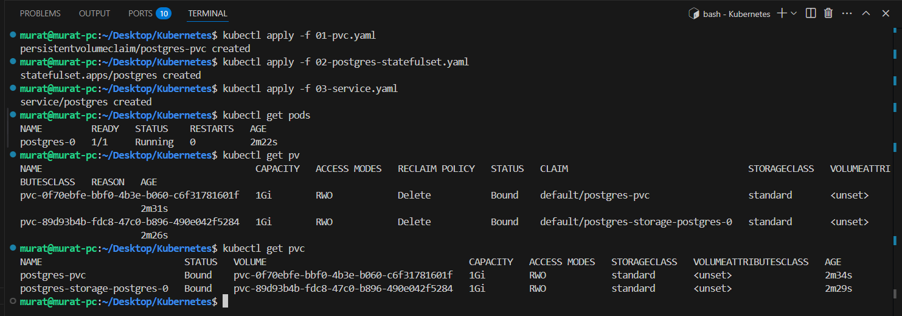
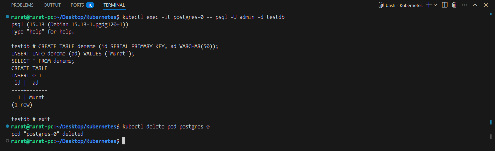
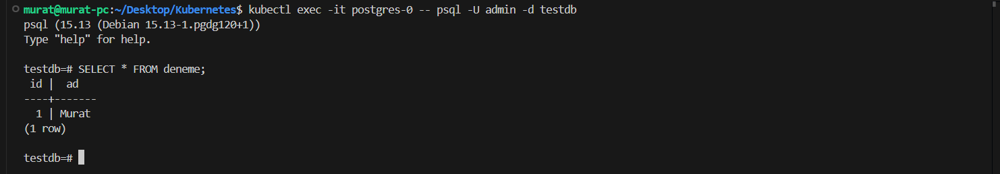
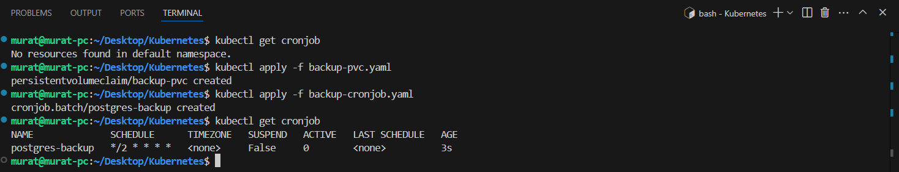

# 📦 Kubernetes StatefulSet ile PostgreSQL Kurulumu ve CronJob ile Yedekleme

Kubernetes'te durum bilgisi taşıyan uygulamalar için Statefulset kullanılır. Bu blog yazısında bir kubernetes ortamında Postgresql nasıl kullanılacağını ve verilerin nasıl kalıcı hale getirileceği konusunda bilgi verilecektir. Postgresql veritabanı üzerinde nasıl backup alınacağı ve bir backup işlemini nasıl otomatize hale getirileceğinden bahsedilmiştir.

İlk öncelikle yapılacak olan işlemleri daha iyi anlaşılması amacıyla bilinmesi kavramlar aşağıdaki gibidir;

* **StatefulSet**: sabit kimliğe (isim/IP) sahip, sıralı şekilde oluşan pod'lar ile durum bilgisi taşıyan uygulamaları yönetmek için kullanılır. Her pod kendi PVC’sine bağlanır ve bu sayede pod silinse bile veriler korunur.

* **PersistentVolume (PV)**: Cluster yöneticisi tarafından tanımlanan fiziksel ya da sanal disk alanıdır. Dinamik veya statik olarak oluşturulabilir

* **PersistentVolumeClaim (PVC)**: Pod'ların ihtiyaç duyduğu disk alanını talep etmek için kullanılır. PVC’ler, uygun bir PV ile eşleştirilerek kullanıma hazır hale gelir.


İlk öncelikle Postgresql yapısının kurulması amacıyla aşlağıdaki dosyalar oluşturulur;
**01-pvc.yaml**
```yaml
# 01-pvc.yaml
apiVersion: v1
kind: PersistentVolumeClaim
metadata:
  name: postgres-pvc
spec:
  accessModes:
    - ReadWriteOnce
  resources:
    requests:
      storage: 1Gi
  storageClassName: standard

```
**03-service.yaml**
```yaml
# 03-service.yaml
apiVersion: v1
kind: Service
metadata:
  name: postgres
spec:
  clusterIP: None
  selector:
    app: postgres
  ports:
    - port: 5432
      targetPort: 5432

```
**02-postgres-statefulset.yaml**
```yaml
# 02-postgres-statefulset.yaml
apiVersion: apps/v1
kind: StatefulSet
metadata:
  name: postgres
spec:
  selector:
    matchLabels:
      app: postgres
  serviceName: "postgres"
  replicas: 1
  template:
    metadata:
      labels:
        app: postgres
    spec:
      containers:
        - name: postgres
          image: postgres:15
          ports:
            - containerPort: 5432
              name: postgres
          env:
            - name: POSTGRES_DB
              value: "testdb"
            - name: POSTGRES_USER
              value: "admin"
            - name: POSTGRES_PASSWORD
              value: "admin123"
          volumeMounts:
            - name: postgres-storage
              mountPath: /var/lib/postgresql/data
  volumeClaimTemplates:
    - metadata:
        name: postgres-storage
      spec:
        accessModes: ["ReadWriteOnce"]
        storageClassName: "standard"
        resources:
          requests:
            storage: 1Gi

```

Oluşturma işleminin ardından işlemin tamamlanması amacıyla aşağıdaki komutları kullanabilirsiniz;

```bash
kubectl apply -f 01-pvc.yaml
kubectl apply -f 03-service.yaml
kubectl apply -f 02-postgres-statefulset.yaml
```



Bu işlemin ardından şunu gerçekleştirebiliriz örnek olması amacıyla Postgresql içerisine veri yazacağız ve pod 'u silerek verilerin kalıp kalmadığını görüntüleyebiliriz. Bu işlem için;

PostgreSQL pod’una bağlan:
```bash
kubectl exec -it postgres-0 -- psql -U admin -d testdb
```
Bağlantı işleminin ardından örnek bir tablo oluşturulur;

```sql
CREATE TABLE deneme (id SERIAL PRIMARY KEY, ad VARCHAR(50));
INSERT INTO deneme (ad) VALUES ('Murat');
SELECT * FROM deneme;
```
Bu işlemlerin ardından pod silinir;
```bash
kubectl delete pod postgres-0
```


Bu işlemler gerçekleştirildikten sonra pod'a tekrar bağlanılır ve veri kontrol edilir. 

```bash
kubectl exec -it postgres-0 -- psql -U admin -d testdb
SELECT * FROM deneme;
```



İşlemlerde görüldüğü gibi **PersistentVolume** yapısı kullanılarak pod silinse dahi verinin korulması mümkün olur. 

### CronJob ile Otomatik Backup Alma

**Crontab**, Linux/Unix sistemlerinde zamanlanmış görevleri (script, komut vb.) belirli zaman aralıklarında otomatik olarak çalıştırmak için kullanılan bir zamanlayıcı sistemidir. Bu sistemin yedek alma amacıyla Kubernetes kullanımak için aşağıdaki dosyalar oluşturulur;

**backup-pvc.yaml**
```yaml
# backup-pvc.yaml
apiVersion: v1
kind: PersistentVolumeClaim
metadata:
  name: backup-pvc
spec:
  accessModes:
    - ReadWriteOnce
  resources:
    requests:
      storage: 1Gi
  storageClassName: standard

```

**backup-cronjob.yaml**

```yaml
# backup-cronjob.yaml
apiVersion: batch/v1
kind: CronJob
metadata:
  name: postgres-backup
spec:
  #schedule: "0 */12 * * *"  # Her 12 saatte bir çalışır
  schedule: "*/2 * * * *"
  jobTemplate:
    spec:
      template:
        spec:
          containers:
          - name: pg-backup
            image: postgres:15
            env:
              - name: PGPASSWORD
                value: "admin123"
            command:
              - /bin/sh
              - -c
              - |
                pg_dump -h postgres-0.postgres -U admin testdb > /backup/backup-$(date +%Y-%m-%d-%H%M).sql
            volumeMounts:
              - name: backup-volume
                mountPath: /backup
          restartPolicy: OnFailure
          volumes:
            - name: backup-volume
              persistentVolumeClaim:
                claimName: backup-pvc
```

Oluşturma işlemi için aşağıdaki komutlar kullanılır;

```bash
kubectl apply -f backup-pvc.yaml
kubectl apply -f backup-cronjob.yaml
```



Crontab için ``schedule`` parametresinde bulunan kısım için [crontab guru](https://crontab.guru/) sayfası kullanılabilir.
Backup dosyaların kontrol edilmesi amacıyla ``inspect-backup.yaml`` dosyası oluşturulur. 
**inspect-backup.yaml**
```bash
# inspect-backup.yaml
apiVersion: v1
kind: Pod
metadata:
  name: backup-inspect
spec:
  containers:
    - name: inspector
      image: busybox
      command: ["/bin/sh", "-c", "sleep 3600"]
      volumeMounts:
        - name: backup-volume
          mountPath: /backup
  volumes:
    - name: backup-volume
      persistentVolumeClaim:
        claimName: backup-pvc
  restartPolicy: Never

```
Oluşturulması amacıyla ``kubectl apply -f inspect-backup.yaml`` komutu kullanılır.  Oluşturma işleminin ardından aşağıdaki komutlar kullanılarak backup dosyaları kontrol edilir;


Backup işleminin kontrol edilmesi amacıyla aşağıdaki komutlar sırasıyla kullanılır;
```bash
kubectl get cronjob
kubectl get pods
kubectl exec -it backup-inspect -- ls /backup
```

